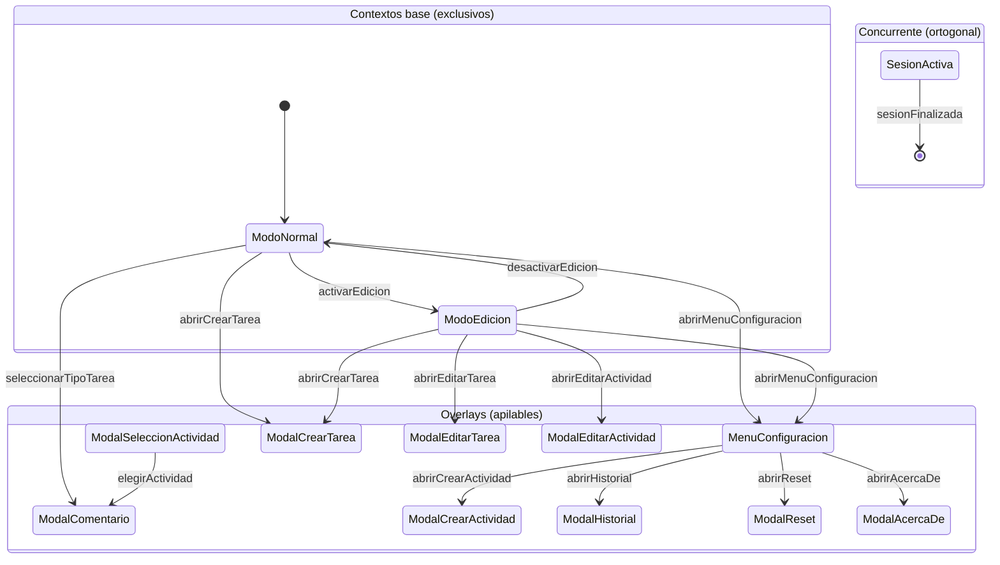
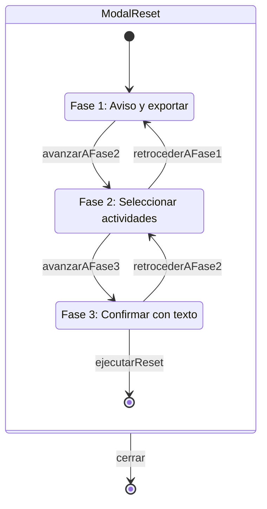

# Diagramas del sistema CronometroPSP

**Fecha**: 13 de marzo de 2026
**Autor**: Claude Opus 4.6
**Fuente**: AST generado por el parser Python de Gemini/Antigravity

---

## 1. Arquitectura general

Muestra las tres zonas del sistema (base, concurrente, overlays) y las
transiciones entre ellas. No muestra roles ni sub-contextos — eso va en
los diagramas de detalle.



## 2. Overlay con sub-contextos: ModalHistorial

Historial7Dias y Historial30Dias son hermanos bajo ModalHistorial, no
anidados uno dentro de otro. Ambos heredan `boton_cerrar` del padre (H1).

```mermaid
stateDiagram-v2
    state ModalHistorial {
        [*] --> Historial7Dias

        state Historial7Dias {
            note right of Historial7Dias
                boton_7dias: Boton (ignorar)
                boton_30dias: Boton
            end note
        }

        state Historial30Dias {
            note right of Historial30Dias
                boton_7dias: Boton
                boton_30dias: Boton (ignorar)
            end note
        }

        Historial7Dias --> Historial30Dias : cambiarA30Dias
        Historial30Dias --> Historial7Dias : cambiarA7Dias
    }

    ModalHistorial --> [*] : cerrar
```

## 3. Overlay con sub-contextos: ModalReset

Tres fases secuenciales con navegación adelante/atrás. Las fases son
hermanas bajo ModalReset, no anidadas en cascada.



---

## Notas de diseño

### Por qué `[cerrar_overlay]` no aparece como nodo

En los `.trz`, `[cerrar_overlay]` es un pseudo-destino — no es un estado
real sino una instrucción al runtime para desapilar el overlay activo y
volver al contexto base que había debajo. En Mermaid, esto se mapea al
estado final `[*]`, que tiene exactamente esa semántica: "este flujo
termina, el control vuelve al nivel superior".

### Por qué no se muestran los roles en el diagrama general

El diagrama 1 es de **arquitectura**: qué contextos existen y cómo se
conectan. Los roles son **detalle de implementación** de cada contexto.
Mezclar ambos niveles en un solo diagrama fue lo que hizo ilegible el
intento anterior. Los roles se ven mejor con `trenza inspect` (cuando
el CLI lo soporte) o en diagramas de detalle por contexto.

### Sobre los renderers

Estos diagramas usan `stateDiagram-v2`, que es el tipo semánticamente
correcto para máquinas de estado. Renderizan en:

- GitHub (nativo en `.md`)
- Mermaid Live Editor (mermaid.live)
- VS Code con extensión Mermaid

Si un editor local no los soporta (MarkText, versiones antiguas),
la alternativa es previsualizarlos en GitHub directamente.
