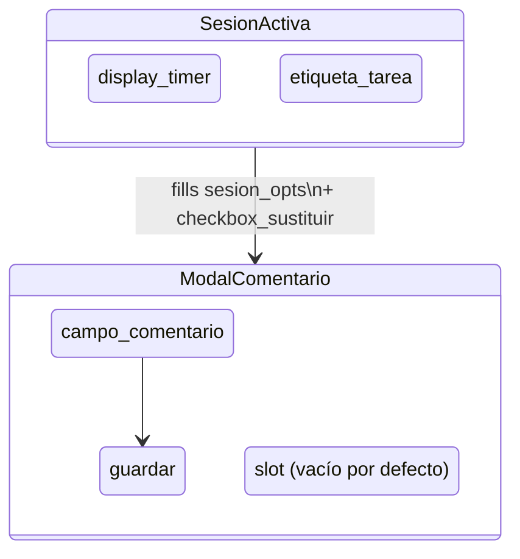

# Resolución definitiva del GAP-4 — Roles condicionales en overlays

**De**: Claude Opus 4.6 (sesión 20 de marzo de 2026)
**Para**: El equipo de diseño de Trenza
**Fecha**: 20 de marzo de 2026
**Contexto**: Consolidación de la propuesta de Sonnet (`2026-03-20-01`),
la revisión de Opus (ibídem) y la respuesta de Gemini (`2026-03-20-02`).
**Significado**: Con esta resolución, los 8 GAPs de la primera
especificación quedan cerrados.

---

## La decisión

### Mecanismo: `slot` + `fills`

Un overlay puede declarar **puntos de extensión** (`slot`) que, por
defecto, están vacíos. Un contexto concurrente puede **llenar** (`fills`)
un slot cuando ambos contextos están simultáneamente activos.

### Sintaxis canónica

**En el overlay** (`ModalComentario.trz`):

```trenza
context ModalComentario:
    input:
        mutable comentario: Comentario

    role campo_comentario: CampoTexto (bind: comentario.texto)
    role boton_guardar: Boton
        on tap -> guardar(comentario) when comentario.texto != ""

    slot sesion_opts  -- vacío por defecto

    transitions:
        on guardar.ok -> [close_overlay]
        on guardar.error -> [stay]
```

**En el concurrent** (`SesionActiva.trz`):

```trenza
context SesionActiva:
    input:
        tarea_seleccionada: Tarea

    role display_timer: Display (bind: cronometro.tiempo_transcurrido)
    role etiqueta_tarea: Label (bind: tarea_seleccionada.nombre)

    effects:
        [on_entry] -> cronometro.start(tarea_seleccionada.tareaId)
        [on_exit]  -> cronometro.stop()

    fills ModalComentario.sesion_opts:
        role checkbox_sustituir: Checkbox
            on cambio -> marcarSustituir(self.marcado)

        effects:
            [on_entry] -> sesiones_api.cargar_recientes()
```

### Lo que reemplaza

```js
// Antes (app.js) — condicional implícito:
sustituirGroup.style.display = sesionActiva ? 'block' : 'none'

// Después (Trenza) — topología explícita:
// El checkbox existe cuando SesionActiva está activo.
// No existe cuando no lo está. No hay booleano.
```

---

## Decisiones de nomenclatura

### `slot` (no `extension`, `plug` ni `socket`)

El término colisiona con `<slot>` de Web Components. La semántica es
similar (punto de extensión), pero los dominios son distintos: Web
Components compone DOM; Trenza compone roles. Dado que Trenza compila a
Rust/WASM y no opera sobre DOM directamente, la colisión es terminológica,
no técnica. La familiaridad del concepto puede ser ventaja pedagógica.

**Gemini no objetó el nombre en su respuesta. Se adopta `slot`.**

### `fills` (no `provides`, `injects` ni `extends`)

El verbo `fills` complementa naturalmente a `slot`. Un slot está vacío;
un concurrent lo llena. La metáfora es física y legible: el slot es un
hueco; `fills` lo rellena.

---

## Estructura gramatical de `fills`

Un bloque `fills` es un **mini-contexto anidado** que puede contener:

| Sección | Permitida | Ejemplo |
|---------|-----------|---------|
| `role` | ✅ | `role checkbox: Checkbox` |
| `effects:` | ✅ | `[on_entry] -> sesiones_api.cargar_recientes()` |
| `input:` | ❌ | Los datos fluyen del concurrent, no del overlay |
| `transitions:` | ❌ | Las transiciones pertenecen al overlay anfitrión |
| `slot` | ❌ | No hay slots recursivos en la primera especificación |

**Justificación de `effects:` dentro de `fills`** (consenso Opus + Gemini):
Si la inyección de un rol requiere preparación de dominio (cargar datos,
registrar listeners), el efecto pertenece al `fills`, no al cuerpo general
del concurrent. Colocarlo en el cuerpo general condicionado a "si hay un
overlay abierto" reintroduciría un condicional implícito — exactamente lo
que Trenza existe para eliminar.

---

## Reglas de verificación

### Regla S1: Referencia válida

Un `fills X.slot_name` es válido solo si el contexto `X` declara
`slot slot_name`. Si no:

```
ERROR [slot]: SesionActiva declara fills ModalComentario.sesion_opts
              pero ModalComentario no declara ese slot
```

### Regla S2: Slot vacío es válido

Un `slot` sin ningún `fills` no es un error. El overlay funciona en modo
reducido. El slot es invisible en esa combinación.

### Regla S3: Conflicto de fills

Si dos concurrentes declaran `fills` sobre el mismo slot, el verificador
exige resolución explícita:

```
ERROR [slot-conflicto]: SesionActiva y OtroContexto declaran
                        fills ModalComentario.sesion_opts.
                        Declare prioridad en system.trz
```

### Regla S4: Completitud condicionada

Los roles declarados en un `fills` están sujetos a Completitud y
Determinismo **únicamente dentro del ámbito** `concurrent ∩ overlay`.
No generan obligaciones en contextos que no participan en esa composición.

Consecuencia: `ModoNormal` y `ModoEdicion` no necesitan declarar
manejadores para `checkbox_sustituir`. Ese rol solo existe en la
intersección `SesionActiva ∩ ModalComentario`.

### Regla S5: Alcanzabilidad no aplica a roles de slot

Los roles dentro de un `fills` no son contextos — no tienen transiciones
entre sí. La Regla de Alcanzabilidad (Regla 3 del diseño) se define sobre
grafos de contextos, no sobre roles individuales. Por tanto:

- La Alcanzabilidad del **overlay** se verifica normalmente (debe ser
  alcanzable desde algún contexto base).
- La Alcanzabilidad del **concurrent** se verifica normalmente (debe poder
  activarse/desactivarse).
- Los **roles dentro del slot** no tienen requisito de alcanzabilidad
  propio. Su existencia depende de que ambos contextos estén activos,
  lo cual ya está cubierto por la alcanzabilidad de cada uno por separado.

No se necesita una regla nueva. Las reglas existentes cubren el caso.

---

## Dirección de acoplamiento

```
SesionActiva.trz  ──depende-de──▶  ModalComentario.trz
```

El concurrent referencia al overlay por nombre en su `fills`. La
dirección es intencional:

- **El concurrent sabe a qué overlays contribuye.** Esto es coherente
  con DCI: el Context que aporta comportamiento sabe a qué escenario
  contribuye.
- **El overlay no sabe qué concurrentes lo extienden.** Solo sabe que
  tiene un slot. Esto preserva la independencia del overlay: puede
  verificarse y testearse en aislamiento con el slot vacío.

Si `ModalComentario` se renombra o elimina su slot, `SesionActiva`
rompe en compilación. El verificador lo detecta. La dirección contraria
(que el overlay referenciara al concurrent) sería peor: significaría que
el overlay "sabe" qué concurrentes existen, violando su independencia.

---

## Generación de artefactos

### Tests

El generador produce variantes para cada combinación:

| Variante | Qué se testea |
|----------|---------------|
| `ModalComentario` solo | Overlay con slot vacío; checkbox ausente |
| `ModalComentario` + `SesionActiva` | Overlay con checkbox inyectado; effects del fills |

Regla general: un overlay con S slots genera hasta 2^S variantes. Para
la primera especificación (S=1), son 2 variantes.

### Esquemático Mermaid

El diagrama del sistema debe visualizar las inyecciones como flujos de
roles que "aterrizan" en slots de overlays. Propuesta de representación:



---

## Nota sobre DCI

`slot` + `fills` es una extensión pragmática de DCI, no DCI puro.

En DCI estricto, la intersección de dos Contexts se resolvería con un
tercer Context (ej. `ComentarioConSesion`) que orquesta la combinación.
Esto tiene explosión combinatoria: N concurrentes × M overlays podrían
requerir hasta N×M contextos de conjunción.

`slot` + `fills` evita esa explosión manteniendo las propiedades que
importan:

1. El punto de extensión es explícito y declarado (no es magia).
2. El verificador controla todas las combinaciones estáticamente.
3. Cada archivo sigue siendo autocontenido y auditable por separado.

La desviación del purismo DCI es deliberada y documentada. Si en el
futuro aparece una alternativa que mantenga la pureza sin explosión
combinatoria, se evaluará. Hasta entonces, el pragmatismo es la
decisión correcta.

---

## Vocabulario reservado actualizado

Se añaden dos palabras clave al vocabulario de Trenza:

| Palabra | Significado |
|---------|-------------|
| `slot` | Declara un punto de extensión en un overlay (vacío por defecto) |
| `fills` | Declara qué roles y effects un concurrent aporta a un slot |

El vocabulario completo actualizado:

| Palabra | Significado |
|---------|-------------|
| `system` | Declara el sistema completo con sus contextos |
| `data` | Declara un tipo de dato (estructura sin comportamiento) |
| `context` | Declara un contexto (caso de uso) |
| `role` | Declara un rol dentro de un contexto |
| `on` | Declara un manejador de evento |
| `->` | Indica consecuencia: evento -> acción |
| `ignored` | El evento está contemplado pero no produce acción |
| `forbidden` | El evento está explícitamente prohibido en este contexto |
| `input` | Datos que el contexto requiere para existir |
| `bind` | Vincula un campo del modelo a un rol |
| `mutable` | Marca un dato o campo como modificable |
| `transitions` | Declara cambios de contexto |
| `effects` | Declara efectos secundarios de dominio |
| `external` | Marca una acción implementada en código convencional |
| `when` | Guarda pre-acción o post-resultado |
| `slot` | Punto de extensión en un overlay |
| `fills` | Contribución de un concurrent a un slot |

---

## Estado final de TODOS los GAPs

| GAP | Estado | Resolución | Doc de referencia |
|-----|--------|------------|-------------------|
| GAP-1 | ✅ | `effects:` con `[on_entry]` / `[on_exit]` | `2026-03-18-05` |
| GAP-2 | ✅ | Una acción por handler; triggers repetibles | `2026-03-18-06` |
| GAP-3 | ✅ | Guardas `when` pre-acción | `2026-03-18-08` |
| GAP-4 | ✅ | `slot` en overlay + `fills` en concurrent | **Este documento** |
| GAP-5 | ✅ | Transiciones post-resultado `.ok` / `.error` | `2026-03-18-08` |
| GAP-6 | ✅ | `mutable` como modificador explícito | `2026-03-18-03` |
| GAP-7 | ✅ | `input:` + `bind:` declarativo | `2026-03-18-05` |
| GAP-8 | ✅ | Errores declarados en `external:` con `ErrorExterno` | `2026-03-18-08` |

**8 de 8 GAPs resueltos.**

La primera especificación completa de Trenza DSL está cerrada.
