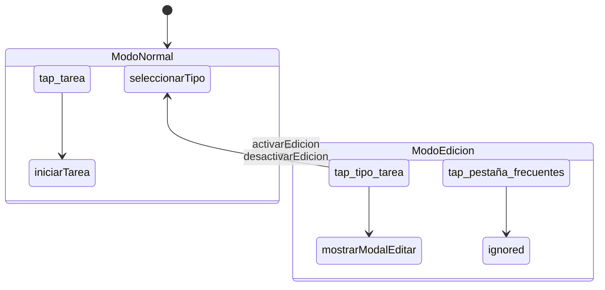

# Manual de usuario de Trenza DSL

**Versión**: Primera Especificación Estable
**Fecha**: 20 de marzo de 2026
**Autores**: Claude Opus 4.6, con material de Claude Sonnet 4.6 y Gemini

---

## 1. Qué es Trenza

Trenza es un lenguaje de dominio específico (DSL) diseñado para especificar
sistemas interactivos de forma verificable. A partir de una especificación
Trenza, el compilador genera tres artefactos — implementación, tests y
esquemático — que no pueden desincronizarse.

Trenza no reemplaza todo el código de una aplicación. Gobierna la lógica
de estados, eventos y transiciones, delegando los efectos secundarios
(llamadas API, DOM, etc.) a código convencional.

### 1.1 Para quién es

Trenza está diseñado para dos tipos de usuario:

- **Desarrolladores humanos** que necesitan razonar sobre flujos de estado
  complejos sin dispersar la lógica en decenas de archivos.
- **LLMs** que generan código: al co-generar implementación y tests desde
  la misma especificación, un LLM no puede "olvidar" un caso porque el
  test es el reverso algebraico de la implementación.

### 1.2 El problema que resuelve

En una aplicación event-driven moderna, un estado como "modo edición"
suele expresarse como un booleano (`if (modoEdicion)`) disperso en
múltiples archivos. Olvidar un guard en un listener produce un bug
silencioso.

En Trenza, "modo edición" es un **contexto** — un objeto con roles,
eventos y transiciones declaradas. Si un evento no tiene manejador en
ese contexto, el verificador lo reporta en tiempo de compilación. El
olvido es imposible.

### 1.3 Extensiones de archivo

| Extensión | Contenido |
|-----------|-----------|
| `.trz` | Archivo fuente Trenza |
| `.tzp` | Paquete verificable (ZIP autocontenido) |

---

## 2. Conceptos fundamentales

Trenza se basa en la separación DCI (Data, Context, Interaction) de
Trygve Reenskaug:

| Capa | Pregunta que responde | Dónde vive |
|------|----------------------|------------|
| **Data** | "¿Qué es esto?" | `data.trz` |
| **Context** | "¿Qué caso de uso está activo?" | `contexts/*.trz` |
| **Interaction** | "¿Qué hace esto aquí?" | Handlers de rol dentro del contexto |

### 2.1 Data: estructura sin comportamiento

Un dato es lo que algo *es*. No tiene métodos ni comportamiento. Una
`Tarea` es una `Tarea` independientemente de si el sistema está en
modo normal o modo edición.

```trenza
data Tarea:
    tareaId: Id
    nombre: Texto
    mutable estado: Texto
```

Los campos son inmutables por defecto. El modificador `mutable` marca
explícitamente los campos que pueden cambiar.

La anotación opcional `[clasificacion:]` permite al verificador aplicar
reglas de conformidad de datos (RGPD Art. 25):

```trenza
data DatosSesion [clasificacion: personal]:
    usuario: Texto
    inicio: Timestamp
```

### 2.2 Context: el caso de uso activo

Un contexto es la unidad mínima de especificación. Es autocontenido
y verificable por sí mismo. Contiene:

- **Roles**: actores que participan en el caso de uso.
- **Eventos**: lo que puede ocurrir.
- **Acciones**: lo que resulta de cada evento.
- **Transiciones**: cambios a otros contextos.
- **Efectos**: acciones de dominio al activar/desactivar.

Hay tres tipos de contexto:

| Tipo | Declaración | Comportamiento |
|------|-------------|----------------|
| **Base** | `contexts:` | Mutuamente exclusivos. Exactamente uno activo. |
| **Overlay** | `overlays:` | Se apilan sobre el base sin reemplazarlo. |
| **Concurrent** | `concurrent:` | Coexisten con el base. Se activan/desactivan independientemente. |

### 2.3 Role: lo que algo hace aquí

Un rol vincula un dato a un comportamiento dentro de un contexto. El
mismo dato puede tener roles distintos en contextos distintos:

```trenza
-- En ModoNormal: tocar una tarjeta selecciona el tipo
context ModoNormal:
    role tipo_tarea: TipoTarea
        on tap -> seleccionarTipo(self.tipoId)

-- En ModoEdicion: tocar la misma tarjeta abre el editor
context ModoEdicion:
    role tipo_tarea: TipoTarea
        on tap -> mostrarModalEditar(self.tipoId)
```

La tarjeta no "sabe" en qué modo está. El contexto le asigna su
comportamiento.

---

## 3. Estructura de un sistema

### 3.1 Archivo del sistema (`system.trz`)

Todo sistema Trenza tiene un archivo raíz que declara la topología:

```trenza
system CronometroPSP:
    initial: ModoNormal

    contexts:
        ModoEdicion
        ModoNormal

    concurrent:
        SesionActiva

    overlays:
        ModalComentario
        ModalEditarTarea
        ModalEditarActividad
        MenuConfiguracion
```

`initial:` declara el contexto base activo al arrancar el sistema.

### 3.2 Archivo de datos (`data.trz`)

Todos los tipos de dato se declaran en un archivo separado:

```trenza
data TipoTarea:
    tipoId: Id
    nombre: Texto
    icono: Texto

data Actividad:
    id: Id
    nombre: Texto
    color: Color

data Comentario:
    mutable texto: Texto
    mutable sustituir: Booleano
```

### 3.3 Un archivo por contexto (`contexts/*.trz`)

Cada contexto vive en su propio archivo. La estructura de directorios
refleja la jerarquía:

```
contexts/
├── ModoNormal.trz
├── ModoEdicion.trz
├── ModoEdicion/
│   ├── EditandoTarea.trz       -- contexto hijo
│   └── EditandoActividad.trz
├── SesionActiva.trz
├── ModalComentario.trz
└── MenuConfiguracion.trz
```

### 3.4 Módulos externos (`external/*.trz`)

Las acciones que interactúan con el exterior se declaran en módulos
externos:

```trenza
external cronometro_api:
    action guardar(actividad: Actividad):
        ok -> Actividad
        error -> ErrorExterno

    action borrar(id: Id):
        ok -> nulo
        error -> ErrorExterno
```

Toda acción externa debe declarar sus ramas de resultado (`.ok` y
`.error`). El verificador exige que todo contexto que invoque una
acción externa maneje ambas ramas.

El tipo `ErrorExterno` es un tipo estándar:

```trenza
data ErrorExterno:
    codigo: Texto          -- "red_timeout", "validacion", "no_autorizado"
    mensaje: Texto         -- legible por humanos
    recuperable: Booleano  -- ¿tiene sentido reintentar?
```

---

## 4. Anatomía de un contexto

Un contexto completo puede incluir hasta seis secciones:

```trenza
context NombreDelContexto:

    -- 1. Datos de entrada (opcionales)
    input:
        dato_requerido: Tipo
        mutable dato_editable: Tipo

    -- 2. Roles con vínculos de datos
    role nombre_rol: TipoDato (bind: dato_requerido.campo)
        on evento -> accion
        on otro_evento -> ignored

    -- 3. Slots de extensión (solo en overlays)
    slot nombre_slot

    -- 4. Efectos de dominio
    effects:
        [on_entry] -> accion_al_entrar()
        [on_exit]  -> accion_al_salir()

    -- 5. Transiciones
    transitions:
        on evento_resultado -> OtroContexto
        on cancelar -> [close_overlay]

    -- 6. Contribuciones a otros contextos (solo en concurrents)
    fills OtroContexto.nombre_slot:
        role rol_inyectado: Tipo
            on evento -> accion
```

### 4.1 `input:` — datos de entrada

Declara los datos que el contexto necesita para existir. Cuando un
contexto se activa, el invocador debe proporcionar estos datos:

```trenza
context ModalEditarActividad:
    input:
        mutable actividad_en_edicion: Actividad
```

El verificador comprueba que el invocador proporciona todos los campos
requeridos con tipos compatibles.

### 4.2 `role` — roles con eventos

Un rol vincula un tipo de dato a un comportamiento. Cada evento de un
rol produce exactamente una acción:

```trenza
role boton_guardar: Boton
    on tap -> guardar(actividad) when actividad.nombre != ""
    on tap -> ignored when actividad.nombre == ""
```

#### Vínculos de datos con `bind:`

Un rol puede vincularse declarativamente a un campo del modelo:

```trenza
role campo_nombre: CampoTexto (bind: actividad_en_edicion.nombre)
role selector_color: SelectorColor (bind: actividad_en_edicion.color)
```

`bind:` establece un vínculo Modelo → Rol. El verificador comprueba
que el campo existe en `data.trz` y que el tipo es compatible.

#### Guardas pre-acción con `when`

Las guardas validan condiciones antes de emitir un evento:

```trenza
role boton_guardar: Boton
    on tap -> guardar(actividad) when actividad.nombre != ""
    on tap -> ignored when actividad.nombre == ""
```

Las guardas solo pueden evaluar el `input:` del contexto y el estado
de sus propios roles.

#### Acciones especiales

| Acción | Significado |
|--------|-------------|
| `ignored` | El evento está contemplado. No produce acción. |
| `forbidden` | El evento está explícitamente prohibido. |

La diferencia: `ignored` es "no pasa nada" (intencional). `forbidden`
es "esto no debería ocurrir aquí" (denegación explícita, alineada con
el principio de mínimo privilegio).

### 4.3 `effects:` — efectos de dominio

Los efectos son acciones que se ejecutan al activar o desactivar el
contexto:

```trenza
effects:
    [on_entry] -> cronometro.start(tarea_seleccionada.tareaId)
    [on_entry] -> analytics.track("session_start")
    [on_exit]  -> cronometro.stop()
```

Si un `[on_entry]` necesita disparar más de un efecto, se repite el
trigger. Cada línea se ejecuta en orden declarado. El verificador
razona sobre cada una independientemente.

Los efectos también pueden responder a resultados de acciones externas:

```trenza
effects:
    [on guardar.error(err)] -> ultimo_error.asignar(err.mensaje)
```

### 4.4 `transitions:` — cambios de contexto

Declaran los cambios de estado del sistema:

```trenza
transitions:
    on activarEdicion -> ModoEdicion
    on guardar.ok -> [close_overlay]
    on guardar.error -> [stay]
    on guardar.error -> [close_overlay] when err.recuperable == false
```

#### Pseudo-transiciones

| Pseudo-transición | Significado |
|--------------------|-------------|
| `[close_overlay]` | Cierra el overlay; regresa al contexto base. |
| `[stay]` | Permanece en el contexto actual. |
| `[desactivar]` | Desactiva un contexto concurrent. |

#### Guardas post-resultado

Las transiciones pueden tener guardas que evalúan el payload del
resultado:

```trenza
transitions:
    on guardar.error -> [close_overlay] when err.recuperable == false
    on guardar.error -> [stay] when err.recuperable == true
```

### 4.5 `slot` y `fills` — composición entre contextos

Un overlay puede declarar puntos de extensión que un concurrent
llena cuando ambos están activos:

**En el overlay:**

```trenza
context ModalComentario:
    input:
        mutable comentario: Comentario

    role campo_comentario: CampoTexto (bind: comentario.texto)

    slot sesion_opts  -- vacío por defecto

    transitions:
        on guardar.ok -> [close_overlay]
```

**En el concurrent:**

```trenza
context SesionActiva:
    fills ModalComentario.sesion_opts:
        role checkbox_sustituir: Checkbox
            on cambio -> marcarSustituir(self.marcado)

        effects:
            [on_entry] -> sesiones_api.cargar_recientes()
```

El bloque `fills` es un mini-contexto que puede contener `role` y
`effects:`, pero no `input:`, `transitions:` ni `slot` anidados.

---

## 5. Contextos anidados

Los contextos pueden anidarse hasta dos niveles de profundidad para
expresar sub-estados:

```trenza
context ModoEdicion:

    role pestaña_frecuentes: Pestaña
        on tap -> ignored

    transitions:
        on desactivarEdicion -> ModoNormal

    context EditandoTarea:
        role campo_nombre: CampoTexto
            on cambio -> actualizarNombre(self.valor)
        role boton_guardar: Boton
            on tap -> guardarEdicion()

        transitions:
            on guardarEdicion -> ModoEdicion
            on cancelar -> ModoEdicion
```

### 5.1 Reglas de herencia (H1–H5)

**H1 — Herencia implícita**: un hijo hereda todos los roles del padre.

**H2 — Roles locales**: un hijo puede declarar roles nuevos, invisibles
para el padre y los hermanos.

**H3 — Completitud por niveles**: la verificación se aplica por nivel.
Un rol local de un hijo no obliga a sus hermanos.

**H4 — Sobrescritura explícita**: para cambiar un handler heredado, se
re-declara el rol completo. El verificador emite una nota informativa.

**H5 — Prohibición de eventos nuevos en roles heredados**: un hijo no
puede añadir eventos a un rol heredado. Para eventos nuevos, se declara
un rol local con el mismo tipo de dato.

### 5.2 Inspección de herencia

El CLI muestra la vista expandida de un contexto hijo:

```
$ trenza inspect contexts/ModoEdicion/EditandoTarea.trz

context EditandoTarea (hijo de ModoEdicion):

  [heredado] role pestaña_frecuentes: Pestaña
      on tap -> ignored

  [local] role campo_nombre: CampoTexto
      on cambio -> actualizarNombre(self.valor)

  [local] role boton_guardar: Boton
      on tap -> guardarEdicion()

  transitions:
      on guardarEdicion -> ModoEdicion
      on cancelar -> ModoEdicion
```

---

## 6. Verificación

Trenza verifica seis propiedades formales expresadas como reglas legibles.
Cada regla puede comprobarse por inspección, sin ejecutar código.

### 6.1 Las seis reglas

**Regla 1 — Completitud**: Todo rol que maneje un evento en algún
contexto debe manejarlo en todos los contextos del sistema.

```
ERROR [completitud]: pestaña_frecuentes.tap definido en ModoNormal
                     pero ausente en ModoEdicion
```

**Regla 2 — Determinismo**: Cada evento de cada rol produce exactamente
una acción en un contexto dado.

```
ERROR [determinismo]: tarjeta.tap tiene dos acciones en ModoEdicion
```

**Regla 3 — Alcanzabilidad**: Todo contexto es alcanzable desde el
inicial.

```
ERROR [alcanzabilidad]: ModoMantenimiento no es alcanzable desde
                        ModoNormal (contexto inicial)
```

**Regla 4 — Retorno**: Todo contexto no inicial tiene un camino de
vuelta al inicial.

**Regla 5 — Exhaustividad de roles**: Todo rol declarado en el sistema
aparece en todos los contextos.

**Regla 6 — Conformidad de datos**: Ningún dato clasificado fluye a
un módulo `external` sin autorización explícita.

```
ERROR [conformidad]: DatosSesion [clasificacion: personal] fluye hacia
                     modulo_analytics que no declara [autorizado_para: personal]
```

### 6.2 Reglas de slots (S1–S5)

Los slots introducen cinco reglas adicionales:

**S1 — Referencia válida**: `fills X.slot_name` es válido solo si `X`
declara `slot slot_name`.

**S2 — Slot vacío es válido**: Un slot sin `fills` no es error. Es el
caso base.

**S3 — Conflicto**: Si dos concurrentes hacen `fills` sobre el mismo
slot, el verificador exige resolución en `system.trz`.

**S4 — Completitud condicionada**: Los roles de un `fills` están sujetos
a verificación solo dentro del ámbito `concurrent ∩ overlay`. No generan
obligaciones en otros contextos.

**S5 — Alcanzabilidad no aplica a roles de slot**: Los roles dentro de
un `fills` no son contextos. Su existencia depende de que ambos contextos
estén activos, lo cual ya está cubierto por la alcanzabilidad de cada
uno por separado.

---

## 7. Generación de artefactos

Cada especificación Trenza genera tres artefactos — las tres hebras:

### 7.1 Hebra 1: Implementación (Rust)

Los contextos se traducen a un enum con `match` exhaustivo:

```rust
pub enum Contexto {
    ModoNormal,
    ModoEdicion,
}

pub fn handle_tipo_tarea_tap(ctx: &Contexto, tipo: &TipoTarea) -> Accion {
    match ctx {
        Contexto::ModoNormal => Accion::SeleccionarTipo(tipo.tipo_id),
        Contexto::ModoEdicion => Accion::MostrarModalEditar(tipo.tipo_id),
    }
}
```

El `match` exhaustivo de Rust impone la misma completitud que el
verificador de Trenza, pero a nivel de compilación del código generado.

El código se compila a WASM para despliegue universal.

### 7.2 Hebra 2: Tests

Cada pareja evento-acción produce un test por contexto:

```rust
#[test]
fn modo_edicion_pestaña_frecuentes_tap_ignora() {
    let ctx = Contexto::ModoEdicion;
    let resultado = handle_pestaña_frecuentes_tap(&ctx);
    assert_eq!(resultado, Accion::Ignorar);
}
```

No hay tests manuales. Si la especificación cambia, los tests cambian.

Para overlays con slots, se generan variantes:

| Variante | Qué testea |
|----------|------------|
| Overlay solo (slot vacío) | Comportamiento sin concurrent activo |
| Overlay + concurrent | Comportamiento con roles inyectados |

### 7.3 Hebra 3: Esquemático (Mermaid)

Diagrama auto-generado del sistema:



Las tres hebras son proyecciones del mismo artefacto. Modificar una
implica regenerar las otras dos. No pueden desincronizarse.

---

## 8. Módulos externos e interoperabilidad

Trenza declara la interfaz de las funciones externas; el código
convencional las implementa:

```trenza
external cronometro_api:
    action iniciar_sesion(tarea_id: Id, comentario: Texto):
        ok -> Sesion
        error -> ErrorExterno
```

El generador produce un trait Rust que el código convencional implementa:

```rust
pub trait CronometroApi {
    fn iniciar_sesion(&self, tarea_id: Id, comentario: &str) -> Result<Sesion, ErrorExterno>;
}
```

Los tests generados usan mocks. Los tests de integración (contra la
implementación real) están fuera del alcance de Trenza.

---

## 9. El paquete `.tzp`

Un sistema Trenza completo se empaqueta como ZIP autocontenido:

```
cronometro-psp.tzp
├── mimetype                        -- "application/trenza-dsl"
├── manifest.json                   -- checksums, versión
├── system.trz
├── data.trz
├── contexts/
│   ├── ModoNormal.trz
│   ├── ModoEdicion.trz
│   └── ModoEdicion/
│       ├── EditandoTarea.trz
│       └── EditandoActividad.trz
├── external/
│   └── cronometro_api.trz
├── generated/
│   ├── impl/
│   │   └── cronometro_psp.rs       -- hebra 1
│   ├── tests/
│   │   └── cronometro_psp_test.rs  -- hebra 2
│   └── schematics/
│       └── system.mermaid          -- hebra 3
└── verification/
    └── report.json                 -- resultado de verificación
```

El `manifest.json` contiene checksums de cada archivo. Permite la
regeneración incremental: si solo cambia un contexto, solo se regeneran
sus artefactos.

El paquete encarna el principio de autocontención: contiene
especificación, implementación, tests, esquemático y verificación.
Un solo archivo `.tzp` se copia, se versiona y se despliega como
una unidad.

---

## 10. CLI

```bash
trenza verify sistema.tzp         -- verifica el sistema completo
trenza verify contexto.trz        -- verifica un contexto aislado
trenza generate sistema.tzp       -- genera las tres hebras
trenza check sistema.tzp          -- verify + generate + ejecuta tests
trenza inspect contexto.trz       -- muestra herencia expandida
```

Salida del verificador:

```
$ trenza verify cronometro-psp.tzp

  completitud ............ OK
  determinismo ........... OK
  alcanzabilidad ......... OK
  retorno ................ OK
  exhaustividad .......... OK
  conformidad de datos ... OK

  6/6 reglas cumplidas. Sistema verificado.
  Checksum del artefacto: a7f8b9...
```

---

## 11. Convenciones de nombrado

| Elemento | Convención | Ejemplo |
|----------|------------|---------|
| Contexto | PascalCase | `ModoEdicion`, `ModalComentario` |
| Tipo de dato | PascalCase | `TipoTarea`, `Actividad` |
| Rol | snake_case | `tarjeta_tipo`, `boton_guardar` |
| Evento | snake_case | `tap`, `doble_tap`, `cambio` |
| Acción | camelCase | `mostrarModalEditar`, `actualizarNombre` |
| Slot | snake_case | `sesion_opts` |
| Comentario | `--` | `-- esto es un comentario` |

Las palabras clave del lenguaje están en inglés (`ignored`, `on_entry`,
`mutable`, `when`, `slot`, `fills`). Los nombres definidos por el usuario
pueden estar en cualquier idioma.

---

## 12. Vocabulario reservado completo

| Palabra | Significado |
|---------|-------------|
| `system` | Declara el sistema completo con sus contextos |
| `data` | Declara un tipo de dato (estructura sin comportamiento) |
| `context` | Declara un contexto (caso de uso) |
| `role` | Declara un rol dentro de un contexto |
| `on` | Declara un manejador de evento |
| `->` | Indica consecuencia: evento -> acción |
| `ignored` | El evento está contemplado pero no produce acción |
| `forbidden` | El evento está explícitamente prohibido |
| `input` | Datos que el contexto requiere para existir |
| `bind` | Vincula un campo del modelo a un rol |
| `mutable` | Marca un dato o campo como modificable |
| `transitions` | Declara cambios de contexto |
| `effects` | Declara efectos secundarios de dominio |
| `external` | Marca una acción implementada en código convencional |
| `when` | Guarda pre-acción o post-resultado |
| `slot` | Punto de extensión en un overlay |
| `fills` | Contribución de un concurrent a un slot |
| `self` | Referencia a las propiedades del dato vinculado al rol |

---

## 13. Resumen de principios de diseño

1. **Cada especificación genera implementación + test**: no son
   artefactos separados sino proyecciones del mismo acto.

2. **Todo código condicional vive en factorías**: el código generado
   es polimórfico. Los `if` desaparecen.

3. **Los flujos de estado son explícitos**: no hay booleanos globales
   ni flags dispersos. Un estado es un contexto con nombre.

4. **La semántica es verificable**: las seis reglas de verificación
   detectan errores que en código convencional serían bugs silenciosos.

5. **La legibilidad es un requisito formal**: si un ingeniero de
   software medio no puede leer la especificación, el DSL ha fracasado.

---

## Apéndice A: Ejemplo completo — Cronómetro PSP

El cronómetro PSP es el banco de pruebas original de Trenza. El sistema
completo reemplaza cinco condicionales `if (modoEdicion)` dispersos en
`app.js` por dos contextos base, un concurrent y diez overlays.

### A.1 Sistema

```trenza
system CronometroPSP:
    initial: ModoNormal

    contexts:
        ModoEdicion
        ModoNormal

    concurrent:
        SesionActiva

    overlays:
        ModalComentario
        ModalEditarTarea
        ModalEditarActividad
        ModalCrearTarea
        ModalCrearActividad
        ModalSeleccionActividad
        ModalHistorial
        ModalReset
        ModalAcercaDe
        MenuConfiguracion
```

### A.2 Datos

```trenza
data TipoTarea:
    tipoId: Id
    nombre: Texto
    icono: Texto

data Tarea:
    tareaId: Id
    tipoId: Id

data Actividad:
    id: Id
    nombre: Texto
    color: Color

data Comentario:
    mutable texto: Texto
    mutable sustituir: Booleano

data ErrorExterno:
    codigo: Texto
    mensaje: Texto
    recuperable: Booleano
```

### A.3 Contextos base

```trenza
context ModoNormal:

    role tipo_tarea: TipoTarea
        on tap -> seleccionarTipo(self.tipoId)

    role tarea: Tarea
        on tap -> iniciarTarea(self.tareaId)

    role pestaña_actividad: Actividad
        on tap -> cambiarPestaña(self.id)

    role pestaña_frecuentes: Pestaña
        on tap -> cambiarPestaña('frecuentes')

    transitions:
        on activarEdicion -> ModoEdicion
```

```trenza
context ModoEdicion:

    role tipo_tarea: TipoTarea
        on tap -> mostrarModalEditar(self.tipoId)

    role tarea: Tarea
        on tap -> mostrarModalEditar(self.tipoId)

    role pestaña_actividad: Actividad
        on tap -> mostrarModalEditarActividad(self.id)

    role pestaña_frecuentes: Pestaña
        on tap -> ignored

    transitions:
        on desactivarEdicion -> ModoNormal
```

### A.4 Concurrent con fills

```trenza
context SesionActiva:
    input:
        tarea_seleccionada: Tarea

    role display_timer: Display (bind: cronometro.tiempo_transcurrido)
    role etiqueta_tarea: Label (bind: tarea_seleccionada.nombre)

    effects:
        [on_entry] -> cronometro.start(tarea_seleccionada.tareaId)
        [on_exit]  -> cronometro.stop()

    fills ModalComentario.sesion_opts:
        role checkbox_sustituir: Checkbox
            on cambio -> marcarSustituir(self.marcado)

        effects:
            [on_entry] -> sesiones_api.cargar_recientes()

    transitions:
        on sesionFinalizada -> [desactivar]
```

### A.5 Overlay con slot

```trenza
context ModalComentario:
    input:
        mutable comentario: Comentario

    role campo_comentario: CampoTexto (bind: comentario.texto)
    role boton_guardar: Boton
        on tap -> guardar(comentario) when comentario.texto != ""

    slot sesion_opts

    transitions:
        on guardar.ok -> [close_overlay]
        on guardar.error -> [stay]
```

### A.6 Comparación

| `app.js` (antes) | Trenza (después) |
|-------------------|-------------------|
| `if (modoEdicion)` en 5 sitios | 0 condicionales; 2 contextos |
| `sustituirGroup.style.display = sesionActiva ? ...` | `slot` + `fills` |
| Guard olvidado = bug silencioso | Evento sin handler = error de compilación |
| Estado disperso en booleanos globales | Estado explícito como contexto activo |
| Tests escritos a mano (si existen) | Tests generados automáticamente |
| Diagrama: solo si alguien lo dibuja | Esquemático Mermaid auto-generado |
