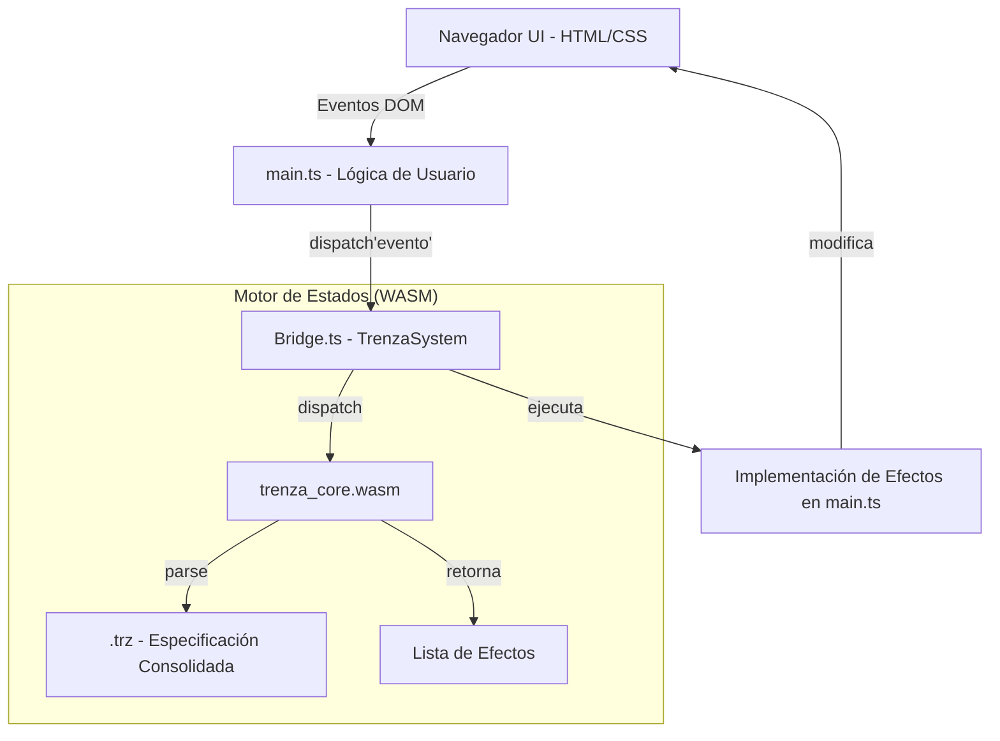

# Arquitectura del Runtime WASM en Trenza DSL

Este documento describe cómo interactúan las piezas del demostrador para ejecutar una especificación DSL en el navegador.

## Vista General

A diferencia de la arquitectura anterior (donde se generaba un binario WASM por proyecto), el nuevo modelo es **modular y desacoplado**.

## Componentes

### 1. `trenza_core.wasm` (Núcleo Genérico)
Es un binario absoluto e independiente escrito en Rust. No sabe nada de "Cronómetros" ni de "Sesiones" en tiempo de compilación. Es un **intérprete de grafos de estados**.
- **Entrada**: Una cadena de texto con la especificación `.trz` completa.
- **Función**: Evalúa transiciones y retorna efectos basados en el modelo de Trenza.

### 2. Especificación `.trz` (Carga Dinámica)
Es el archivo de texto que contiene las reglas de tu sistema. El navegador lo carga como un recurso (un "asset") y lo inyecta en el núcleo WASM al iniciar. Esto permite cambiar la lógica del sistema sin recompilar el binario WASM.

### 3. Bridge TS (`TrenzaSystem`)
Es la clase generada automáticamente por `trenza-cli`. Actúa como el "Director de Orquesta":
- **Tipado**: Define los `enums` de contextos y las interfaces de efectos posibles para tu proyecto específico.
- **Despacho**: Facilita el envío de eventos al núcleo WASM.
- **Ejecución**: Recibe la lista de efectos que el motor WASM ha disparado y los mapea a funciones TypeScript reales en tu aplicación.

### 4. `main.ts` (Implementación Real)
Es tu aplicación final. Aquí es donde decides **qué hace** cada efecto (ej. "cuando Trenza diga `iniciar_sesion`, yo arranco un timer de JS y actualizo el DOM").

## Flujo de una interacción

1. El usuario pulsa el botón **"Iniciar Tarea"**.
2. `main.ts` llama a `system.dispatch('iniciarTarea')`.
3. El Bridge inyecta este evento en el núcleo WASM.
4. El núcleo WASM consulta el DSL consolidado y decide que el estado cambia a `SesionActiva` y dispara el efecto `iniciar_sesion`.
5. El Bridge captura `iniciar_sesion` y ejecuta la función `effects.iniciar_sesion` que tú has definido en `main.ts`.
6. El timer empieza a correr en el navegador.
