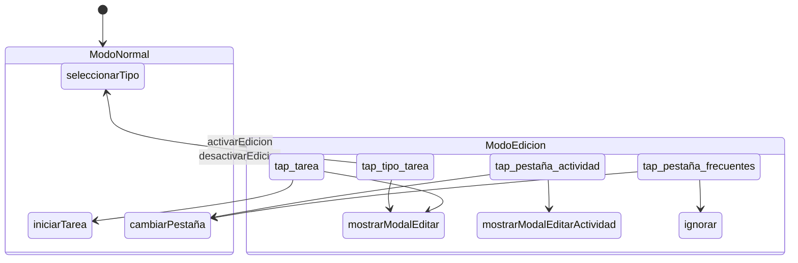

# Diseño del lenguaje — helix-dsl-verified

**Estado**: propuesta de diseño — en revisión
**Fecha**: 4 de marzo de 2026
**Participantes**: desarrollador + Claude Sonnet 4.6 + Claude Opus 4.6

---

## Principio rector: la legibilidad es un requisito formal

Los métodos formales tienen un problema de adopción. No es que los ingenieros
de software no necesiten razonamiento formal — es que la notación habitual
(lógica temporal, álgebra relacional, tipos dependientes) aleja a la mayoría
de profesionales que más se beneficiarían de ellos.

Helix toma una posición deliberada: **las propiedades formales se expresan
como reglas legibles, no como fórmulas**. El rigor no viene de la notación
sino de la estructura. Un DSL bien diseñado puede ser tan verificable como
TLA+ sin necesitar que el usuario sepa qué es un operador temporal.

Esto no es una concesión a la simplicidad. Es una decisión de diseño: si el
DSL es ilegible para un ingeniero de software medio, ha fracasado en su
objetivo, independientemente de cuán formalmente correcto sea.

---

## Influencia: soluciones autocontenidas

El trabajo de Reuven Cohen (rUv) sobre soluciones autocontenidas aporta un
principio que encaja naturalmente con helix.

Cohen construye sistemas que empaquetan todo lo necesario para funcionar y
verificarse en un solo artefacto. Su proyecto RuView (captura de movimiento
vía WiFi) es un ejemplo extremo: sensores ESP32 a 8 dólares que procesan
señales WiFi localmente, sin internet, sin nube, sin dependencias externas.
El artefacto incluye modelo, runtime de inferencia y verificación
criptográfica — todo en un solo archivo binario (formato RVF).

El principio relevante para helix no es técnico sino arquitectónico:

> Cada artefacto debe contener todo lo necesario para verificar su propia
> corrección, sin depender de nada externo.

En RuView, puedes ejecutar `./verify` con solo Python y numpy — sin hardware
WiFi — y obtener una validación completa del pipeline de procesamiento.

Helix adopta este principio: **cada contexto es una unidad autocontenida**.
Contiene su especificación, genera su implementación, sus tests y su
esquemático, y puede verificarse en aislamiento. No necesitas ejecutar la
aplicación completa para saber si un contexto está bien definido.

Hay una conexión adicional con la metodología SPARC de Cohen (Specification,
Pseudocode, Architecture, Refinement, Completion): ambas parten de que la
especificación es el artefacto primario. Pero en SPARC, la especificación
es un documento que humanos y LLMs leen. En helix, **la especificación es
el programa**. No hay brecha entre lo que se especifica y lo que se ejecuta.

---

## La unidad mínima de especificación: el contexto

La primera pregunta abierta del concepto inicial era: *¿qué es la unidad
mínima de especificación?*

La respuesta es el **contexto** — en el sentido DCI de Reenskaug.

Un contexto es la menor porción de especificación que es autocontenida y
verificable por sí misma. Contiene:

- Un **nombre** que corresponde a un caso de uso del dominio.
- Los **roles** que participan en ese caso de uso.
- Los **eventos** que cada rol puede recibir.
- Las **acciones** que resultan de cada evento.
- Las **transiciones** a otros contextos.
- Los **efectos** que se producen (llamadas API, cambios en DOM, etc.).

No existe una especificación helix más pequeña que un contexto. Un evento
suelto no tiene significado. Un rol sin contexto no tiene comportamiento.
Un contexto es el átomo del sistema — indivisible y autocontenido.

---

## Gramática del DSL

La gramática de helix usa indentación (como Python) y palabras clave legibles.
No hay operadores simbólicos excepto `->` para indicar consecuencia.

### Estructura de un contexto

```
context <nombre>:
    [requires: <condiciones>]

    role <nombre_rol>:
        on <evento> -> <acción>
        [on <evento> -> ignorar]

    [transitions:
        on <evento> -> <otro_contexto>]

    [effects:
        <acción> -> <descripción_del_efecto>]
```

### Reglas sintácticas

- Los nombres de contexto empiezan con mayúscula: `ModoEdicion`, `SesionActiva`.
- Los nombres de rol empiezan con minúscula: `tarjeta`, `pestaña_actividad`.
- Los eventos empiezan con minúscula: `tap`, `doble_tap`, `mantener`.
- Las acciones empiezan con minúscula: `mostrarModal`, `iniciarTarea`.
- La palabra `ignorar` significa "este evento está contemplado y no hace nada".
- Los comentarios usan `--` (doble guion, como SQL y Haskell).

### Vocabulario reservado

| Palabra | Significado |
|---------|-------------|
| `system` | Declara el sistema completo con sus contextos |
| `context` | Declara un contexto (caso de uso) |
| `role` | Declara un rol dentro de un contexto |
| `on` | Declara un manejador de evento |
| `->` | Indica consecuencia: evento -> acción |
| `ignorar` | El evento está contemplado pero no produce acción |
| `bloqueado` | El evento está explícitamente prohibido en este contexto |
| `requires` | Condición necesaria para que el contexto esté activo |
| `transitions` | Declara cambios de contexto |
| `effects` | Declara efectos secundarios asociados a acciones |
| `external` | Marca una acción implementada en código convencional |

---

## Ejemplo completo: el cronómetro PSP

El cronómetro-psp tiene cinco condicionales dispersos que dependen del booleano
`AppState.modoEdicion` (ver `frontend/js/app.js`, líneas 286, 323, 411, 651, 662).

En helix, esos cinco condicionales desaparecen. En su lugar hay dos contextos:

```
system CronometroPSP:
    initial: ModoNormal
    roles: tipo_tarea, tarea, pestaña_actividad, pestaña_frecuentes
    events: tap, iniciar

-- Contexto: uso normal del cronómetro
context ModoNormal:

    role tipo_tarea:
        on tap -> seleccionarTipo(self.tipoId)

    role tarea:
        on tap -> iniciarTarea(self.tareaId)

    role pestaña_actividad:
        on tap -> cambiarPestaña(self.id)

    role pestaña_frecuentes:
        on tap -> cambiarPestaña('frecuentes')

    transitions:
        on activarEdicion -> ModoEdicion

    effects:
        iniciarTarea -> POST /api/sesiones { tipoTareaId, comentario }
        cambiarPestaña -> actualizarUI()

-- Contexto: edición de actividades y tareas
context ModoEdicion:

    role tipo_tarea:
        on tap -> mostrarModalEditar(self.tipoId)

    role tarea:
        on tap -> mostrarModalEditar(self.tipoId)

    role pestaña_actividad:
        on tap -> mostrarModalEditarActividad(self.id)

    role pestaña_frecuentes:
        on tap -> ignorar                         -- explícito: no se puede editar

    transitions:
        on desactivarEdicion -> ModoNormal

    effects:
        mostrarModalEditar -> GET /api/tipos-tarea?id=
        mostrarModalEditarActividad -> GET /api/actividades?id=
```

### Qué hace visible esta especificación

1. **Los cinco condicionales del código actual no existen.** No hay `if (modoEdicion)`
   en ningún sitio. La factoría (que genera el `system`) decide qué contexto está
   activo; el resto es polimórfico.

2. **`pestaña_frecuentes` en `ModoEdicion` dice `ignorar`**, no simplemente la omite.
   Si fuera omitida, el verificador reportaría: "el rol `pestaña_frecuentes` maneja
   el evento `tap` en `ModoNormal` pero no en `ModoEdicion`". El olvido es imposible.

3. **La acción `iniciarTarea` no aparece en `ModoEdicion`** porque ningún camino
   conduce a ella desde ese contexto. No hace falta un guard defensivo
   `if (modoEdicion) return` porque la topología lo impide.

4. **Los efectos son declarativos.** La especificación dice *qué* se comunica con el
   exterior, no *cómo*. El cómo vive en el código generado o en un módulo `external`.

### Comparación lado a lado

| Código actual (app.js) | Helix |
|---|---|
| `if (AppState.modoEdicion)` en 5 sitios | 0 condicionales; 2 contextos |
| Guard olvidado = bug silencioso | Rol sin manejador = error de verificación |
| Efectos mezclados con lógica de control | Efectos declarados por separado |
| Estado implícito en booleano global | Estado explícito como contexto activo |
| Diagrama: solo si alguien lo dibuja | Esquemático Mermaid auto-generado |

---

## Qué se genera: las tres hebras

Cada contexto helix genera tres artefactos — las tres hebras de la hélice:

### Hebra 1: Implementación

Para el contexto `ModoEdicion`, el generador produce (en JavaScript):

```javascript
const ModoEdicion = {
    tipo_tarea: {
        onTap(self) { mostrarModalEditar(self.tipoId); }
    },
    tarea: {
        onTap(self) { mostrarModalEditar(self.tipoId); }
    },
    pestaña_actividad: {
        onTap(self) { mostrarModalEditarActividad(self.id); }
    },
    pestaña_frecuentes: {
        onTap(self) { /* ignorar */ }
    }
};
```

### Hebra 2: Tests

Para el mismo contexto, el reverso algebraico:

```javascript
describe('ModoEdicion', () => {
    test('tipo_tarea: tap -> mostrarModalEditar', () => {
        dado({ contexto: ModoEdicion, rol: 'tipo_tarea' });
        cuando('tap', { tipoId: 42 });
        entonces(mostrarModalEditar).fueInvocadoCon(42);
    });

    test('pestaña_frecuentes: tap -> ignorar', () => {
        dado({ contexto: ModoEdicion, rol: 'pestaña_frecuentes' });
        cuando('tap');
        entonces(ningunaAccion).fueInvocada();
    });
});
```

Cada pareja evento-acción produce exactamente un test. No hay tests
que escribir manualmente: si la especificación cambia, los tests cambian.

### Hebra 3: Esquemático

El diagrama Mermaid auto-generado para el sistema completo:



Las tres hebras son proyecciones del mismo artefacto. Modificar una
implica regenerar las otras dos. No pueden desincronizarse.

---

## Verificación sin notación simbólica

Helix verifica propiedades formales expresándolas como reglas legibles.
Cada regla puede comprobarse por inspección de la especificación, sin
ejecutar código.

### Regla 1: Completitud

**Enunciado**: Todo rol que maneje un evento en algún contexto debe
manejar ese mismo evento en todos los contextos del sistema, aunque sea
con `ignorar` o `bloqueado`.

**Ejemplo**: Si `pestaña_frecuentes` responde a `tap` en `ModoNormal`,
debe responder a `tap` en `ModoEdicion`. Si no lo hace, el verificador
reporta:

```
ERROR [completitud]: pestaña_frecuentes.tap definido en ModoNormal
                     pero ausente en ModoEdicion
```

**Qué previene**: El bug original — un evento sin manejador en un contexto.

### Regla 2: Determinismo

**Enunciado**: En un contexto dado, cada evento de cada rol produce
exactamente una acción. No hay ambigüedad.

**Ejemplo**: Si alguien escribe:

```
role tarjeta:
    on tap -> mostrarModalEditar
    on tap -> seleccionarTipo          -- ERROR
```

El verificador reporta:

```
ERROR [determinismo]: tarjeta.tap tiene dos acciones en ModoEdicion
```

**Qué previene**: Comportamiento impredecible por manejadores duplicados.

### Regla 3: Alcanzabilidad

**Enunciado**: Todo contexto debe poder alcanzarse desde el contexto
inicial a través de alguna secuencia de transiciones.

**Ejemplo**: Si se define un contexto `ModoMantenimiento` pero ningún
otro contexto tiene una transición hacia él:

```
ERROR [alcanzabilidad]: ModoMantenimiento no es alcanzable desde
                        ModoNormal (contexto inicial)
```

**Qué previene**: Código muerto — contextos que se especifican pero
nunca se activan.

### Regla 4: Retorno

**Enunciado**: Todo contexto no inicial debe tener al menos una
transición que, directa o indirectamente, regrese al contexto inicial.

**Qué previene**: Estados sumidero — contextos de los que no se puede
salir.

### Regla 5: Exhaustividad de roles

**Enunciado**: Todo rol declarado en el bloque `system` debe aparecer
en todos los contextos del sistema.

**Ejemplo**: Si `system` declara el rol `pestaña_frecuentes` pero
`ModoEdicion` no lo menciona:

```
ERROR [exhaustividad]: rol pestaña_frecuentes declarado en el sistema
                       pero ausente del contexto ModoEdicion
```

**Qué previene**: Roles olvidados — elementos del interfaz cuyo
comportamiento en un contexto no fue considerado.

### Nota sobre equivalencia formal

Estas cinco reglas son equivalentes a las propiedades que se expresarían
con lógica temporal en TLA+ o con invariantes en Alloy. La diferencia es
que un ingeniero de software puede leerlas, discutirlas con su equipo, y
verificarlas con una herramienta que emite mensajes en lenguaje natural.

---

## Composición de contextos

La quinta pregunta abierta era: *¿cómo se expresa `ModoEdicion + SesiónActiva`?*

La solución DCI (documentada en `influencias-dci.md`) se mantiene: los contextos
coexisten, no se combinan. Pero la composición necesita reglas de prioridad
cuando dos contextos activos asignan comportamientos distintos al mismo rol
para el mismo evento.

### Reglas de composición

```
system CronometroPSP:
    initial: ModoNormal

    -- Los contextos se declaran en orden de prioridad descendente
    contexts:
        SesionActiva        -- mayor prioridad
        ModoEdicion
        ModoNormal          -- menor prioridad (base)

    composition: prioridad  -- el contexto de mayor prioridad prevalece
```

Si `SesionActiva` y `ModoEdicion` ambos definen un manejador para
`tarea.tap`, prevalece el de `SesionActiva`. Si `SesionActiva` no define
ese manejador, se busca en `ModoEdicion`, y luego en `ModoNormal`.

Alternativa: `composition: exclusiva` — solo el contexto activo de mayor
prioridad tiene efecto. Los demás se ignoran completamente. Esto es más
simple pero menos expresivo.

La elección entre prioridad y exclusiva es una decisión del diseñador del
sistema, no del lenguaje. Helix ofrece ambas.

---

## Efectos secundarios

Los efectos (llamadas API, modificaciones al DOM, navegación) se declaran
en el contexto pero no se ejecutan por el DSL. El DSL genera la interfaz;
el runtime la implementa.

```
context ModoEdicion:
    role tipo_tarea:
        on tap -> mostrarModalEditar(self.tipoId)

    effects:
        mostrarModalEditar -> external cargarDatosTarea(tipoId)
```

La palabra `external` indica que `cargarDatosTarea` es una función
convencional (JavaScript, Python, etc.) que el código generado invoca.
Helix no la genera — espera encontrarla en el entorno destino.

Esto resuelve la segunda pregunta abierta: los efectos se declaran en
helix pero se implementan fuera de helix. El DSL define *qué* efectos
ocurren; el código convencional define *cómo*.

---

## Interoperabilidad con código convencional

Helix no pretende reemplazar todo el código de una aplicación. Pretende
gobernar la lógica de estados y eventos, delegando el resto.

### Módulos external

```
external module cronometro_api:
    cargarDatosTarea(tipoId) -> TipoTarea
    guardarEdicion(tipoId, datos) -> Resultado
    iniciarSesion(tareaId, comentario) -> Sesion
```

El bloque `external` declara funciones que existen en código convencional.
Helix las trata como cajas negras: conoce su firma pero no su implementación.

Los tests generados usan mocks para estas funciones. Los tests de
integración (que verifican el `external` real) están fuera del alcance
de helix — pertenecen al código convencional.

---

## Decisiones pendientes

1. **Compilación destino**: ¿JavaScript como primer target? ¿TypeScript?
   El cronómetro-psp sugiere JS vanilla, pero TypeScript daría verificación
   de tipos en el código generado.

2. **Formato de archivo**: ¿`.hlx`? ¿Un archivo por contexto o un archivo
   por sistema?

3. **Herramienta de verificación**: ¿CLI? ¿Plugin de editor? ¿Integración
   con CI/CD?

4. **Generación incremental**: Cuando cambia un contexto, ¿se regenera
   todo el sistema o solo los artefactos afectados?

5. **Sintaxis para datos del rol**: `self.tipoId` asume que los roles
   tienen propiedades. ¿Cómo se declaran? ¿Se infieren del código destino?

---

## Respuestas a las preguntas abiertas

Para referencia, las preguntas de `concepto-inicial.md` y su estado actual:

| # | Pregunta | Estado |
|---|----------|--------|
| 1 | ¿Unidad mínima de especificación? | **Respondida**: el contexto |
| 2 | ¿Efectos secundarios? | **Respondida**: declarados con `effects`, implementados con `external` |
| 3 | ¿Compila o interpreta? | **Parcial**: compila a lenguaje destino (propuesto JS/TS) |
| 4 | ¿Interop con código existente? | **Respondida**: módulos `external` con firma declarada |
| 5 | ¿Composición de estados? | **Respondida**: contextos coexistentes con reglas de prioridad |
