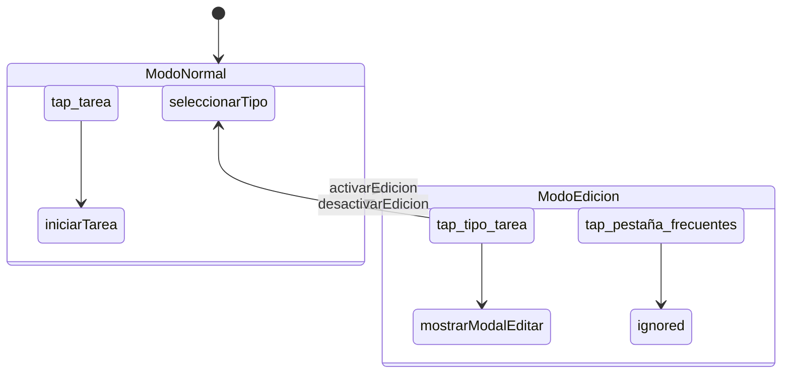

# Trenza DSL User Manual

**Version**: First Stable Specification
**Date**: March 20, 2026
**Authors**: Claude Opus 4.6, with material from Claude Sonnet 4.6 and Gemini

---

## 1. What Is Trenza

Trenza is a domain-specific language (DSL) designed to specify interactive systems
in a verifiable way. From a Trenza specification, the compiler generates three
artifacts — implementation, tests, and schematics — that cannot fall out of sync.

Trenza does not replace all code in an application. It governs state logic,
events, and transitions, delegating side effects (API calls, DOM operations, etc.)
to conventional code.

### 1.1 Who It Is For

Trenza is designed for two types of user:

- **Human developers** who need to reason about complex state flows without
  scattering logic across dozens of files.
- **LLMs** generating code: by co-generating implementation and tests from the
  same specification, an LLM cannot "forget" a case because the test is the
  algebraic inverse of the implementation.

### 1.2 The Problem It Solves

In a modern event-driven application, a state like "edit mode" is typically
expressed as a boolean (`if (modoEdicion)`) scattered across multiple files.
Forgetting a guard in a listener produces a silent bug.

In Trenza, "edit mode" is a **context** — an object with declared roles,
events, and transitions. If an event has no handler in that context, the verifier
reports it at compile time. Forgetting is impossible.

### 1.3 File Extensions

| Extension | Content |
|-----------|---------|
| `.trz` | Trenza source file |
| `.tzp` | Verifiable package (self-contained ZIP) |

---

## 2. Core Concepts

Trenza is based on Trygve Reenskaug's DCI (Data, Context, Interaction) separation:

| Layer | Question it answers | Where it lives |
|-------|---------------------|----------------|
| **Data** | "What is this?" | `data.trz` |
| **Context** | "What use case is active?" | `contexts/*.trz` |
| **Interaction** | "What does this do here?" | Role handlers inside the context |

### 2.1 Data: Structure Without Behavior

Data is what something *is*. It has no methods or behavior. A
`Tarea` is a `Tarea` regardless of whether the system is in
normal mode or edit mode.

```trenza
data Tarea:
    tareaId: Id
    nombre: Texto
    mutable estado: Texto
```

Fields are immutable by default. The `mutable` modifier explicitly marks
fields that can change.

The optional `[clasificacion:]` annotation allows the verifier to apply
data compliance rules (GDPR Art. 25):

```trenza
data DatosSesion [clasificacion: personal]:
    usuario: Texto
    inicio: Timestamp
```

### 2.2 Context: The Active Use Case

A context is the minimum unit of specification. It is self-contained
and verifiable on its own. It contains:

- **Roles**: actors that participate in the use case.
- **Events**: what can happen.
- **Actions**: what results from each event.
- **Transitions**: changes to other contexts.
- **Effects**: domain actions upon activation/deactivation.

There are three types of context:

| Type | Declaration | Behavior |
|------|-------------|----------|
| **Base** | `contexts:` | Mutually exclusive. Exactly one active at a time. |
| **Overlay** | `overlays:` | Stack on top of the base without replacing it. |
| **Concurrent** | `concurrent:` | Coexist with the base. Activated/deactivated independently. |

### 2.3 Role: What Something Does Here

A role binds a data type to behavior within a context. The
same data type can have different roles in different contexts:

```trenza
-- In ModoNormal: tapping a card selects the type
context ModoNormal:
    role tipo_tarea: TipoTarea
        on tap -> seleccionarTipo(self.tipoId)

-- In ModoEdicion: tapping the same card opens the editor
context ModoEdicion:
    role tipo_tarea: TipoTarea
        on tap -> mostrarModalEditar(self.tipoId)
```

The card does not "know" which mode it is in. The context assigns its
behavior.

---

## 3. System Structure

### 3.1 System File (`system.trz`)

Every Trenza system has a root file that declares the topology:

```trenza
system CronometroPSP:
    initial: ModoNormal

    contexts:
        ModoEdicion
        ModoNormal

    concurrent:
        SesionActiva

    overlays:
        ModalComentario
        ModalEditarTarea
        ModalEditarActividad
        MenuConfiguracion
```

`initial:` declares the base context active at system startup.

### 3.2 Data File (`data.trz`)

All data types are declared in a separate file:

```trenza
data TipoTarea:
    tipoId: Id
    nombre: Texto
    icono: Texto

data Actividad:
    id: Id
    nombre: Texto
    color: Color

data Comentario:
    mutable texto: Texto
    mutable sustituir: Booleano
```

### 3.3 One File Per Context (`contexts/*.trz`)

Each context lives in its own file. The directory structure
reflects the hierarchy:

```
contexts/
├── ModoNormal.trz
├── ModoEdicion.trz
├── ModoEdicion/
│   ├── EditandoTarea.trz       -- child context
│   └── EditandoActividad.trz
├── SesionActiva.trz
├── ModalComentario.trz
└── MenuConfiguracion.trz
```

### 3.4 External Modules (`external/*.trz`)

Actions that interact with the outside world are declared in
external modules:

```trenza
external cronometro_api:
    action guardar(actividad: Actividad):
        ok -> Actividad
        error -> ErrorExterno

    action borrar(id: Id):
        ok -> nulo
        error -> ErrorExterno
```

Every external action must declare its result branches (`.ok` and
`.error`). The verifier requires that every context invoking an
external action handles both branches.

The `ErrorExterno` type is a standard type:

```trenza
data ErrorExterno:
    codigo: Texto          -- "red_timeout", "validacion", "no_autorizado"
    mensaje: Texto         -- human-readable
    recuperable: Booleano  -- does retrying make sense?
```

---

## 4. Anatomy of a Context

A complete context can include up to six sections:

```trenza
context NombreDelContexto:

    -- 1. Input data (optional)
    input:
        dato_requerido: Tipo
        mutable dato_editable: Tipo

    -- 2. Roles with data bindings
    role nombre_rol: TipoDato (bind: dato_requerido.campo)
        on evento -> accion
        on otro_evento -> ignored

    -- 3. Extension slots (overlays only)
    slot nombre_slot

    -- 4. Domain effects
    effects:
        [on_entry] -> accion_al_entrar()
        [on_exit]  -> accion_al_salir()

    -- 5. Transitions
    transitions:
        on evento_resultado -> OtroContexto
        on cancelar -> [close_overlay]

    -- 6. Contributions to other contexts (concurrent only)
    fills OtroContexto.nombre_slot:
        role rol_inyectado: Tipo
            on evento -> accion
```

### 4.1 `input:` — Input Data

Declares the data the context needs in order to exist. When a
context is activated, the caller must supply this data:

```trenza
context ModalEditarActividad:
    input:
        mutable actividad_en_edicion: Actividad
```

The verifier checks that the caller supplies all required fields
with compatible types.

### 4.2 `role` — Roles With Events

A role binds a data type to behavior. Each event in a
role produces exactly one action:

```trenza
role boton_guardar: Boton
    on tap -> guardar(actividad) when actividad.nombre != ""
    on tap -> ignored when actividad.nombre == ""
```

#### Data Bindings With `bind:`

A role can be declaratively bound to a field of the model:

```trenza
role campo_nombre: CampoTexto (bind: actividad_en_edicion.nombre)
role selector_color: SelectorColor (bind: actividad_en_edicion.color)
```

`bind:` establishes a Model → Role binding. The verifier checks
that the field exists in `data.trz` and that the type is compatible.

#### Pre-action Guards With `when`

Guards validate conditions before emitting an event:

```trenza
role boton_guardar: Boton
    on tap -> guardar(actividad) when actividad.nombre != ""
    on tap -> ignored when actividad.nombre == ""
```

Guards can only evaluate the context's `input:` and the state
of its own roles.

#### Special Actions

| Action | Meaning |
|--------|---------|
| `ignored` | The event is accounted for. It produces no action. |
| `forbidden` | The event is explicitly prohibited. |

The difference: `ignored` means "nothing happens" (intentional). `forbidden`
means "this should not occur here" (explicit denial, aligned with
the principle of least privilege).

### 4.3 `effects:` — Domain Effects

Effects are actions executed when the context is activated or deactivated:

```trenza
effects:
    [on_entry] -> cronometro.start(tarea_seleccionada.tareaId)
    [on_entry] -> analytics.track("session_start")
    [on_exit]  -> cronometro.stop()
```

If an `[on_entry]` needs to fire more than one effect, the trigger is
repeated. Each line executes in declaration order. The verifier
reasons about each one independently.

Effects can also respond to results from external actions:

```trenza
effects:
    [on guardar.error(err)] -> ultimo_error.asignar(err.mensaje)
```

**Visibility scope**: arguments in `effects:` are names declared
in the context's `input:`. `self` is not valid here — `self` only exists
inside role handlers, where it refers to the instance of the data bound
to the role. In `effects:`, there is no defined "self".

```trenza
-- INCORRECT:
effects:
    [on_entry] -> api.guardar(self.nombre)    -- self has no referent in effects

-- CORRECT: the data comes from input:
context ModalEditar:
    input:
        mutable elemento: Elemento

    effects:
        [on_entry] -> api.cargar(elemento.id)
```

### 4.4 `transitions:` — Context Changes

Declare the system's state changes:

```trenza
transitions:
    on activarEdicion -> ModoEdicion
    on guardar.ok -> [close_overlay]
    on guardar.error -> [stay]
    on guardar.error -> [close_overlay] when err.recuperable == false
```

#### Pseudo-transitions

| Pseudo-transition | Meaning |
|-------------------|---------|
| `[close_overlay]` | Closes the overlay; returns to the base context. |
| `[stay]` | Remains in the current context. |
| `[deactivate]` | Deactivates a concurrent context. |

#### Post-result Guards

Transitions can have guards that evaluate the result payload:

```trenza
transitions:
    on guardar.error -> [close_overlay] when err.recuperable == false
    on guardar.error -> [stay] when err.recuperable == true
```

### 4.5 `slot` and `fills` — Composition Between Contexts

An overlay can declare extension points that a concurrent
fills when both are active:

**In the overlay:**

```trenza
context ModalComentario:
    input:
        mutable comentario: Comentario

    role campo_comentario: CampoTexto (bind: comentario.texto)

    slot sesion_opts  -- empty by default

    transitions:
        on guardar.ok -> [close_overlay]
```

**In the concurrent:**

```trenza
context SesionActiva:
    fills ModalComentario.sesion_opts:
        role checkbox_sustituir: Checkbox
            on cambio -> marcarSustituir(self.marcado)

        effects:
            [on_entry] -> sesiones_api.cargar_recientes()
```

The `fills` block is a mini-context that can contain `role` and
`effects:`, but not `input:`, `transitions:`, or nested `slot`s.

---

## 5. Nested Contexts

Contexts can be nested up to two levels deep to
express sub-states:

```trenza
context ModoEdicion:

    role pestaña_frecuentes: Pestaña
        on tap -> ignored

    transitions:
        on desactivarEdicion -> ModoNormal

    context EditandoTarea:
        role campo_nombre: CampoTexto
            on cambio -> actualizarNombre(self.valor)
        role boton_guardar: Boton
            on tap -> guardarEdicion()

        transitions:
            on guardarEdicion -> ModoEdicion
            on cancelar -> ModoEdicion
```

### 5.1 Inheritance Rules (H1–H5)

**H1 — Implicit inheritance**: a child inherits all roles from the parent.

**H2 — Local roles**: a child can declare new roles, invisible
to the parent and siblings.

**H3 — Completeness by level**: verification is applied per level.
A local role of a child does not obligate its siblings.

**H4 — Explicit override**: to change an inherited handler, the
role is re-declared in full. The verifier emits an informational note.

**H5 — Prohibition of new events on inherited roles**: a child cannot
add events to an inherited role. For new events, a local role is declared
with the same data type.

### 5.2 Inheritance Inspection

The CLI shows the expanded view of a child context:

```
$ trenza inspect contexts/ModoEdicion/EditandoTarea.trz

context EditandoTarea (child of ModoEdicion):

  [inherited] role pestaña_frecuentes: Pestaña
      on tap -> ignored

  [local] role campo_nombre: CampoTexto
      on cambio -> actualizarNombre(self.valor)

  [local] role boton_guardar: Boton
      on tap -> guardarEdicion()

  transitions:
      on guardarEdicion -> ModoEdicion
      on cancelar -> ModoEdicion
```

---

## 6. Verification

Trenza verifies six formal properties expressed as readable rules.
Each rule can be checked by inspection, without executing code.

### 6.1 The Six Rules

**Rule 1 — Completeness**: Every role that handles an event in any
context must handle it in all contexts of the system.

```
ERROR [completeness]: pestaña_frecuentes.tap defined in ModoNormal
                      but absent in ModoEdicion
```

**Rule 2 — Determinism**: Each event of each role produces exactly
one action in a given context.

```
ERROR [determinism]: tarjeta.tap has two actions in ModoEdicion
```

**Rule 3 — Reachability**: Every context is reachable from the
initial one.

```
ERROR [reachability]: ModoMantenimiento is not reachable from
                      ModoNormal (initial context)
```

**Rule 4 — Return**: Every non-initial context has a path
back to the initial context.

**Rule 5 — Role exhaustiveness**: Every role declared in the system
appears in all contexts.

**Rule 6 — Data conformance**: No classified data flows to
an `external` module without explicit authorization.

```
ERROR [conformance]: DatosSesion [clasificacion: personal] flows to
                     modulo_analytics which does not declare [autorizado_para: personal]
```

### 6.2 Slot Rules (S1–S5)

Slots introduce five additional rules:

**S1 — Valid reference**: `fills X.slot_name` is valid only if `X`
declares `slot slot_name`.

**S2 — Empty slot is valid**: A slot without `fills` is not an error. It is the
base case.

**S3 — Conflict**: If two concurrent contexts do `fills` on the same
slot, the verifier requires resolution in `system.trz`.

**S4 — Conditional completeness**: The roles in a `fills` block are subject
to verification only within the `concurrent ∩ overlay` scope. They do not generate
obligations in other contexts.

**S5 — Reachability does not apply to slot roles**: Roles inside a
`fills` block are not contexts. Their existence depends on both contexts
being active, which is already covered by the reachability of each
context individually.

---

## 7. Artifact Generation

Each Trenza specification generates three artifacts — the three strands:

### 7.1 Strand 1: Implementation (Rust)

Contexts are translated into an enum with an exhaustive `match`:

```rust
pub enum Contexto {
    ModoNormal,
    ModoEdicion,
}

pub fn handle_tipo_tarea_tap(ctx: &Contexto, tipo: &TipoTarea) -> Accion {
    match ctx {
        Contexto::ModoNormal => Accion::SeleccionarTipo(tipo.tipo_id),
        Contexto::ModoEdicion => Accion::MostrarModalEditar(tipo.tipo_id),
    }
}
```

Rust's exhaustive `match` enforces the same completeness as the
Trenza verifier, but at the compilation level of the generated code.

The code is compiled to WASM for universal deployment.

### 7.2 Strand 2: Tests

Each event-action pair produces one test per context:

```rust
#[test]
fn modo_edicion_pestaña_frecuentes_tap_ignores() {
    let ctx = Contexto::ModoEdicion;
    let resultado = handle_pestaña_frecuentes_tap(&ctx);
    assert_eq!(resultado, Accion::Ignorar);
}
```

There are no manual tests. If the specification changes, the tests change.

For overlays with slots, variants are generated:

| Variant | What it tests |
|---------|---------------|
| Overlay alone (empty slot) | Behavior without an active concurrent |
| Overlay + concurrent | Behavior with injected roles |

### 7.3 Strand 3: Schematics (Mermaid)

Auto-generated system diagram:



The three strands are projections of the same artifact. Modifying one
implies regenerating the other two. They cannot fall out of sync.

---

## 8. External Modules and Interoperability

Trenza declares the interface of external functions; conventional
code implements them:

```trenza
external cronometro_api:
    action iniciar_sesion(tarea_id: Id, comentario: Texto):
        ok -> Sesion
        error -> ErrorExterno
```

The generator produces a Rust trait that conventional code implements:

```rust
pub trait CronometroApi {
    fn iniciar_sesion(&self, tarea_id: Id, comentario: &str) -> Result<Sesion, ErrorExterno>;
}
```

Generated tests use mocks. Integration tests (against the real
implementation) are outside the scope of Trenza.

---

## 9. The `.tzp` Package

A complete Trenza system is packaged as a self-contained ZIP:

```
cronometro-psp.tzp
├── mimetype                        -- "application/trenza-dsl"
├── manifest.json                   -- checksums, version
├── system.trz
├── data.trz
├── contexts/
│   ├── ModoNormal.trz
│   ├── ModoEdicion.trz
│   └── ModoEdicion/
│       ├── EditandoTarea.trz
│       └── EditandoActividad.trz
├── external/
│   └── cronometro_api.trz
├── generated/
│   ├── impl/
│   │   └── cronometro_psp.rs       -- strand 1
│   ├── tests/
│   │   └── cronometro_psp_test.rs  -- strand 2
│   └── schematics/
│       └── system.mermaid          -- strand 3
└── verification/
    └── report.json                 -- verification result
```

The `manifest.json` contains checksums for each file. This enables
incremental regeneration: if only one context changes, only its
artifacts are regenerated.

The package embodies the self-containment principle: it holds the
specification, implementation, tests, schematics, and verification.
A single `.tzp` file is copied, versioned, and deployed as
a unit.

---

## 10. CLI

```bash
trenza verify sistema.tzp         -- verifies the complete system
trenza verify contexto.trz        -- verifies an isolated context
trenza generate sistema.tzp       -- generates the three strands
trenza check sistema.tzp          -- verify + generate + runs tests
trenza inspect contexto.trz       -- shows expanded inheritance
```

Verifier output:

```
$ trenza verify cronometro-psp.tzp

  completeness ........... OK
  determinism ............ OK
  reachability ........... OK
  return ................. OK
  role exhaustiveness .... OK
  data conformance ....... OK

  6/6 rules passed. System verified.
  Artifact checksum: a7f8b9...
```

---

## 11. Naming Conventions

| Element | Convention | Example |
|---------|------------|---------|
| Context | PascalCase | `ModoEdicion`, `ModalComentario` |
| Data type | PascalCase | `TipoTarea`, `Actividad` |
| Role | snake_case | `tarjeta_tipo`, `boton_guardar` |
| Event | snake_case | `tap`, `doble_tap`, `cambio` |
| Action | camelCase | `mostrarModalEditar`, `actualizarNombre` |
| Slot | snake_case | `sesion_opts` |
| Comment | `--` | `-- this is a comment` |

The language keywords are in English (`ignored`, `on_entry`,
`mutable`, `when`, `slot`, `fills`). User-defined names
can be in any language.

---

## 12. Full Reserved Vocabulary

| Keyword | Meaning |
|---------|---------|
| `system` | Declares the complete system with its contexts |
| `data` | Declares a data type (structure without behavior) |
| `context` | Declares a context (use case) |
| `role` | Declares a role within a context |
| `on` | Declares an event handler |
| `->` | Indicates consequence: event -> action |
| `ignored` | The event is accounted for but produces no action |
| `forbidden` | The event is explicitly prohibited |
| `input` | Data the context requires to exist |
| `bind` | Binds a model field to a role |
| `mutable` | Marks a data item or field as modifiable |
| `transitions` | Declares context changes |
| `effects` | Declares domain side effects |
| `external` | Marks an action implemented in conventional code |
| `when` | Pre-action or post-result guard |
| `slot` | Extension point in an overlay |
| `fills` | Contribution of a concurrent to a slot |
| `self` | Reference to the properties of the data bound to the role |

---

## 13. Summary of Design Principles

1. **Each specification generates implementation + tests**: they are not
   separate artifacts but projections of the same act.

2. **All conditional code lives in factories**: the generated code
   is polymorphic. `if` statements disappear.

3. **State flows are explicit**: no global booleans
   or scattered flags. A state is a named context.

4. **Semantics are verifiable**: the six verification rules
   detect errors that in conventional code would be silent bugs.

5. **Readability is a formal requirement**: if an average software
   engineer cannot read the specification, the DSL has failed.

---

## Appendix A: Complete Example — PSP Timer

The PSP timer is Trenza's original test bench. The complete system
replaces five scattered `if (modoEdicion)` conditionals in
`app.js` with two base contexts, one concurrent, and ten overlays.

### A.1 System

```trenza
system CronometroPSP:
    initial: ModoNormal

    contexts:
        ModoEdicion
        ModoNormal

    concurrent:
        SesionActiva

    overlays:
        ModalComentario
        ModalEditarTarea
        ModalEditarActividad
        ModalCrearTarea
        ModalCrearActividad
        ModalSeleccionActividad
        ModalHistorial
        ModalReset
        ModalAcercaDe
        MenuConfiguracion
```

### A.2 Data

```trenza
data TipoTarea:
    tipoId: Id
    nombre: Texto
    icono: Texto

data Tarea:
    tareaId: Id
    tipoId: Id

data Actividad:
    id: Id
    nombre: Texto
    color: Color

data Comentario:
    mutable texto: Texto
    mutable sustituir: Booleano

data ErrorExterno:
    codigo: Texto
    mensaje: Texto
    recuperable: Booleano
```

### A.3 Base Contexts

```trenza
context ModoNormal:

    role tipo_tarea: TipoTarea
        on tap -> seleccionarTipo(self.tipoId)

    role tarea: Tarea
        on tap -> iniciarTarea(self.tareaId)

    role pestaña_actividad: Actividad
        on tap -> cambiarPestaña(self.id)

    role pestaña_frecuentes: Pestaña
        on tap -> cambiarPestaña('frecuentes')

    transitions:
        on activarEdicion -> ModoEdicion
```

```trenza
context ModoEdicion:

    role tipo_tarea: TipoTarea
        on tap -> mostrarModalEditar(self.tipoId)

    role tarea: Tarea
        on tap -> mostrarModalEditar(self.tipoId)

    role pestaña_actividad: Actividad
        on tap -> mostrarModalEditarActividad(self.id)

    role pestaña_frecuentes: Pestaña
        on tap -> ignored

    transitions:
        on desactivarEdicion -> ModoNormal
```

### A.4 Concurrent With fills

```trenza
context SesionActiva:
    input:
        tarea_seleccionada: Tarea

    role display_timer: Display (bind: cronometro.tiempo_transcurrido)
    role etiqueta_tarea: Label (bind: tarea_seleccionada.nombre)

    effects:
        [on_entry] -> cronometro.start(tarea_seleccionada.tareaId)
        [on_exit]  -> cronometro.stop()

    fills ModalComentario.sesion_opts:
        role checkbox_sustituir: Checkbox
            on cambio -> marcarSustituir(self.marcado)

        effects:
            [on_entry] -> sesiones_api.cargar_recientes()

    transitions:
        on sesionFinalizada -> [deactivate]
```

### A.5 Overlay With Slot

```trenza
context ModalComentario:
    input:
        mutable comentario: Comentario

    role campo_comentario: CampoTexto (bind: comentario.texto)
    role boton_guardar: Boton
        on tap -> guardar(comentario) when comentario.texto != ""

    slot sesion_opts

    transitions:
        on guardar.ok -> [close_overlay]
        on guardar.error -> [stay]
```

### A.6 Comparison

| `app.js` (before) | Trenza (after) |
|-------------------|----------------|
| `if (modoEdicion)` in 5 places | 0 conditionals; 2 contexts |
| `sustituirGroup.style.display = sesionActiva ? ...` | `slot` + `fills` |
| Forgotten guard = silent bug | Event without handler = compiler error |
| State scattered in global booleans | Explicit state as active context |
| Tests written by hand (if they exist) | Tests generated automatically |
| Diagram: only if someone draws it | Auto-generated Mermaid schematic |
