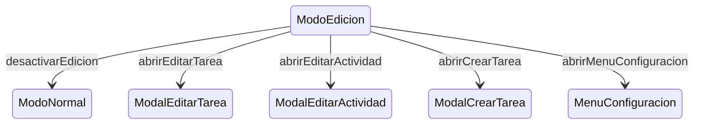

# ModoEdicion

**Tipo**: contexto base (exclusivo)
**Propósito**: tap en tarjeta abre modal de edición. Los 5 condicionales
dispersos en `app.js` desaparecen aquí.
Fuente: [`ModoEdicion.trz`](../../../examples/cronometro-psp/trenza/contexts/ModoEdicion.trz)

---

## Roles

| Rol | Tipo | Evento | Acción |
|-----|------|--------|--------|
| tarjeta_tipo | [TipoTarea](../data.md) | tap | abrirEditarTarea(self.tipoId) |
| tarjeta_tarea | [Tarea](../data.md) | tap | abrirEditarTarea(self.tipoId) |
| pestana_actividad | [Actividad](../data.md) | tap | abrirEditarActividad(self.id) |
| pestana_frecuentes | [Pestaña](../data.md) | tap | **ignorar** |
| boton_edicion | [Boton](../data.md) | tap | desactivarEdicion |
| boton_nuevo | [Boton](../data.md) | tap | abrirCrearTarea |
| boton_configuracion | [Boton](../data.md) | tap | abrirMenuConfiguracion |

> **Nota**: `pestana_frecuentes → ignorar` es el caso canónico de Trenza:
> en ModoNormal hace `cambiarPestana('frecuentes')`; en ModoEdicion,
> explícitamente no hace nada.

## Transiciones

| Evento | Destino |
|--------|---------|
| desactivarEdicion | [ModoNormal](ModoNormal.md) |
| abrirEditarTarea | [ModalEditarTarea](../overlays/ModalEditarTarea.md) |
| abrirEditarActividad | [ModalEditarActividad](../overlays/ModalEditarActividad.md) |
| abrirCrearTarea | [ModalCrearTarea](../overlays/ModalCrearTarea.md) |
| abrirMenuConfiguracion | [MenuConfiguracion](../overlays/MenuConfiguracion.md) |

> **GAP-1**: abrirEditarTarea y abrirEditarActividad necesitan pasar el ID
> del elemento al modal destino.

---

← [ModoNormal](ModoNormal.md) · ↑ [CronometroPSP](../index.md)
