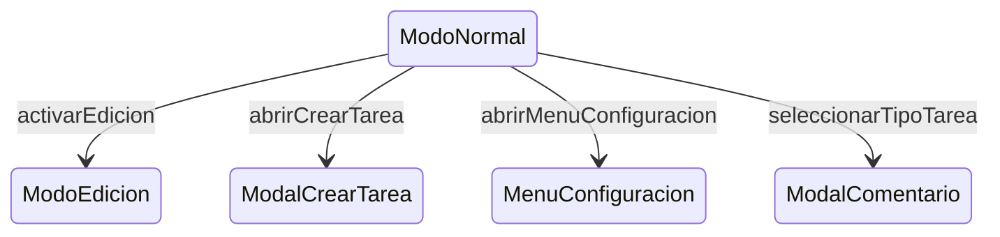

# ModoNormal

**Tipo**: contexto base (exclusivo)
**Propósito**: el usuario consulta tareas y activa sesiones de cronometraje. No hay edición.
Fuente: [`ModoNormal.trz`](../../../examples/cronometro-psp/trenza/contexts/ModoNormal.trz)

---

## Roles

| Rol | Tipo | Evento | Acción |
|-----|------|--------|--------|
| tarjeta_tipo | [TipoTarea](../data.md) | tap | seleccionarTipoTarea(self.tipoId) |
| tarjeta_tarea | [Tarea](../data.md) | tap | iniciarTarea(self.tareaId) |
| pestana_actividad | [Actividad](../data.md) | tap | cambiarPestana(self.id) |
| pestana_frecuentes | [Pestaña](../data.md) | tap | cambiarPestana('frecuentes') |
| boton_edicion | [Boton](../data.md) | tap | activarEdicion |
| boton_nuevo | [Boton](../data.md) | tap | abrirCrearTarea |
| boton_configuracion | [Boton](../data.md) | tap | abrirMenuConfiguracion |

## Transiciones

| Evento | Destino |
|--------|---------|
| activarEdicion | [ModoEdicion](ModoEdicion.md) |
| abrirCrearTarea | [ModalCrearTarea](../overlays/ModalCrearTarea.md) |
| abrirMenuConfiguracion | [MenuConfiguracion](../overlays/MenuConfiguracion.md) |
| seleccionarTipoTarea | [ModalComentario](../overlays/ModalComentario.md) |

> **GAP-5**: seleccionarTipoTarea debería ramificar a ModalComentario
> (1 actividad) o ModalSeleccionActividad (varias). Requiere transiciones
> condicionales.

## Effects

| Trigger | Acción |
|---------|--------|
| cambiarPestana | actualizarGridVisible() |
| iniciarTarea | external [iniciar_sesion](../external/cronometro_api.md)(...) |

---

← [ModoEdicion](ModoEdicion.md) · ↑ [CronometroPSP](../index.md)
