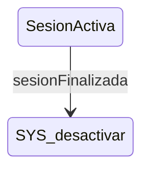

# SesionActiva

**Tipo**: contexto concurrent

## Roles

| Rol | Tipo | Origen |
|-----|------|--------|
| display_timer | Boton | Local |
| checkbox_sustituir | Checkbox | Local |

## Transiciones

| Evento | Destino |
|--------|---------|
| sesionFinalizada | [desactivar] |