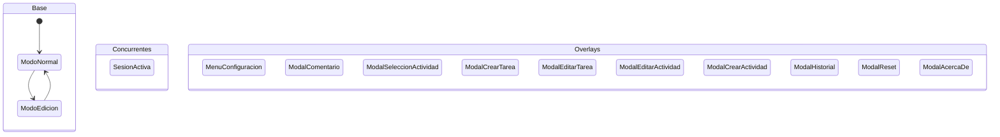

# CronometroPSP

**Estado inicial**: [ModoNormal](base/ModoNormal.md)

## Arquitectura

```mermaid
stateDiagram-v2
    state "Base" as BASE {
        [*] --> ModoNormal
        ModoEdicion --> ModoNormal
        ModoNormal --> ModoEdicion
    }
    state "Concurrentes" as CONC {
        SesionActiva
    }
    state "Overlays" as OV {
        MenuConfiguracion
        ModalComentario
        ModalSeleccionActividad
        ModalCrearTarea
        ModalEditarTarea
        ModalEditarActividad
        ModalCrearActividad
        ModalHistorial
        ModalReset
        ModalAcercaDe
    }
```
