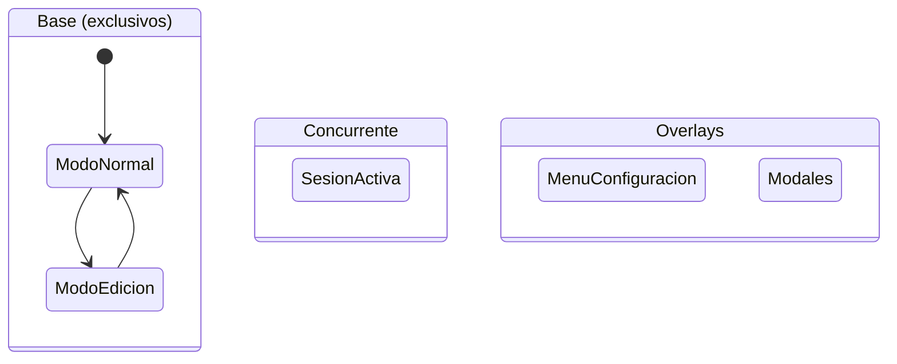

# CronometroPSP

Sistema de cronometraje de tareas por el método PSP (Personal Software Process).

**Estado inicial**: [ModoNormal](base/ModoNormal.md)
**Composición base**: exclusiva (un solo contexto base activo a la vez)

---

## Arquitectura

## Contextos base

Mutuamente excluyentes. En cada momento exactamente uno está activo.

| Contexto | Propósito |
|----------|-----------|
| [ModoNormal](base/ModoNormal.md) | Consulta y activación de sesiones |
| [ModoEdicion](base/ModoEdicion.md) | Edición de tareas y actividades |

## Contexto concurrente

Coexiste con el contexto base. Se activa/desactiva independientemente.

| Contexto | Propósito |
|----------|-----------|
| [SesionActiva](concurrent/SesionActiva.md) | Timer y lógica de sesión en curso |

## Overlays

Se apilan sobre el contexto base sin reemplazarlo. Al cerrarse, el base
que había debajo sigue activo.

| Overlay | Abierto desde | Propósito |
|---------|---------------|-----------|
| [MenuConfiguracion](overlays/MenuConfiguracion.md) | ModoNormal, ModoEdicion | Menú desplegable de opciones |
| [ModalComentario](overlays/ModalComentario.md) | ModoNormal | Comentario antes de iniciar sesión |
| [ModalSeleccionActividad](overlays/ModalSeleccionActividad.md) | ModoNormal | Elegir actividad cuando hay varias |
| [ModalCrearTarea](overlays/ModalCrearTarea.md) | ModoNormal, ModoEdicion | Crear nuevo tipo de tarea |
| [ModalEditarTarea](overlays/ModalEditarTarea.md) | ModoEdicion | Editar nombre/icono de tipo de tarea |
| [ModalEditarActividad](overlays/ModalEditarActividad.md) | ModoEdicion | Editar actividad existente |
| [ModalCrearActividad](overlays/ModalCrearActividad.md) | MenuConfiguracion | Crear nueva actividad |
| [ModalHistorial](overlays/ModalHistorial.md) | MenuConfiguracion | Ver historial (7d/30d) |
| [ModalReset](overlays/ModalReset.md) | MenuConfiguracion | Borrado de datos (3 fases) |
| [ModalAcercaDe](overlays/ModalAcercaDe.md) | MenuConfiguracion | Info de la app y estado de conexión |

## Otros

| Recurso | Descripción |
|---------|-------------|
| [Tipos de datos](data.md) | Estructuras de datos del sistema |
| [API externa](external/cronometro_api.md) | Contrato de funciones del backend |

---

↑ [Proyecto Trenza](../../CLAUDE.md)
