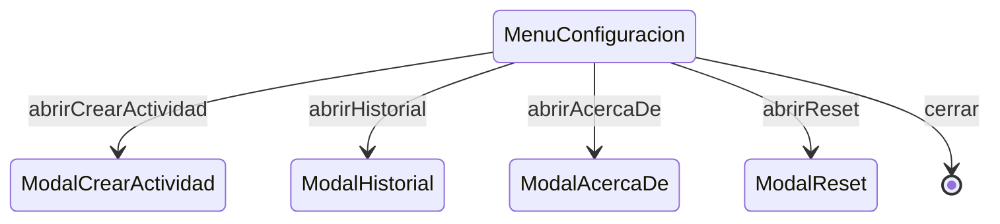

# MenuConfiguracion

**Tipo**: overlay
**Propósito**: menú desplegable con acceso a crear actividad, historial, reset y acerca de.
Fuente: [`MenuConfiguracion.trz`](../../../examples/cronometro-psp/trenza/contexts/MenuConfiguracion.trz)

---

## Roles

| Rol | Tipo | Evento | Acción |
|-----|------|--------|--------|
| item_nueva_actividad | [ItemMenu](../data.md) | tap | abrirCrearActividad |
| item_historial | [ItemMenu](../data.md) | tap | abrirHistorial |
| item_acerca_de | [ItemMenu](../data.md) | tap | abrirAcercaDe |
| item_reset | [ItemMenu](../data.md) | tap | abrirReset |
| overlay | [Boton](../data.md) | tap | cerrar |

## Transiciones

| Evento | Destino |
|--------|---------|
| abrirCrearActividad | [ModalCrearActividad](ModalCrearActividad.md) |
| abrirHistorial | [ModalHistorial](ModalHistorial.md) |
| abrirAcercaDe | [ModalAcercaDe](ModalAcercaDe.md) |
| abrirReset | [ModalReset](ModalReset.md) |
| cerrar | **[cerrar_overlay]** |

> **GAP-2**: cuando un item abre otro overlay, ¿se cierra el menú primero
> o se apila el modal encima?

---

↑ [CronometroPSP](../index.md)
