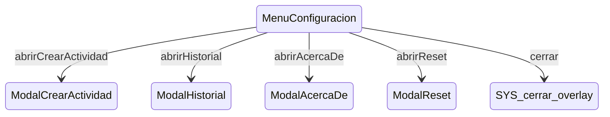

# MenuConfiguracion

**Tipo**: contexto overlays

## Roles

| Rol | Tipo | Origen |
|-----|------|--------|
| item_nueva_actividad | ItemMenu | Local |
| item_historial | ItemMenu | Local |
| item_acerca_de | ItemMenu | Local |
| item_reset | ItemMenu | Local |
| overlay | Boton | Local |

## Transiciones

| Evento | Destino |
|--------|---------|
| abrirCrearActividad | [ModalCrearActividad](../overlays/ModalCrearActividad.md) |
| abrirHistorial | [ModalHistorial](../overlays/ModalHistorial.md) |
| abrirAcercaDe | [ModalAcercaDe](../overlays/ModalAcercaDe.md) |
| abrirReset | [ModalReset](../overlays/ModalReset.md) |
| cerrar | [cerrar_overlay] |