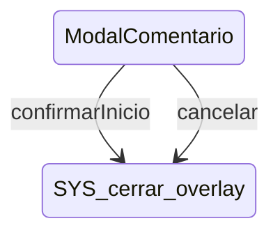

# ModalComentario

**Tipo**: contexto overlays

## Roles

| Rol | Tipo | Origen |
|-----|------|--------|
| campo_comentario | CampoTexto | Local |
| campo_retroactivo | CampoNumerico | Local |
| boton_confirmar | Boton | Local |
| boton_cancelar | Boton | Local |

## Transiciones

| Evento | Destino |
|--------|---------|
| confirmarInicio | [cerrar_overlay] |
| cancelar | [cerrar_overlay] |