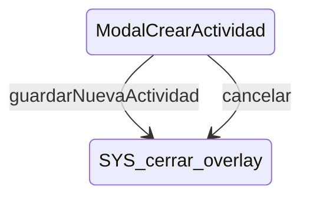

# ModalCrearActividad

**Tipo**: contexto overlays

## Roles

| Rol | Tipo | Origen |
|-----|------|--------|
| campo_nombre | CampoTexto | Local |
| selector_color | SelectorColor | Local |
| checkbox_permanente | Checkbox | Local |
| boton_guardar | Boton | Local |
| boton_cancelar | Boton | Local |

## Transiciones

| Evento | Destino |
|--------|---------|
| guardarNuevaActividad | [cerrar_overlay] |
| cancelar | [cerrar_overlay] |