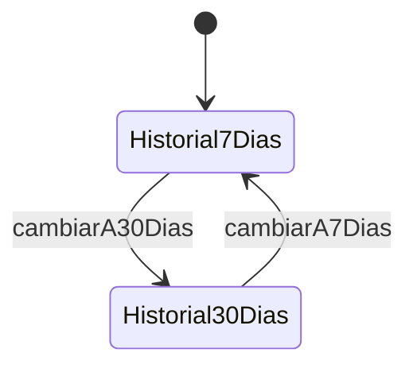

# ModalHistorial

**Tipo**: overlay con sub-contextos
**Propósito**: visualización del historial de sesiones en dos vistas (7 días / 30 días).
Fuente: [`ModalHistorial.trz`](../../../examples/cronometro-psp/trenza/contexts/ModalHistorial.trz)

---

## Roles del padre

| Rol | Tipo | Evento | Acción |
|-----|------|--------|--------|
| boton_cerrar | [Boton](../data.md) | tap | cerrar |

> Los sub-contextos heredan `boton_cerrar` por H1.

## Transiciones del padre

| Evento | Destino |
|--------|---------|
| cerrar | **[cerrar_overlay]** |

## Sub-contextos

### Historial7Dias (activo por defecto)

| Rol | Tipo | Evento | Acción | Nota |
|-----|------|--------|--------|------|
| boton_7dias | [Boton](../data.md) | tap | **ignorar** | ya estamos aquí |
| boton_30dias | [Boton](../data.md) | tap | cambiarA30Dias | |

**Effect** (GAP-7): `[al_entrar]` → external cargar_historial(dias: 7)

### Historial30Dias

| Rol | Tipo | Evento | Acción | Nota |
|-----|------|--------|--------|------|
| boton_7dias | [Boton](../data.md) | tap | cambiarA7Dias | |
| boton_30dias | [Boton](../data.md) | tap | **ignorar** | ya estamos aquí |

**Effect** (GAP-7): `[al_entrar]` → external cargar_historial(dias: 30)

## Reglas de herencia aplicadas

- **H1**: ambos heredan `boton_cerrar` del padre
- **H2**: `boton_7dias` y `boton_30dias` son roles locales de cada sub-contexto
- **H3**: completitud por nivel — los roles locales de un hermano no obligan al otro
- **H5**: ningún sub-contexto añade eventos a roles heredados

---

↑ [CronometroPSP](../index.md) · ← abierto desde [MenuConfiguracion](MenuConfiguracion.md)
