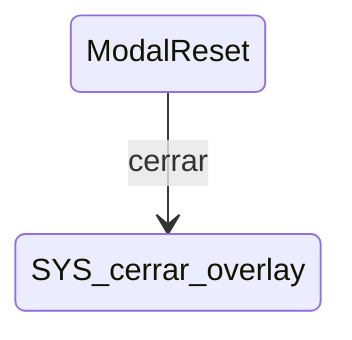

# ModalReset

**Tipo**: contexto overlays

## Roles

| Rol | Tipo | Origen |
|-----|------|--------|
| boton_cancelar | Boton | Local |

## Transiciones

| Evento | Destino |
|--------|---------|
| cerrar | [cerrar_overlay] |