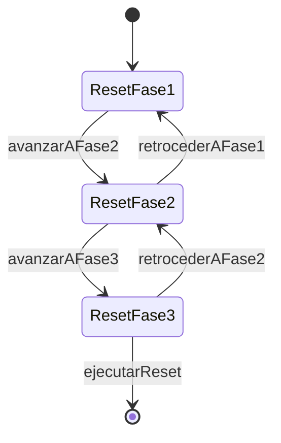

# ModalReset

**Tipo**: overlay con sub-contextos (3 fases secuenciales)
**Propósito**: borrado de datos con navegación adelante/atrás y confirmación explícita.
Fuente: [`ModalReset.trz`](../../../examples/cronometro-psp/trenza/contexts/ModalReset.trz)

---

## Roles del padre

| Rol | Tipo | Evento | Acción |
|-----|------|--------|--------|
| boton_cancelar | [Boton](../data.md) | tap | cerrar |

## Transiciones del padre

| Evento | Destino |
|--------|---------|
| cerrar | **[cerrar_overlay]** |

## Sub-contextos (fases)

### ResetFase1 — Aviso y exportar

| Rol | Tipo | Evento | Acción |
|-----|------|--------|--------|
| boton_continuar | [Boton](../data.md) | tap | avanzarAFase2 |
| boton_exportar_csv | [Boton](../data.md) | tap | exportarCSV |

**Effect**: exportarCSV → external [descargar_csv](../external/cronometro_api.md)()

### ResetFase2 — Seleccionar actividades a conservar

| Rol | Tipo | Evento | Acción |
|-----|------|--------|--------|
| checkbox_actividad | [OpcionActividad](../data.md) | cambio | toggleConservar(self.id, self.marcado) |
| boton_continuar | [Boton](../data.md) | tap | avanzarAFase3 |
| boton_atras | [Boton](../data.md) | tap | retrocederAFase1 |

> **GAP-6**: `checkbox_actividad` es uno por actividad existente (multiplicidad).

### ResetFase3 — Confirmación escribiendo "BORRAR"

| Rol | Tipo | Evento | Acción |
|-----|------|--------|--------|
| campo_confirmacion | [CampoTexto](../data.md) | cambio | actualizarConfirmacion(self.valor) |
| boton_ejecutar | [Boton](../data.md) | tap | ejecutarReset |
| boton_atras | [Boton](../data.md) | tap | retrocederAFase2 |

**Effect**: ejecutarReset → external [reset_datos](../external/cronometro_api.md)(actividades_conservar)

> **GAP-5**: `ejecutarReset` solo procede si `campo_confirmacion.valor == "BORRAR"`.

## Reglas de herencia aplicadas

- **H1**: las 3 fases heredan `boton_cancelar` del padre
- **H4**: ResetFase1 redeclara `boton_cancelar` (misma acción, override explícito)

---

↑ [CronometroPSP](../index.md) · ← abierto desde [MenuConfiguracion](MenuConfiguracion.md)
