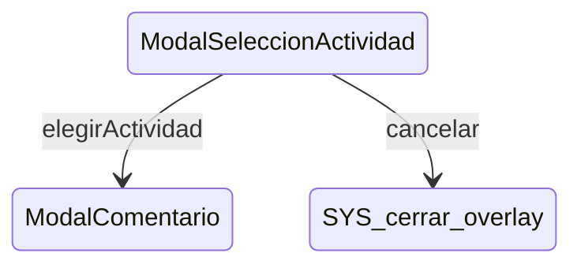

# ModalSeleccionActividad

**Tipo**: contexto overlays

## Roles

| Rol | Tipo | Origen |
|-----|------|--------|
| boton_actividad | Actividad | Local |
| boton_cancelar | Boton | Local |

## Transiciones

| Evento | Destino |
|--------|---------|
| elegirActividad | [ModalComentario](../overlays/ModalComentario.md) |
| cancelar | [cerrar_overlay] |