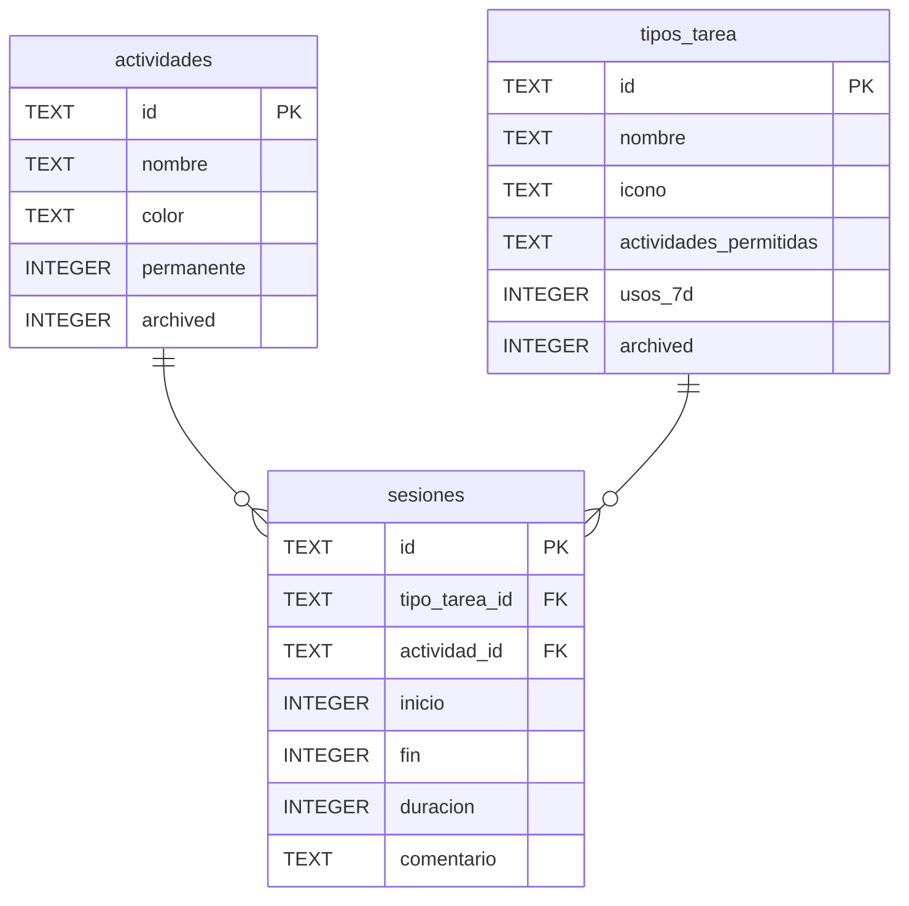

# Mi Cronómetro PSP

**Versión**: 1.1 (en desarrollo)
**Estado**: MVP v1.0 operativo — implementando acceso remoto
**Última actualización**: 19 febrero 2026

---

## Tabla de Contenidos

1. [Descripción](#descripción)
2. [Arquitectura](#arquitectura)
3. [Estructura del Proyecto](#estructura-del-proyecto)
4. [Despliegue](#despliegue)
5. [Desarrollo](#desarrollo)
6. [Testing](#testing)
7. [Documentación](#documentación)
8. [Decisiones de Diseño](#decisiones-de-diseño)
9. [Roadmap](#roadmap)

---

## Descripción

Aplicación web para seguimiento personal de tiempo dedicado a actividades profesionales. Auto-hospedada en NAS doméstico. Inspirada en Personal Software Process (PSP) pero adaptada para uso general.

### Características principales (v1.0)

- ✅ **Inicio de sesión con 1 tap**: Cambiar de tarea cierra automáticamente la anterior
- ✅ **Organización flexible**: Tipos de tarea reutilizables en múltiples actividades
- ✅ **Pestaña "Frecuentes"**: Acceso rápido a tareas más usadas (usos_7d > 0)
- ✅ **Timer en tiempo real**: Actualización por minutos, sincronizado con servidor
- ✅ **Creación rápida**: Nuevas tareas y actividades desde la interfaz
- ✅ **Optimizado para móvil**: Grid de 3 columnas, iconos grandes (~2 cm)
- ✅ **Comentario opcional**: Texto libre al iniciar cada sesión
- ✅ **Puesta a cero**: 3 fases con selección de actividades a conservar
- ✅ **Actividades permanentes**: Se conservan por defecto en la puesta a cero
- ✅ **Exportación CSV**: Se descarga automáticamente antes de la puesta a cero

### Filosofía

- **Fricción mínima**: Trackear debe ser más rápido que no trackear
- **Datos bajo control**: SQLite en NAS propio, exportación CSV siempre disponible
- **Privacy-first**: Sin dependencias de servicios externos para funcionar
- **Sin Cloudflare**: En España puede ser bloqueado judicialmente — alternativas preferidas

---

## Arquitectura

### Stack Tecnológico

| Capa | Tecnología |
|------|-----------|
| Frontend | HTML5 + CSS3 + JavaScript ES2022 vanilla |
| Backend | PHP 8.x + PDO |
| Base de datos | SQLite 3 |
| Servidor web | Apache 2.4.56 |
| Infraestructura | WD My Cloud EX2 Ultra (NAS doméstico) |
| DNS | GoDaddy API (`cronometro.hash-pointer.com`) |
| TLS | Let's Encrypt vía acme.sh (DNS challenge) |

### Modelo de Datos



### Endpoints API

| Método | URL | Descripción |
|--------|-----|-------------|
| GET | `/api/actividades` | Listar actividades activas |
| POST | `/api/actividades` | Crear actividad |
| PUT | `/api/actividades/{id}` | Actualizar actividad |
| GET | `/api/tipos-tarea` | Listar tipos de tarea activos |
| POST | `/api/tipos-tarea` | Crear tipo de tarea |
| GET | `/api/sesiones` | Sesiones del día + sesión activa |
| POST | `/api/sesiones?action=iniciar` | Iniciar sesión (cierra la activa) |
| POST | `/api/sesiones?action=detener` | Detener sesión activa |
| POST | `/api/sesiones?action=reset` | Puesta a cero (descarga CSV + archiva datos) |

---

## Estructura del Proyecto

```
mi-cronometro-psp/
├── frontend/
│   ├── index.html              ← App (SPA de un solo fichero HTML)
│   ├── css/
│   │   └── styles.css
│   └── js/
│       ├── app.js              ← Lógica UI (v=5)
│       └── api-client.js       ← Wrapper fetch hacia API (v=4)
│
├── backend/
│   └── api/
│       ├── index.php           ← Router PHP principal
│       ├── actividades.php     ← CRUD actividades
│       ├── tipos-tarea.php     ← CRUD tipos de tarea
│       ├── sesiones.php        ← Sesiones + reset
│       ├── .htaccess           ← Rewrite rules
│       └── db/
│           └── database.php    ← Wrapper PDO SQLite
│
├── scripts/
│   ├── deploy-nas.sh           ← Despliegue al NAS (desde WSL)
│   └── recuperar-nas.sh        ← Recuperación post-reinicio manual
│
├── docs/
│   ├── README.md               ← Este fichero
│   ├── requisitos.md           ← Especificación de requisitos v1.1
│   ├── plan-pruebas.md         ← Plan de pruebas v1.1
│   ├── arquitectura-time-tracker.md  ← Documento de arquitectura v1.1
│   ├── futuras-versiones.md    ← Roadmap
│   ├── configuracion-red-local.md    ← Configuración de infraestructura
│   └── configuracion-nas-wd.md       ← Guía de configuración del NAS
│
├── memory/
│   └── MEMORY.md               ← Estado del proyecto para Claude
│
└── CHANGELOG.md                ← Historial de cambios
```

---

## Despliegue

### Requisitos

- NAS WD My Cloud EX2 Ultra con Apache + PHP
- WSL2 en Windows con clave SSH en `~/.ssh/id_nas`
- SSH habilitado en el NAS

### Deploy al NAS

```bash
# Desde WSL, en la raíz del proyecto
bash scripts/deploy-nas.sh
```

### Recuperación post-reinicio (manual)

```bash
bash scripts/recuperar-nas.sh
```

### Verificar que funciona

```bash
curl http://192.168.1.71:8080/apps/cronometro/www/index.html
# Debe devolver 200
```

---

## Desarrollo

### Workflow

La app es estática — no hay build step. Los cambios en `frontend/` se despliegan directamente al NAS con `deploy-nas.sh`.

**Versiones de script** (incrementar en cada deploy relevante):
- `index.html`: `<script src="js/app.js?v=5">` — evita caché del móvil
- `index.html`: `<script src="js/api-client.js?v=4">`

### Añadir nueva funcionalidad

1. Modificar ficheros en `frontend/` y/o `backend/api/`
2. Incrementar `?v=N` en `index.html` si se modifica JS
3. Probar en local (si es posible) o directo en NAS
4. `bash scripts/deploy-nas.sh`
5. Verificar en móvil

### Convenciones

- **camelCase** para variables y funciones JS
- **snake_case** para variables PHP y campos de BD
- IDs en formato `tipoTarea_actividad` (ej: `codificar_proyectox`)
- Timestamps: Unix epoch en segundos en BD, milisegundos en JS

---

## Testing

Ver [docs/plan-pruebas.md](plan-pruebas.md) para el plan completo.

### Tests rápidos de API

```bash
BASE="http://192.168.1.71:8080/apps/cronometro/api"

# Listar actividades
curl "$BASE/actividades"

# Listar tipos de tarea
curl "$BASE/tipos-tarea"

# Ver sesiones del día
curl "$BASE/sesiones"
```

### Checklist de regresión post-deploy

- [ ] App carga en móvil sin errores de consola
- [ ] Pestaña Frecuentes muestra tareas (si hay usos_7d > 0)
- [ ] Iniciar tarea → timer se muestra en minutos
- [ ] Cambiar tarea → cierra la anterior
- [ ] Puesta a cero completa (descarga CSV, UI se regenera)

---

## Documentación

| Documento | Descripción |
|-----------|-------------|
| [requisitos.md](requisitos.md) | Especificación completa de requisitos RF-001 a RF-015 |
| [plan-pruebas.md](plan-pruebas.md) | Tests de API (curl) y checklist UI manual |
| [arquitectura-time-tracker.md](arquitectura-time-tracker.md) | Decisiones arquitectónicas, diagramas Mermaid |
| [futuras-versiones.md](futuras-versiones.md) | Roadmap y backlog |
| [configuracion-red-local.md](configuracion-red-local.md) | Infraestructura, DDNS, Apache, TLS |
| [configuracion-nas-wd.md](configuracion-nas-wd.md) | Guía paso a paso de configuración inicial del NAS |

---

## Decisiones de Diseño

### ¿Por qué PHP + SQLite?

El NAS WD tiene PHP y Apache preinstalados. Usar lo que ya existe elimina overhead de mantenimiento. SQLite es más que suficiente para un usuario personal con datos de años.

### ¿Por qué JavaScript vanilla?

Sin build step, sin dependencias de npm, sin complejidad innecesaria. La app funciona abriendo el HTML directamente. Migración a React/Vue posible si el proyecto crece.

### ¿Por qué no botón "Stop"?

El flujo natural es **cambiar de tarea**, no "parar de trabajar". 1 tap vs 2-3 taps. Para pausas existe la actividad "No productivo" con sus propias tareas.

### ¿Por qué no Cloudflare?

En España, Cloudflare ha sido bloqueado judicialmente en varias ocasiones. Para una app de uso diario, la dependencia en un servicio que puede desaparecer o ser bloqueado es inaceptable. GoDaddy (registrador actual) es el proveedor DNS usado.

### ¿Por qué acme.sh para TLS?

Cliente ACME puro shell, sin dependencias de Python/Node. Compatible con el entorno minimalista del NAS WD. Soporta DNS-01 challenge (no requiere abrir puerto 80).

---

## Roadmap

### v1.0 (MVP) — ✅ Completado (febrero 2026)

- ✅ App funcional en red local
- ✅ PHP + SQLite en NAS WD
- ✅ Timer en tiempo real (minutos, sincronizado con servidor)
- ✅ Puesta a cero con 3 fases y selección de actividades
- ✅ Actividades permanentes
- ✅ Exportación CSV
- ✅ Menú Configuración (Acerca de, Puesta a cero)
- ✅ Restauración automática post-reinicio

### v1.1 — 🔄 En curso (febrero 2026)

- 🔄 Acceso remoto: DDNS + HTTPS + Let's Encrypt
- 📋 Fix bug `usos_7d` (no se incrementa al cerrar sesiones)
- 📋 Vista historial diario/semanal
- 📋 Editar flag `permanente` en actividades existentes

### v1.2 — Planificado

- Autenticación básica para acceso externo
- Editar nombre/icono de tipos de tarea
- Editar nombre/color de actividades

### v2.0 — Futuro

- Integración Google Calendar (avisos de tiempo disponible)
- Técnica Pomodoro (pausas inteligentes)
- Reportes y gráficos

Ver [docs/futuras-versiones.md](futuras-versiones.md) para detalles.

---

**¡Gracias por tu interés en Mi Cronómetro PSP!**
