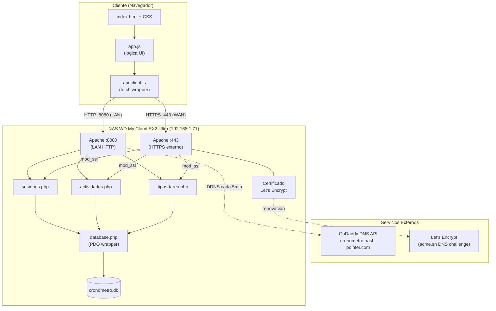
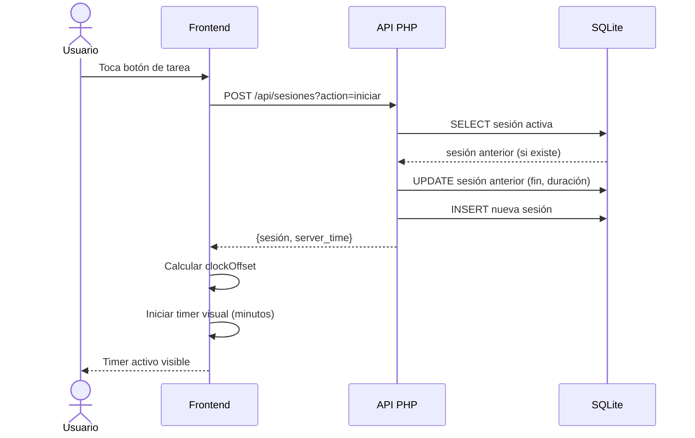
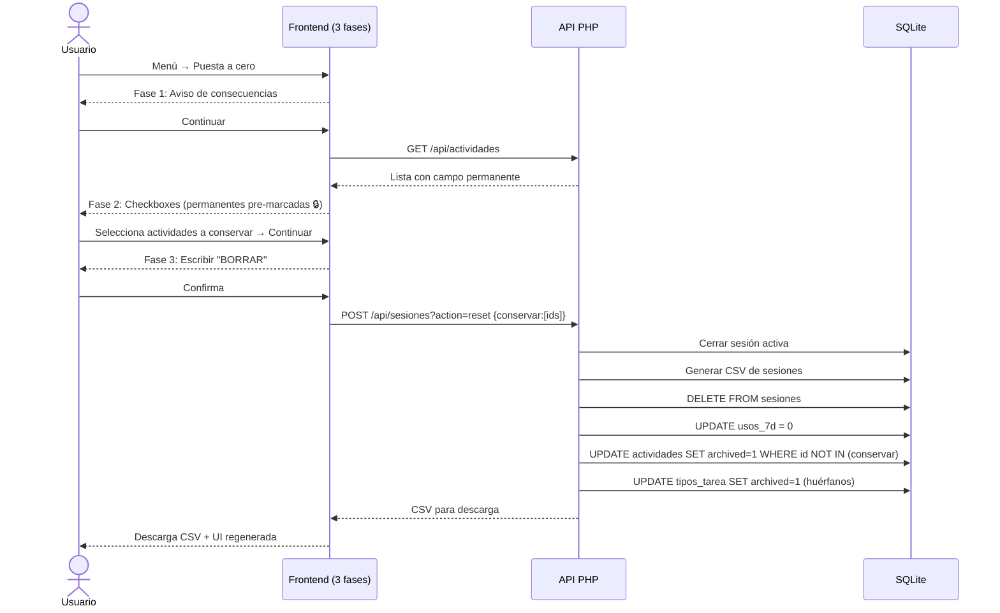
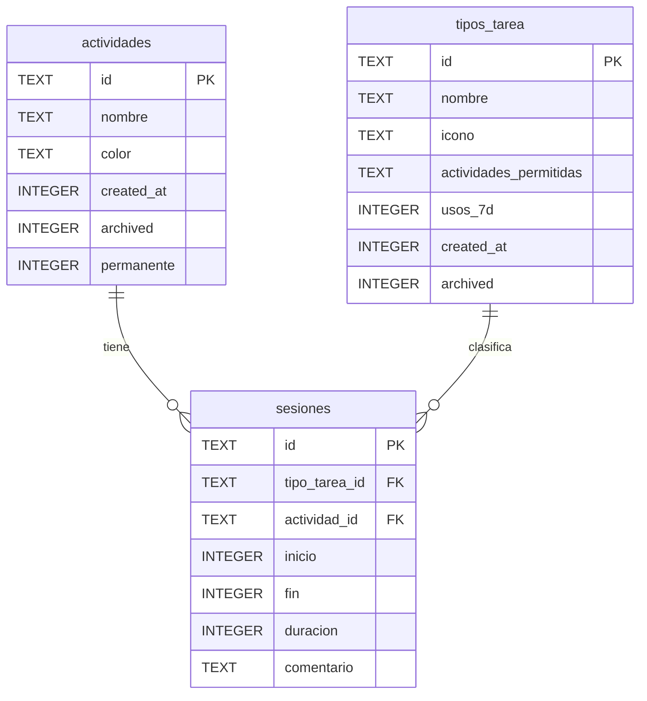
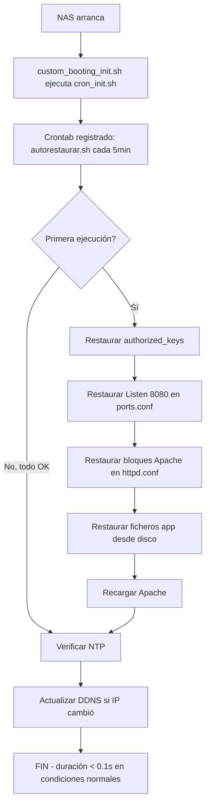
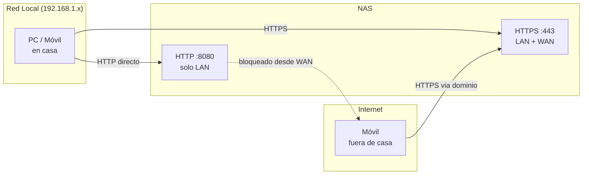

# Mi Cronómetro Personal Software Process

## Documento de Arquitectura v1.1

**Versión**: 1.1
**Fecha**: 19 febrero 2026
**Actualizado por**: Revisión post-MVP (migración a PHP+SQLite, acceso remoto)

---

## 1. Visión General

Herramienta web para seguimiento de tiempo dedicado a actividades profesionales, auto-hospedada en NAS doméstico con acceso remoto seguro. Filosofía privacy-first: datos bajo control total del usuario, sin dependencias de servicios externos.

### 1.1 Principios de Diseño

- **Privacy-first**: Datos almacenados localmente en NAS propio
- **Simplicidad**: Interfaz minimalista, bajo fricción para tracking
- **Open Source**: Stack completamente abierto (PHP + SQLite + JS vanilla)
- **Offline-friendly**: Funciona en red local aunque falle internet
- **Auto-hospedado**: Sin dependencia de servicios en la nube

---

## 2. Stack Tecnológico Actual (v1.0 MVP)

| Capa            | Tecnología                       | Notas                                   |
| --------------- | -------------------------------- | --------------------------------------- |
| Frontend        | HTML5 + CSS3 + JS ES2022 vanilla | Sin frameworks, sin build step          |
| Backend         | PHP 8.x con PDO                  | Apache mod_php vía PHP-FPM              |
| Base de datos   | SQLite 3                         | Fichero único en disco persistente      |
| Servidor web    | Apache 2.4.56                    | Puerto 8080 (LAN) + 443 (HTTPS externo) |
| Infraestructura | WD My Cloud EX2 Ultra            | NAS doméstico, IP fija LAN              |
| DNS dinámico    | GoDaddy API / alternativa        | `cronometro.hash-pointer.com`           |
| Certificado TLS | Let's Encrypt (acme.sh)          | Renovación automática vía cron          |

---

## 3. Arquitectura de Componentes

### 3.1 Vista General del Sistema



### 3.2 Flujo de Datos — Inicio de Sesión



### 3.3 Flujo de Datos — Puesta a Cero



---

## 4. Modelo de Datos

### 4.1 Esquema de Base de Datos



### 4.2 Notas sobre la BD

- **IDs**: Strings con formato `tipo_actividad` (ej: `codificar_proyectox`)
- **Timestamps**: Unix epoch en segundos
- **`actividades_permitidas`**: JSON array de IDs de actividades en tipos_tarea
- **`permanente`**: 0/1 — si la actividad se conserva por defecto en puesta a cero
- **`archived`**: 0/1 — soft delete para actividades y tipos_tarea
- **`usos_7d`**: Contador de usos en los últimos 7 días (para pestaña Frecuentes)
- **`comentario`**: Texto libre opcional al iniciar sesión
- La BD vive en `/mnt/HD/HD_a2/.cronometro-psp/data/cronometro.db` (disco persistente)

---

## 5. Arquitectura de Despliegue

### 5.1 Estructura de Directorios en el NAS

```
/mnt/HD/HD_a2/.cronometro-psp/   ← Disco persistente (sobrevive reinicios)
├── app/                          ← Copia de la app (fuente de restauración)
│   ├── www/                      ← Frontend
│   └── api/                      ← Backend PHP
├── data/
│   └── cronometro.db             ← Base de datos SQLite (nunca se toca)
├── ssl/
│   ├── fullchain.pem             ← Certificado Let's Encrypt
│   └── privkey.pem               ← Clave privada
├── autorestaurar.sh              ← Script de restauración post-reinicio
└── ddns-update.sh                ← Script de actualización DDNS

/var/www/apps/cronometro/         ← Directorio activo (tmpfs, se restaura)
├── www/                          ← Frontend servido por Apache
├── api/                          ← Backend PHP
├── data/ → symlink a disco       ← BD (enlace al disco persistente)
└── logs/                         ← Logs Apache

/usr/local/config/cronometro-psp/ ← Configuración persistente (UBIFS)
├── authorized_keys               ← Clave pública SSH
├── apache-extra.conf             ← Bloques Directory/Location
├── cron_init.sh                  ← Registra crontab al arrancar
└── custom_booting_init.sh        ← Hook de arranque del NAS
```

### 5.2 Flujo de Restauración Automática



---

## 6. Seguridad

### 6.1 Modelo de Acceso



### 6.2 Medidas Implementadas

- **Control de acceso por IP**: Puerto 8080 solo acepta `192.168.1.x`
- **HTTPS obligatorio en acceso externo**: Puerto 443 con TLS 1.2+
- **Certificado válido**: Let's Encrypt vía acme.sh + DNS challenge
- **Sin autenticación de usuario** (v1.0): La app es de uso personal y el acceso HTTPS actúa como barrera suficiente. Autenticación prevista para v1.2 si se comparte con otros usuarios.
- **SQLite fuera del docroot**: La BD no es accesible vía web
- **Cabeceras de seguridad**: `X-Content-Type-Options`, `X-Frame-Options` en PHP

---

## 7. Decisiones de Diseño

### ¿Por qué PHP + SQLite en vez de Node.js / PostgreSQL?

El NAS WD My Cloud EX2 Ultra tiene PHP preinstalado con Apache. Usar lo que ya existe elimina dependencias de mantenimiento adicionales. SQLite es suficiente para un usuario con datos de un año (~365 × 20 sesiones = ~7.000 filas).

### ¿Por qué JavaScript vanilla sin framework?

Para MVP, vanilla JS ofrece menor complejidad, carga más rápida y sin dependencias de frameworks. La estructura modular permite migración futura a React/Vue si el proyecto crece.

### ¿Por qué no Cloudflare para DNS?

En España, Cloudflare ha sido bloqueado por resolución judicial en varias ocasiones (casos relacionados con piratería). Para una app de uso diario, la dependencia en un proveedor que puede ser bloqueado es inaceptable. GoDaddy (registrador actual) o un servidor DNS propio son preferibles.

### ¿Por qué acme.sh para certificados?

Es un cliente ACME puro shell (sin dependencias de Python/Node), compatible con el entorno minimalista del NAS WD. Soporta el challenge DNS-01 que no requiere abrir el puerto 80.

### ¿Por qué no botón "Stop"?

El flujo natural es **cambiar de tarea**, no "parar de trabajar". 1 tap vs 2-3 taps (stop → select → start). Para pausas reales existe la actividad "No productivo".

---

## 8. Preguntas Abiertas / Pendientes

1. **Autenticación**: ¿Básica HTTP, JWT o simplemente una contraseña de acceso? Prevista para v1.2.
2. **Backup automático**: La BD está en disco persistente pero sin backup periódico a otro NAS de la red local.
3. **usos_7d**: El campo existe pero no se incrementa al cerrar sesiones (bug pendiente v1.1).
4. **Historial**: Vista diaria/semanal de distribución de tiempo — pendiente v1.1.

---

## 9. Roadmap Técnico

| Versión  | Estado         | Cambios principales                                               |
| -------- | -------------- | ----------------------------------------------------------------- |
| v1.0 MVP | ✅ Completado   | PHP+SQLite, puesta a cero 3 fases, actividades permanentes        |
| v1.1     | 🔄 En curso    | Acceso remoto HTTPS, fix usos_7d, historial                       |
| v1.2     | 📋 Planificado | Autenticación básica, editar permanente en actividades existentes |
| v2.0     | 💡 Idea        | Integración Google Calendar, técnica Pomodoro                     |
