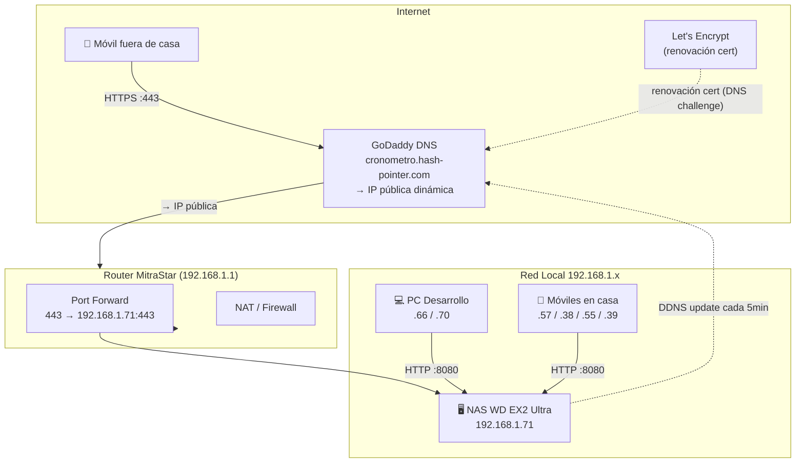
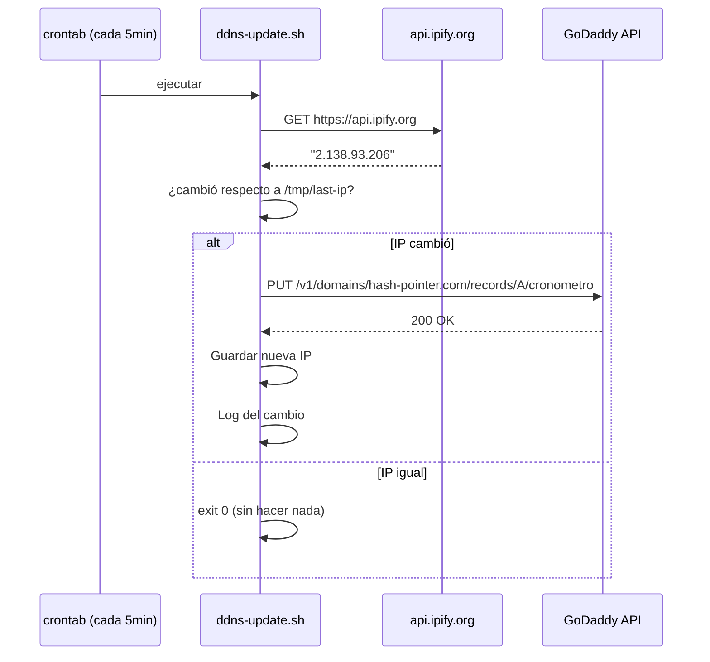
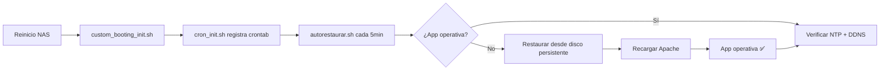

# Mi Cronómetro PSP - Configuración de Red e Infraestructura

**Versión**: 2.0
**Fecha**: 19 febrero 2026
**Autor**: César (Ingeniero de Caminos)
**Actualizado por**: Revisión post-MVP — arquitectura PHP+SQLite + acceso remoto

---

## 1. Estado Actual

### 1.1 Objetivos

- ✅ Servidor web accesible en red local (192.168.1.x) vía HTTP :8080
- ✅ Backend PHP + SQLite funcionando en NAS
- ✅ Acceso desde PC (desarrollo) y móviles (uso)
- ✅ Base de datos SQLite en disco persistente (sobrevive reinicios)
- ✅ Restauración automática tras reinicio del NAS
- 🔄 Acceso remoto seguro vía HTTPS desde fuera de casa (v1.1 en curso)

### 1.2 URLs de Acceso

| Entorno | URL | Estado |
|---------|-----|--------|
| Red local | `http://192.168.1.71:8080/apps/cronometro/www/` | ✅ Operativo |
| Acceso externo | `https://cronometro.hash-pointer.com/` | 🔄 En configuración |

---

## 2. Inventario de Red

### 2.1 Dispositivos Clave

| IP | Dispositivo | Rol en el Proyecto |
|----|-------------|-------------------|
| `192.168.1.1` | MitraStar Router | Gateway principal |
| `192.168.1.71` | **WD My Cloud EX2 Ultra** | **Servidor backend** |
| `192.168.1.66` | Lenovo ThinkPad L460 | Desarrollo / Testing |
| `192.168.1.70` | Lenovo ThinkPad X230 | Desarrollo / Testing |
| `192.168.1.57` | Samsung Galaxy S25 Ultra | Cliente principal (móvil) |
| `192.168.1.38` | Samsung Galaxy Tab | Testing móvil |
| `192.168.1.55` | Samsung Galaxy Tab A9 | Testing móvil |
| `192.168.1.39` | Sony Xperia 10 III | Testing móvil |

### 2.2 Otros NAS Disponibles

| IP | Modelo | Uso potencial |
|----|--------|---------------|
| `192.168.1.68` | WDC WDMyCloud | Backup de BD SQLite |
| `192.168.1.75` | Western Digital WDH1NC | Backup secundario |

> **Pendiente**: Implementar backup automático nocturno a 192.168.1.68

---

## 3. Arquitectura de Red



---

## 4. Configuración del NAS

### 4.1 Información del Servidor

| Parámetro | Valor |
|-----------|-------|
| Modelo | WD My Cloud EX2 Ultra |
| IP LAN | `192.168.1.71` (fija) |
| Sistema Operativo | Linux (ARM, BusyBox) |
| Apache | 2.4.56 en puerto 8080 |
| PHP | 8.x vía PHP-FPM (proxy_fcgi) |
| OpenSSL | 1.1.1n |
| Usuario SSH | `sshd` (actúa como root) |

### 4.2 Rutas Importantes

```
/usr/local/apache2/conf/httpd.conf          ← Configuración principal Apache
/usr/local/apache2/conf/extra/              ← Includes (ports.conf, ssl-cronometro.conf)
/usr/local/apache2/conf/mods-enabled/       ← Módulos activos (*.load, *.conf)
/usr/local/apache2/modules/mod_ssl.so       ← Módulo SSL (existe, cargado en v1.1)
/var/www/apps/cronometro/                   ← App activa (tmpfs, se restaura)
/mnt/HD/HD_a2/.cronometro-psp/              ← Todo persistente
/usr/local/config/cronometro-psp/           ← Config persistente (UBIFS)
```

### 4.3 Módulos Apache Activos Relevantes

| Módulo | Fichero | Estado |
|--------|---------|--------|
| mod_rewrite | `rewrite.load` | ✅ Activo |
| mod_socache_shmcb | `socache_shmcb.load` | ✅ Activo (requerido por SSL) |
| mod_ssl | `ssl.load` | ✅ Activo desde v1.1 |
| mod_proxy_fcgi | `proxy_fcgi.load` | ✅ Activo (para PHP-FPM) |
| mod_headers | `headers.load` | ✅ Activo |

---

## 5. Configuración Apache

### 5.1 VirtualHost HTTP (LAN, puerto 8080)

Configurado en `/usr/local/config/cronometro-psp/apache-extra.conf`:

```apache
<Directory "/var/www/apps/cronometro">
    Options +FollowSymLinks -Indexes
    AllowOverride All
    AuthType None
    <RequireAll>
        Require ip 192.168.1
    </RequireAll>
</Directory>

<Location "/apps/cronometro">
    AuthType None
    <RequireAll>
        Require ip 192.168.1
    </RequireAll>
</Location>
```

> ⚠️ El acceso HTTP está restringido a la red local 192.168.1.x. Desde fuera de casa solo funciona HTTPS.

### 5.2 VirtualHost HTTPS (externo, puerto 443)

Configurado en `/usr/local/apache2/conf/extra/ssl-cronometro.conf`:

```apache
Listen 443

SSLSessionCache        shmcb:/var/run/ssl_scache(512000)
SSLSessionCacheTimeout 300

<VirtualHost *:443>
    ServerName cronometro.hash-pointer.com
    DocumentRoot /var/www/apps/cronometro/www

    SSLEngine on
    SSLCertificateFile    /mnt/HD/HD_a2/.cronometro-psp/ssl/fullchain.pem
    SSLCertificateKeyFile /mnt/HD/HD_a2/.cronometro-psp/ssl/privkey.pem

    SSLProtocol all -SSLv3 -TLSv1 -TLSv1.1
    SSLCipherSuite ECDHE-ECDSA-AES128-GCM-SHA256:ECDHE-RSA-AES128-GCM-SHA256:...
    SSLHonorCipherOrder off

    ProxyPass /apps/cronometro/api http://localhost:8080/apps/cronometro/api
    ProxyPassReverse /apps/cronometro/api http://localhost:8080/apps/cronometro/api

    <Directory /var/www/apps/cronometro/www>
        Options +FollowSymLinks -Indexes
        AllowOverride All
        Require all granted
    </Directory>
</VirtualHost>
```

---

## 6. DDNS y Certificados

### 6.1 Flujo DDNS



### 6.2 Obtención del Certificado (acme.sh)

El certificado se obtiene mediante DNS-01 challenge (no requiere puerto 80):

```bash
# 1. Instalar acme.sh
curl https://get.acme.sh | sh -s email=ceo@hash-pointer.com

# 2. Emitir certificado via GoDaddy DNS
export GD_Key="TU_GODADDY_KEY"
export GD_Secret="TU_GODADDY_SECRET"
~/.acme.sh/acme.sh --issue --dns dns_gd -d cronometro.hash-pointer.com

# 3. Instalar en ruta persistente
~/.acme.sh/acme.sh --install-cert -d cronometro.hash-pointer.com \
    --cert-file /mnt/HD/HD_a2/.cronometro-psp/ssl/fullchain.pem \
    --key-file  /mnt/HD/HD_a2/.cronometro-psp/ssl/privkey.pem \
    --reloadcmd "httpd -f /usr/local/apache2/conf/httpd.conf -k graceful"
```

### 6.3 Renovación Automática

La renovación se gestiona en `autorestaurar.sh` (ejecutado cada 5 min):
- acme.sh comprueba si el certificado vence en < 30 días
- Si es así, renueva automáticamente vía GoDaddy API
- Recarga Apache tras la renovación

---

## 7. Restauración Automática Post-Reinicio

El NAS WD usa tmpfs para `/var/www` y partes de `/usr/local/apache2` — todo se pierde en cada reinicio. El sistema de restauración automática garantiza que la app vuelva a funcionar en < 5 minutos:



**Ficheros que sobreviven reinicios**:
- `/mnt/HD/HD_a2/.cronometro-psp/` — Disco duro del NAS (siempre persistente)
- `/usr/local/config/cronometro-psp/` — UBIFS (flash persistente del NAS)

---

## 8. Seguridad

### 8.1 Control de Acceso

| Puerto | Protocolo | Origen permitido | Notas |
|--------|-----------|-----------------|-------|
| 8080 | HTTP | Solo 192.168.1.x | Configurado en `apache-extra.conf` |
| 443 | HTTPS | Cualquier IP | TLS 1.2+ requerido |
| 22 | SSH | Solo LAN | Clave pública, sin contraseña |

### 8.2 Buenas Prácticas Implementadas

- SQLite fuera del DocumentRoot (no accesible vía web)
- Prepared statements en todo el PHP (sin SQL injection posible)
- Cabeceras de seguridad HTTP en las respuestas de la API
- Clave SSH almacenada fuera del repositorio (`C:\Users\cpcxb\.ssh\id_nas`)

---

## 9. Testing de Conectividad

### 9.1 Desde Red Local

```bash
# Verificar app
curl -s -o /dev/null -w "%{http_code}" http://192.168.1.71:8080/apps/cronometro/www/index.html
# Esperado: 200

# Verificar API
curl http://192.168.1.71:8080/apps/cronometro/api/actividades
# Esperado: JSON con lista de actividades
```

### 9.2 Desde Exterior (cuando esté configurado)

```bash
# Verificar HTTPS
curl -s -o /dev/null -w "%{http_code}" https://cronometro.hash-pointer.com/
# Esperado: 200

# Verificar certificado
curl -v https://cronometro.hash-pointer.com/ 2>&1 | grep "SSL certificate"

# Verificar DNS
nslookup cronometro.hash-pointer.com 8.8.8.8
# Esperado: IP pública del router
```

### 9.3 Comandos SSH Útiles

```bash
# Conectar al NAS (desde WSL)
cp ~/.ssh/id_nas /tmp/id_nas_deploy && chmod 600 /tmp/id_nas_deploy
ssh -i /tmp/id_nas_deploy sshd@192.168.1.71

# Ver logs de restauración
tail -20 /tmp/cronometro-psp-restore.log

# Ver estado Apache
httpd -f /usr/local/apache2/conf/httpd.conf -t   # Test sintaxis
httpd -f /usr/local/apache2/conf/httpd.conf -M   # Módulos cargados

# Recargar Apache
httpd -f /usr/local/apache2/conf/httpd.conf -k graceful
```

---

## 10. Troubleshooting

### App no accesible desde LAN

```bash
# 1. Verificar que Apache está corriendo
ps aux | grep httpd

# 2. Si no está corriendo, reiniciarlo
httpd -f /usr/local/apache2/conf/httpd.conf

# 3. Verificar logs
tail -20 /var/www/apps/cronometro/logs/error.log

# 4. Forzar restauración manual
sh /mnt/HD/HD_a2/.cronometro-psp/autorestaurar.sh
```

### Error 403 desde red local

El bloque `Require ip 192.168.1` puede rechazar la petición si el dispositivo tiene una IP diferente. Verificar que el dispositivo está en el rango 192.168.1.x.

### Certificado SSL caducado

```bash
# Renovar manualmente
~/.acme.sh/acme.sh --renew -d cronometro.hash-pointer.com --force
```

### DDNS no actualiza

```bash
# Probar manualmente
sh /mnt/HD/HD_a2/.cronometro-psp/ddns-update.sh
cat /tmp/cronometro-last-ip.txt   # IP última registrada
tail -5 /tmp/cronometro-psp-restore.log   # Últimas entradas de log
```

---

## Anexo: Referencias

- [WD My Cloud EX2 Ultra Support](https://support-en.wd.com/app/products/product-detail/p/531)
- [Apache mod_ssl Documentation](https://httpd.apache.org/docs/2.4/mod/mod_ssl.html)
- [acme.sh Wiki](https://github.com/acmesh-official/acme.sh/wiki)
- [GoDaddy API Docs](https://developer.godaddy.com/doc/endpoint/domains)
- [Let's Encrypt Documentation](https://letsencrypt.org/docs/)

---

**Fin del Documento de Configuración de Red e Infraestructura v2.0**
