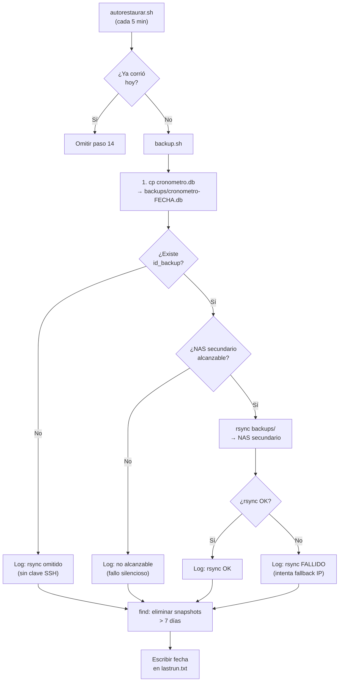

# Sesión 2026-02-26 — Backup automático al NAS secundario

## Qué se hizo

1. **Backup automático al NAS secundario** (v1.3, primer item del backlog)
   - `scripts/backup.sh` reescrito completamente desde cero
   - Paso 14 añadido en `scripts/autorestaurar.sh`
   - `scripts/deploy-nas.sh` actualizado para desplegar también los scripts de mantenimiento
   - Verificado en producción: snapshot creado correctamente en el NAS

2. **Conversación sobre compactación y guardado de sesiones**
   - Explicado el mecanismo de compactación de Claude Code vs. conservación en Claude.ai
   - Acordado nuevo flujo: guardar sesiones a `docs/sesiones/YYYY-MM-DD-Nombre.md` bajo demanda
   - Actualizada instrucción 6 en `MEMORY.md` con el formato de sesión y mención a Mermaid

## Archivos modificados

| Archivo | Cambio |
|---------|--------|
| `scripts/backup.sh` | Reescrito: BusyBox sh, `cp` para snapshot, rsync opcional vía SSH, retención 7 días |
| `scripts/autorestaurar.sh` | Añadido paso 14: llama a `backup.sh` una vez al día (idempotente) |
| `scripts/deploy-nas.sh` | Añadido bloque que sube `autorestaurar.sh` y `backup.sh` al DISK_DIR del NAS |
| `MEMORY.md` | Sección "Estado actual" actualizada a v1.3.0-dev; instrucción 6 añadida |

## Comandos ejecutados y resultados relevantes

```bash
# Commit de los tres scripts
git add scripts/backup.sh scripts/autorestaurar.sh scripts/deploy-nas.sh
git commit -m "feat: backup diario automatico al NAS secundario (v1.3)"
# → [master 3abb565]

# Deploy al NAS (SCP directo, sin usar deploy-nas.sh)
scp -i /tmp/id_nas_deploy scripts/backup.sh      sshd@192.168.1.71:/mnt/HD/HD_a2/.cronometro-psp/backup.sh
scp -i /tmp/id_nas_deploy scripts/autorestaurar.sh sshd@192.168.1.71:/mnt/HD/HD_a2/.cronometro-psp/autorestaurar.sh
ssh -i /tmp/id_nas_deploy sshd@192.168.1.71 "chmod +x ..."

# Prueba manual en el NAS
sh /mnt/HD/HD_a2/.cronometro-psp/backup.sh
# → EXIT_OK

# Log generado en el NAS
cat /mnt/HD/HD_a2/.cronometro-psp/logs/backup.log
# 2026-02-26 16:53:51: [BACKUP] Snapshot creado: cronometro-20260226-165351.db
# 2026-02-26 16:53:51: [BACKUP] Sin clave SSH en .../ssl/id_backup — rsync omitido
# 2026-02-26 16:53:51: [BACKUP] Backup completado

# Snapshot visible
ls /mnt/HD/HD_a2/.cronometro-psp/data/backups/
# cronometro-20260226-165351.db
```

## Decisiones tomadas

- **Sin `sqlite3` CLI en el NAS**: usar `cp` directo para el snapshot (SQLite es safe de copiar en un entorno de baja concurrencia como este).
- **Sin `gzip`**: la BD es pequeña, simplifica el script y evita incompatibilidades de BusyBox.
- **rsync deshabilitado por defecto**: se activa solo cuando existe `$DISK_DIR/ssl/id_backup`. Falla silenciosamente si no existe, sin interrumpir el flujo de autorestaurar.sh.
- **Idempotencia**: el paso 14 de autorestaurar.sh comprueba `/tmp/cronometro-backup-lastrun.txt` para no ejecutar el backup más de una vez al día (autorestaurar.sh corre cada 5 min).
- **Formato de sesiones**: acordado guardar en `.md` con Mermaid cuando proceda, en lugar de Word con copy-paste.

## Flujo de backup



## Para activar rsync al NAS secundario

```bash
# Ejecutar en el NAS principal vía SSH:
ssh-keygen -t ed25519 -f /mnt/HD/HD_a2/.cronometro-psp/ssl/id_backup -N ""
ssh-copy-id -i /mnt/HD/HD_a2/.cronometro-psp/ssl/id_backup.pub admin@192.168.1.68
ssh admin@192.168.1.68 "mkdir -p /mnt/HD/HD_a2/backups/cronometro-psp"
# Verificar:
rsync -az -e "ssh -i /mnt/HD/HD_a2/.cronometro-psp/ssl/id_backup -o BatchMode=yes" \
  /mnt/HD/HD_a2/.cronometro-psp/data/backups/ \
  admin@192.168.1.68:/mnt/HD/HD_a2/backups/cronometro-psp/
```
> Nota: ajustar `REMOTE_USER` en `backup.sh` si el usuario SSH del NAS secundario no es `admin`.

## Pendiente para la próxima sesión

- [ ] **Vista historial** (siguiente item v1.3): resumen diario/semanal con distribución de tiempo por actividad
- [ ] **Activar rsync**: cuando se tenga acceso al NAS secundario, generar `id_backup` y configurar destino
- [ ] Editar tipos de tarea existentes (nombre e icono)
- [ ] Editar actividades existentes (nombre y color)
- [ ] Editar flag `permanente` en actividades ya creadas

## Contexto de sesión anterior (compactada)

La sesión anterior al resumen de compactación cubrió:
- Suite de tests automatizados (PHPUnit 25 tests, JS 29 tests, smoke 48/49)
- Fixes backend PHP 8.3 (function_exists, class_exists, clamp)
- Acceso remoto HTTPS + DDNS (`cronometro.hash-pointer.com`)
- Autenticación mTLS con CA privada + certificado de cliente `cpcxb-movil`
- Documentación SSL/mTLS en `docs/configuracion-ssl-mtls.md`
- Bug en `autorestaurar.sh` (SSL_CONF_SRC apuntaba a `/` en lugar de `$DISK_DIR`) → corregido
- Actualización de `futuras-versiones.md` con estado real del proyecto
- Conexión de la extensión Claude in Chrome al navegador
- Instrucciones de trabajo añadidas a `MEMORY.md`
