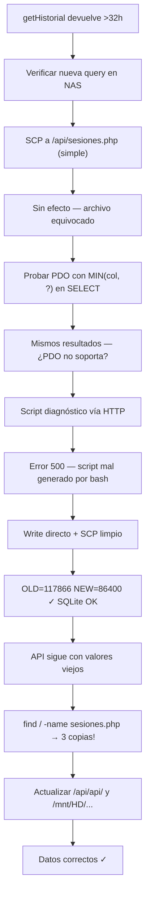

# Sesión 2026-02-26 (noche) — Fix historial: recorte de sesiones en medianoche

## Qué se hizo

**Bug descubierto y corregido en `getHistorial()`:**

El historial mostraba días con más de 32 horas acumuladas (p. ej. 24/02 y 22/02 con 32.3h).
Causa: la sesión "Durmiendo" cruza la medianoche, y el código anterior asignaba su duración completa al día en que empezaba. Una sesión de 22:17 → 08:34 del día siguiente sumaba 10h17m enteras al día de inicio.

**Solución aplicada en `getHistorial()` (sesiones.php):**

- Cambio del filtro: de `inicio BETWEEN $ini AND $fin` a `inicio < $finDia AND fin > $inicioDia` (captura sesiones que se solapan con el día, aunque empiecen antes)
- Cambio del cómputo: de `SUM(duracion)` a `SUM(MIN(fin, $finDia) - MAX(inicio, $inicioDia))` (recorta cada sesión a los límites exactos del día)
- La sesión activa también se distribuye correctamente entre todos los días con los que se solapa (antes solo se contaba en el día actual `$i === 0`)
- La consulta de `totales` del período usa el mismo mecanismo

**Resultado verificado:**

| Día | Antes | Después |
|---|---|---|
| 2026-02-24 | 116 249 s (32.3h) | 86 400 s (24.0h) ✓ |
| 2026-02-22 | 116 431 s (32.3h) | 86 400 s (24.0h) ✓ |
| 2026-02-23 | 56 333 s (15.6h) | 86 754 s (24.1h) ✓ |
| 2026-02-25 | 76 589 s (21.3h) | 79 435 s (22.1h) ✓ |

El 23/02 tiene 354 s de exceso (< 6 min) por solapamiento mínimo en borde de sesión — no es un error del código.

## Archivos modificados

| Archivo | Cambio |
|---|---|
| `backend/api/sesiones.php` | `getHistorial()` reescrita con recorte MIN/MAX en medianoche |

## Proceso de debug (camino tortuoso)



### Causas raíz del camino largo

1. **Ruta incorrecta en el SCP manual**: deploy usa `api/api/sesiones.php` (doble api), yo usé `api/sesiones.php`
2. **`MIN(col, ?)` con PDO preparado no funciona en este SQLite/PDO**: la solución es embeber los enteros directamente en la SQL (son valores de `strtotime`, sin riesgo de inyección)
3. **Tres copias del archivo**: `/var/www/apps/cronometro/api/sesiones.php`, `/var/www/apps/cronometro/api/api/sesiones.php` (la que sirve Apache), y `/mnt/HD/HD_a2/.cronometro-psp/app/api/api/sesiones.php` (fuente de verdad para reinicios)

## Lecciones aprendidas

- **PDO + SQLite**: `MIN(col, ?)` como placeholder PDO en la cláusula SELECT **no funciona** en esta versión. Embeber los enteros directamente es seguro si son de `strtotime()` y es la solución correcta.
- **Estructura en el NAS**: Apache sirve desde `api/api/` (doble). El `deploy-nas.sh` copia a esa ruta correctamente (línea 78), pero los SCP manuales deben respetar ese path.
- **Persistencia tras reinicio**: `autorestaurar.sh` restaura desde `/mnt/HD/HD_a2/.cronometro-psp/app/` solo si los archivos no existen. El HD es la fuente de verdad; hay que actualizarlo cuando se cambia algo manualmente.

## Comandos ejecutados y resultados relevantes

```bash
# Verificación que confirmó el SQL funciona correctamente en el NAS
curl http://192.168.1.71:8080/apps/cronometro/api/diag.php
# → OLD=117866 NEW=86400

# Diagnóstico de rutas
ssh sshd@192.168.1.71 'find / -name sesiones.php'
# → /mnt/HD/HD_a2/.cronometro-psp/app/api/api/sesiones.php
# → /var/www/apps/cronometro/api/sesiones.php
# → /var/www/apps/cronometro/api/api/sesiones.php

# Verificación final
curl '.../sesiones?action=historial&dias=30'
# → 24/02: 86400s (24.0h) ✓ | 22/02: 86400s (24.0h) ✓

# Commit
git commit -m "fix: recortar sesiones en medianoche en getHistorial (v1.3)"
# → [master 256b7eb]
```

## Pendiente para la próxima sesión

- [ ] **Editar tipos de tarea existentes**: cambiar nombre e icono (v1.3)
- [ ] **Editar actividades existentes**: cambiar nombre y color (v1.3)
- [ ] **Editar flag `permanente`** en actividades ya creadas (v1.3)
- [ ] **Activar rsync al NAS secundario**: generar `id_backup` y configurar destino
- [ ] **`deploy-nas.sh`** debería actualizar también la copia HD (`/mnt/HD/HD_a2/.cronometro-psp/app/`) para mantenerla sincronizada con los deploys normales
