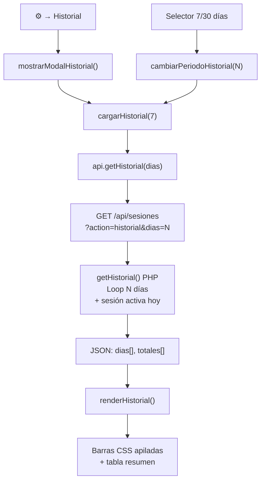

# Sesión 2026-02-26 (tarde) — Vista historial de tiempo por actividad

## Qué se hizo

1. **Vista historial de tiempo** (v1.3, segundo item del backlog)
   - Nuevo endpoint PHP `GET /api/sesiones?action=historial&dias=N`
   - Modal "📊 Historial" accesible desde ⚙️, con selector 7 / 30 días
   - Barras horizontales apiladas por actividad (CSS puro, sin librerías externas)
   - Tabla resumen del período (tiempo por actividad + total)
   - Verificado visualmente con el servidor de desarrollo local

2. **Servidor de desarrollo local configurado**
   - `dev-server.php`: router PHP que mapea `/apps/cronometro/api/` → backend y `/apps/cronometro/www/` → frontend
   - `.claude/launch.json`: arranque con `php -S 0.0.0.0:8080` vía WSL, reutilizable con `preview_start`

3. **Reorganización de MEMORY.md**
   - Historial de "Estados anteriores" movido a `SESIONES_ANTERIORES.md`
   - Instrucción de inicio de sesión añadida al principio de MEMORY.md

## Archivos modificados

| Archivo | Cambio |
|---------|--------|
| `backend/api/sesiones.php` | Añadido `getHistorial()` + routing `action=historial` |
| `frontend/js/api-client.js` | Añadido `getHistorial(dias)`, bumpeado a v7 |
| `frontend/js/app.js` | Funciones `mostrarModalHistorial`, `renderHistorial`, etc., bumpeado a v15 |
| `frontend/index.html` | Opción "Historial" en ⚙️, modal HTML añadido, scripts bumpeados |
| `frontend/css/styles.css` | Estilos del modal historial (barras, selector, tabla resumen) |
| `dev-server.php` | Nuevo: router PHP para servidor de desarrollo local |
| `.claude/launch.json` | Nuevo: configuración del servidor de preview |
| `docs/sesiones/SESIONES_ANTERIORES.md` | Nuevo: historial compacto de sesiones anteriores |
| `MEMORY.md` (en .claude/) | Compactado; instrucción de inicio de sesión añadida |

## Comandos ejecutados y resultados relevantes

```bash
# Verificación del endpoint en producción
curl 'http://192.168.1.71:8080/apps/cronometro/api/sesiones?action=historial&dias=7'
# → dias: 7 | totales: 9 | server_time: True

# Deploy al NAS
bash scripts/deploy-nas.sh
# → ✅ Despliegue completado

# Commits
git commit -m "docs: añadir SESIONES_ANTERIORES.md y compactar MEMORY.md"
# → [master 102d92b]

git commit -m "feat: vista historial de tiempo por actividad (v1.3)"
# → [master 6137b0e]
```

## Decisiones tomadas

- **CSS puro, sin Chart.js**: consistente con el resto de la app, sin dependencias externas.
- **Agrupación por actividad** (no por tipo de tarea): las actividades tienen colores propios, más informativas en una barra. Los 16 tipos de tarea habrían saturado la vista en móvil.
- **Días vacíos omitidos**: la vista no muestra filas con total=0 para no desperdiciar espacio.
- **Escala relativa**: el ancho de cada barra es proporcional al día de mayor actividad del período, no a horas absolutas, para aprovechar mejor el espacio horizontal en pantallas pequeñas.
- **Servidor de desarrollo**: `dev-server.php` como router PHP mínimo, sin npm ni dependencias de node. Arranque vía WSL con `preview_start`.

## Flujo del modal historial



## Pendiente para la próxima sesión

- [ ] **Editar tipos de tarea existentes**: cambiar nombre e icono (v1.3)
- [ ] **Editar actividades existentes**: cambiar nombre y color (v1.3)
- [ ] **Editar flag `permanente`** en actividades ya creadas (v1.3)
- [ ] **Activar rsync al NAS secundario**: generar `id_backup` y configurar destino
