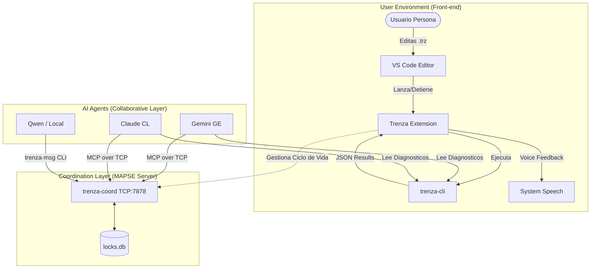

# Architecture: Trenza-MAPSE Topology

This document clarifies the roles and interactions between the components of the Trenza development ecosystem.

## 1. The Compiler (`trenza-cli`)
- **Nature**: Pure, stateless tool.
- **Role**: Validates logic, checks syntax, and generates the "four strands" (HTML/JS/JSON/Docs).
- **Communication**: None. It just reads files and writes to stdout.

## 2. The Server (`trenza-coord`)
- **Nature**: Stateful network service.
- **Role**: The **Coexistence Center**. It doesn't compile things; it manages **who is doing what**.
- **Services**: Locks (preventing two agents from editing the same file) and a Message Queue (Agent-to-Agent talk).

## 3. The Extension (The Host)
- **Role**: It acts as the "Floor Manager". 
  - It triggers the **Compiler** when you save a file.
  - It triggers the **Voice** when there's an error.
  - **Why start the Server?**: Because the server's lifecycle should match your working session. When you close VS Code, you usually want the coordination to stop.

## 4. MCP (Model Context Protocol)
This is the *language* agents use to talk to the Server. `trenza-coord` is the host, and we (Claude/Gemini) are clients.

---
*Summary: The compiler builds the bridge; the server manages the traffic on it.*
