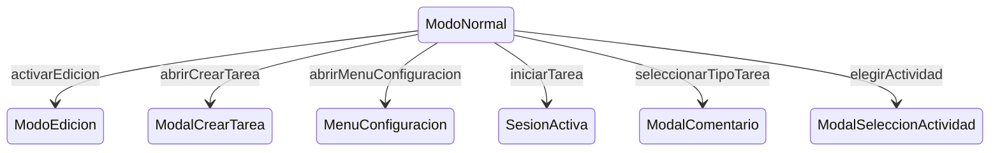

# ModoNormal

**Tipo**: contexto base

## Roles

| Rol | Tipo | Origen |
|-----|------|--------|
| * | ignored | Local |
| tarjeta_tipo | TipoTarea | Local |
| tarjeta_tarea | Tarea | Local |
| pestana_actividad | Actividad | Local |
| pestana_frecuentes | Pestana | Local |
| boton_edicion | Boton | Local |
| boton_nuevo | Boton | Local |
| boton_configuracion | Boton | Local |

## Transiciones

| Evento | Destino |
|--------|---------|
| activarEdicion | [ModoEdicion](../base/ModoEdicion.md) |
| abrirCrearTarea | [ModalCrearTarea](../overlays/ModalCrearTarea.md) |
| abrirMenuConfiguracion | [MenuConfiguracion](../overlays/MenuConfiguracion.md) |
| iniciarTarea | [SesionActiva](../concurrent/SesionActiva.md) |
| seleccionarTipoTarea | [ModalComentario](../overlays/ModalComentario.md) |
| elegirActividad | [ModalSeleccionActividad](../overlays/ModalSeleccionActividad.md) |