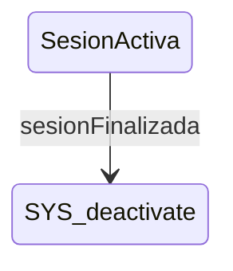

# SesionActiva

**Tipo**: contexto concurrent

## Roles

| Rol | Tipo | Origen |
|-----|------|--------|
| * | ignored | Local |
| display_timer | Boton | Local |
| checkbox_sustituir | Checkbox | Local |

## Contribuciones (Fills)

- Llenando **ModalComentario.sesion_opts** con:

## Transiciones

| Evento | Destino |
|--------|---------|
| sesionFinalizada | [deactivate] |