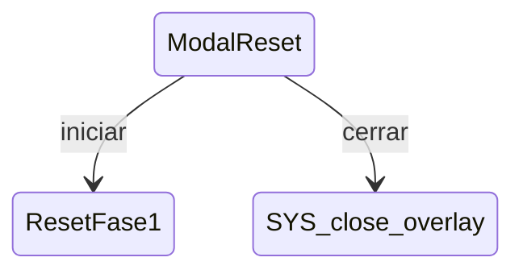

# ModalReset

**Tipo**: contexto overlays

## Roles

| Rol | Tipo | Origen |
|-----|------|--------|
| * | ignored | Local |
| boton_cancelar | Boton | Local |

## Transiciones

| Evento | Destino |
|--------|---------|
| iniciar | [ResetFase1](../ResetFase1.md) |
| cerrar | [close_overlay] |