# Diseño del lenguaje — Trenza DSL

**Estado**: propuesta de diseño — en revisión (actualizado con Seguridad por Diseño + decisiones pendientes resueltas)
**Fecha**: 4–6 de marzo de 2026; actualizado 12 de marzo de 2026
**Participantes**: desarrollador + Claude Sonnet 4.6 + Claude Opus 4.6 + Gemini 3.1 Pro
**Referencias de diseño**: Parnas & Clements (A Rational Design Process: How and Why to Fake It, 1986); Reenskaug (DCI)

---

## Principio rector: la legibilidad es un requisito formal

Los métodos formales tienen un problema de adopción. No es que los ingenieros
de software no necesiten razonamiento formal — es que la notación habitual
(lógica temporal, álgebra relacional, tipos dependientes) aleja a la mayoría
de profesionales que más se beneficiarían de ellos.

Trenza toma una posición deliberada: **las propiedades formales se expresan
como reglas legibles, no como fórmulas**. El rigor no viene de la notación
sino de la estructura. Un DSL bien diseñado puede ser tan verificable como
TLA+ sin necesitar que el usuario sepa qué es un operador temporal.

Esto no es una concesión a la simplicidad. Es una decisión de diseño: si el
DSL es ilegible para un ingeniero de software medio, ha fracasado en su
objetivo, independientemente de cuán formalmente correcto sea.

---

## Influencia: soluciones autocontenidas

El trabajo de Reuven Cohen (rUv) sobre soluciones autocontenidas aporta un
principio que encaja naturalmente con trenza.

Cohen construye sistemas que empaquetan todo lo necesario para funcionar y
verificarse en un solo artefacto. Su proyecto RuView (captura de movimiento
vía WiFi) es un ejemplo extremo: sensores ESP32 a 8 dólares que procesan
señales WiFi localmente, sin internet, sin nube, sin dependencias externas.
El artefacto incluye modelo, runtime de inferencia y verificación
criptográfica — todo en un solo archivo binario (formato RVF).

El principio relevante para trenza no es técnico sino arquitectónico:

> Cada artefacto debe contener todo lo necesario para verificar su propia
> corrección, sin depender de nada externo.

En RuView, puedes ejecutar `./verify` con solo Python y numpy — sin hardware
WiFi — y obtener una validación completa del pipeline de procesamiento.

Trenza adopta este principio: **cada contexto es una unidad autocontenida**.
Contiene su especificación, genera su implementación, sus tests y su
esquemático, y puede verificarse en aislamiento. No necesitas ejecutar la
aplicación completa para saber si un contexto está bien definido.

Hay una conexión adicional con la metodología SPARC de Cohen (Specification,
Pseudocode, Architecture, Refinement, Completion): ambas parten de que la
especificación es el artefacto primario. Pero en SPARC, la especificación
es un documento que humanos y LLMs leen. En trenza, **la especificación es
el programa**. No hay brecha entre lo que se especifica y lo que se ejecuta.

---

## La unidad mínima de especificación: el contexto

La primera pregunta abierta del concepto inicial era: *¿qué es la unidad
mínima de especificación?*

La respuesta es el **contexto** — en el sentido DCI de Reenskaug.

Un contexto es la menor porción de especificación que es autocontenida y
verificable por sí misma. Contiene:

- Un **nombre** que corresponde a un caso de uso del dominio.
- Los **roles** que participan en ese caso de uso.
- Los **eventos** que cada rol puede recibir.
- Las **acciones** que resultan de cada evento.
- Las **transiciones** a otros contextos.
- Los **efectos** que se producen (llamadas API, cambios en DOM, etc.).

No existe una especificación trenza más pequeña que un contexto. Un evento
suelto no tiene significado. Un rol sin contexto no tiene comportamiento.
Un contexto es el átomo del sistema — indivisible y autocontenido.

---

## Seguridad y privacidad por diseño (compliance estructural)

La legislación actual (RGPD Art. 25, ENS, CRA, NIS2) exige responsabilidad
sobre la seguridad y privacidad de los sistemas. Sin embargo, las herramientas
de desarrollo tradicionales no ofrecen trazabilidad de estas exigencias,
generando una "deuda técnica" donde la responsabilidad es jurídicamente
exigible pero técnicamente inescrutable.

Trenza convierte parte de estas aspiraciones legislativas en verificaciones
del compilador, haciendo que el cumplimiento normativo sea estructural y
demostrable — no documental. Esto no resuelve la deuda técnica acumulada,
pero crea el tipo de artefacto sobre el que puede construirse responsabilidad
formal trazable.

### Mínimo privilegio estructural (ENS / CRA)

En trenza, si un evento no está cableado a una acción en un contexto
específico, no existe. No es una política de control de acceso que pueda
fallar por omisión — es topología pura. El uso explícito de `bloqueado`
documenta y garantiza la denegación por defecto. La Regla de Completitud
garantiza que ningún evento queda sin manejador declarado.

### Resiliencia y recuperación segura (CRA / NIS2)

Al ser una máquina de estados estricta, el sistema siempre arranca en el
contexto `initial` declarado. No existen estados intermedios huérfanos
derivados de variables booleanas inconsistentes — el bug original del
cronómetro que motivó este proyecto.

### Cadena de custodia criptográfica

El paquete `.tzp` con `manifest.json` y checksums vincula
matemáticamente la especificación (`.trz`), la implementación generada
(`.wasm`) y los tests. Si el código en producción no corresponde a la
especificación firmada, el checksum lo evidencia. Es un artefacto firmable
legalmente y auditable antes de que el código se ejecute.

### Trazabilidad de auditoría (RGPD Art. 30)

Como todas las transiciones de estado ocurren a través del DSL, el
compilador *puede* inyectar automáticamente llamadas a un módulo de
auditoría en el código Rust generado. Para ello, `system.trz` debe
declarar el módulo de auditoría destino:

```
system MiSistema:
    audit: external modulo_auditoria
```

Cuando se declara, ningún desarrollador puede olvidar auditar una
transición de contexto — el código de auditoría es generado, no escrito.

### Clasificación de datos y conformidad de flujo (RGPD Art. 25.1)

Ver sección "Declaración de datos" y Regla 6 en "Verificación".

---

## Gramática del DSL

La gramática de trenza usa indentación (como Python) y palabras clave legibles.
No hay operadores simbólicos excepto `->` para indicar consecuencia.

### Declaración de datos

Los datos se declaran fuera de los contextos. Son estructura pura — sin
comportamiento. Un dato es "lo que algo es"; un rol en un contexto es
"lo que algo hace aquí".

```
data <nombre> [clasificacion: <etiqueta>]:
    <campo>: <tipo>
```

La anotación `[clasificacion:]` es opcional pero verificada: si un dato
tiene `[clasificacion: personal]`, el verificador aplicará la Regla 6
para garantizar que solo fluye hacia módulos `external` explícitamente
autorizados para esa clasificación.

### Estructura de un contexto

```
context <nombre>:
    [requires: <condiciones>]

    role <nombre_rol>: <tipo_dato>
        on <evento> -> <acción>
        [on <evento> -> ignorar]

    [context <nombre_hijo>:       -- contexto anidado (máx. 2 niveles)
        ...]

    [transitions:
        on <evento> -> <otro_contexto>]

    [effects:
        <acción> -> <descripción_del_efecto>]
```

### Reglas sintácticas

- Los nombres de contexto empiezan con mayúscula: `ModoEdicion`, `SesionActiva`.
- Los nombres de dato empiezan con mayúscula: `TipoTarea`, `Actividad`.
- Los nombres de rol empiezan con minúscula: `tarjeta`, `pestaña_actividad`.
- Los eventos empiezan con minúscula: `tap`, `doble_tap`, `mantener`.
- Las acciones empiezan con minúscula: `mostrarModal`, `iniciarTarea`.
- La palabra `ignorar` significa "este evento está contemplado y no hace nada".
- Los comentarios usan `--` (doble guion, como SQL y Haskell).
- Los roles se vinculan a un tipo de dato con `:`. El `self` dentro del rol
  refiere a las propiedades de ese dato.

### Vocabulario reservado

| Palabra | Significado |
|---------|-------------|
| `system` | Declara el sistema completo con sus contextos |
| `data` | Declara un tipo de dato (estructura sin comportamiento) |
| `context` | Declara un contexto (caso de uso) |
| `role` | Declara un rol dentro de un contexto |
| `on` | Declara un manejador de evento |
| `->` | Indica consecuencia: evento -> acción |
| `ignorar` | El evento está contemplado pero no produce acción |
| `bloqueado` | El evento está explícitamente prohibido en este contexto |
| `requires` | Condición necesaria para que el contexto esté activo |
| `transitions` | Declara cambios de contexto |
| `effects` | Declara efectos secundarios asociados a acciones |
| `external` | Marca una acción implementada en código convencional |

---

## Ejemplo completo: el cronómetro PSP

El cronómetro-psp tiene cinco condicionales dispersos que dependen del booleano
`AppState.modoEdicion` (ver `frontend/js/app.js`, líneas 286, 323, 411, 651, 662).

En trenza, esos cinco condicionales desaparecen. Primero se declaran los datos
(estructura pura), luego los contextos (comportamiento puro):

```
-- Capa Data: qué son las cosas (sin comportamiento)
data TipoTarea:
    tipoId: Id
    nombre: Texto
    icono: Texto

data Tarea:
    tareaId: Id
    tipoId: Id

data Actividad:
    id: Id
    nombre: Texto
    color: Color

data Pestaña:
    id: Id

-- Capa System: declaración del sistema
system CronometroPSP:
    initial: ModoNormal
    events: tap

-- Capa Context: qué hacen las cosas aquí (sin estructura)

context ModoNormal:

    role tipo_tarea: TipoTarea
        on tap -> seleccionarTipo(self.tipoId)

    role tarea: Tarea
        on tap -> iniciarTarea(self.tareaId)

    role pestaña_actividad: Actividad
        on tap -> cambiarPestaña(self.id)

    role pestaña_frecuentes: Pestaña
        on tap -> cambiarPestaña('frecuentes')

    transitions:
        on activarEdicion -> ModoEdicion

    effects:
        iniciarTarea -> POST /api/sesiones { tipoTareaId, comentario }
        cambiarPestaña -> actualizarUI()

context ModoEdicion:

    role tipo_tarea: TipoTarea
        on tap -> mostrarModalEditar(self.tipoId)

    role tarea: Tarea
        on tap -> mostrarModalEditar(self.tipoId)

    role pestaña_actividad: Actividad
        on tap -> mostrarModalEditarActividad(self.id)

    role pestaña_frecuentes: Pestaña
        on tap -> ignorar                         -- explícito: no se puede editar

    transitions:
        on desactivarEdicion -> ModoNormal

    effects:
        mostrarModalEditar -> GET /api/tipos-tarea?id=
        mostrarModalEditarActividad -> GET /api/actividades?id=
```

### Qué hace visible esta especificación

1. **Los cinco condicionales del código actual no existen.** No hay `if (modoEdicion)`
   en ningún sitio. La factoría (que genera el `system`) decide qué contexto está
   activo; el resto es polimórfico.

2. **`pestaña_frecuentes` en `ModoEdicion` dice `ignorar`**, no simplemente la omite.
   Si fuera omitida, el verificador reportaría: "el rol `pestaña_frecuentes` maneja
   el evento `tap` en `ModoNormal` pero no en `ModoEdicion`". El olvido es imposible.

3. **La acción `iniciarTarea` no aparece en `ModoEdicion`** porque ningún camino
   conduce a ella desde ese contexto. No hace falta un guard defensivo
   `if (modoEdicion) return` porque la topología lo impide.

4. **Los efectos son declarativos.** La especificación dice *qué* se comunica con el
   exterior, no *cómo*. El cómo vive en el código generado o en un módulo `external`.

### Comparación lado a lado

| Código actual (app.js) | Trenza |
|---|---|
| `if (AppState.modoEdicion)` en 5 sitios | 0 condicionales; 2 contextos |
| Guard olvidado = bug silencioso | Rol sin manejador = error de verificación |
| Efectos mezclados con lógica de control | Efectos declarados por separado |
| Estado implícito en booleano global | Estado explícito como contexto activo |
| Diagrama: solo si alguien lo dibuja | Esquemático Mermaid auto-generado |

---

## Qué se genera: las cuatro hebras

Cada contexto trenza genera cuatro artefactos — las cuatro hebras de la trenza:

### Hebra 1: Implementación

Para el sistema completo, el generador produce Rust. Los contextos se
traducen a un enum, y cada combinación rol+evento se convierte en una
función con `match` exhaustivo:

```rust
pub enum Contexto {
    ModoNormal,
    ModoEdicion,
}

pub fn handle_tipo_tarea_tap(ctx: &Contexto, tipo_tarea: &TipoTarea) -> Accion {
    match ctx {
        Contexto::ModoNormal => Accion::SeleccionarTipo(tipo_tarea.tipo_id),
        Contexto::ModoEdicion => Accion::MostrarModalEditar(tipo_tarea.tipo_id),
    }
}

pub fn handle_pestaña_frecuentes_tap(ctx: &Contexto) -> Accion {
    match ctx {
        Contexto::ModoNormal => Accion::CambiarPestaña("frecuentes"),
        Contexto::ModoEdicion => Accion::Ignorar,
    }
}

// Añadir un nuevo contexto al enum sin actualizar estos match
// produce un error de compilación. Rust impone la completitud.
```

La elección de Rust como destino no es casual. El `match` exhaustivo
de Rust impone la misma regla de completitud que el verificador de trenza,
pero a nivel de compilación del código generado. Es verificación doble:
trenza verifica la especificación; `rustc` verifica la implementación.

El código generado se compila a WASM para despliegue en frontend y backend,
alineándose con el principio de autocontención: un módulo `.wasm` lleva
todo lo que necesita, sin runtime externo.

### Hebra 2: Tests

Para el mismo sistema, el reverso algebraico:

```rust
#[cfg(test)]
mod tests {
    use super::*;

    #[test]
    fn modo_edicion_tipo_tarea_tap_muestra_modal() {
        let ctx = Contexto::ModoEdicion;
        let tipo = TipoTarea { tipo_id: 42, nombre: "Test".into(), icono: "📝".into() };
        let resultado = handle_tipo_tarea_tap(&ctx, &tipo);
        assert_eq!(resultado, Accion::MostrarModalEditar(42));
    }

    #[test]
    fn modo_edicion_pestaña_frecuentes_tap_ignora() {
        let ctx = Contexto::ModoEdicion;
        let resultado = handle_pestaña_frecuentes_tap(&ctx);
        assert_eq!(resultado, Accion::Ignorar);
    }

    #[test]
    fn modo_normal_tipo_tarea_tap_selecciona() {
        let ctx = Contexto::ModoNormal;
        let tipo = TipoTarea { tipo_id: 7, nombre: "Debug".into(), icono: "🔧".into() };
        let resultado = handle_tipo_tarea_tap(&ctx, &tipo);
        assert_eq!(resultado, Accion::SeleccionarTipo(7));
    }
}
```

Cada pareja evento-acción produce exactamente un test por contexto.
No hay tests que escribir manualmente: si la especificación cambia,
los tests cambian.

### Hebra 3: Esquemático

El diagrama Mermaid auto-generado para el sistema completo:

```mermaid
stateDiagram-v2
    [*] --> ModoNormal
    ModoNormal --> ModoEdicion : activarEdicion
    ModoEdicion --> ModoNormal : desactivarEdicion

    state ModoNormal {
        tap_tipo_tarea --> seleccionarTipo
        tap_tarea --> iniciarTarea
        tap_pestaña_actividad --> cambiarPestaña
        tap_pestaña_frecuentes --> cambiarPestaña
    }

    state ModoEdicion {
        tap_tipo_tarea --> mostrarModalEditar
        tap_tarea --> mostrarModalEditar
        tap_pestaña_actividad --> mostrarModalEditarActividad
        tap_pestaña_frecuentes --> ignorar
    }
```



Las cuatro hebras son proyecciones del mismo artefacto. Modificar una
implica regenerar las otras tres. No pueden desincronizarse.

---

## Verificación sin notación simbólica

Trenza verifica propiedades formales expresándolas como reglas legibles.
Cada regla puede comprobarse por inspección de la especificación, sin
ejecutar código.

### Regla 1: Completitud

**Enunciado**: Todo rol que maneje un evento en algún contexto debe
manejar ese mismo evento en todos los contextos del sistema, aunque sea
con `ignorar` o `bloqueado`.

**Ejemplo**: Si `pestaña_frecuentes` responde a `tap` en `ModoNormal`,
debe responder a `tap` en `ModoEdicion`. Si no lo hace, el verificador
reporta:

```
ERROR [completitud]: pestaña_frecuentes.tap definido en ModoNormal
                     pero ausente en ModoEdicion
```

**Qué previene**: El bug original — un evento sin manejador en un contexto.

### Regla 2: Determinismo

**Enunciado**: En un contexto dado, cada evento de cada rol produce
exactamente una acción. No hay ambigüedad.

**Ejemplo**: Si alguien escribe:

```
role tarjeta:
    on tap -> mostrarModalEditar
    on tap -> seleccionarTipo          -- ERROR
```

El verificador reporta:

```
ERROR [determinismo]: tarjeta.tap tiene dos acciones en ModoEdicion
```

**Qué previene**: Comportamiento impredecible por manejadores duplicados.

### Regla 3: Alcanzabilidad

**Enunciado**: Todo contexto debe poder alcanzarse desde el contexto
inicial a través de alguna secuencia de transiciones.

**Ejemplo**: Si se define un contexto `ModoMantenimiento` pero ningún
otro contexto tiene una transición hacia él:

```
ERROR [alcanzabilidad]: ModoMantenimiento no es alcanzable desde
                        ModoNormal (contexto inicial)
```

**Qué previene**: Código muerto — contextos que se especifican pero
nunca se activan.

### Regla 4: Retorno

**Enunciado**: Todo contexto no inicial debe tener al menos una
transición que, directa o indirectamente, regrese al contexto inicial.

**Qué previene**: Estados sumidero — contextos de los que no se puede
salir.

### Regla 5: Exhaustividad de roles

**Enunciado**: Todo rol declarado en el bloque `system` debe aparecer
en todos los contextos del sistema.

**Ejemplo**: Si `system` declara el rol `pestaña_frecuentes` pero
`ModoEdicion` no lo menciona:

```
ERROR [exhaustividad]: rol pestaña_frecuentes declarado en el sistema
                       pero ausente del contexto ModoEdicion
```

**Qué previene**: Roles olvidados — elementos del interfaz cuyo
comportamiento en un contexto no fue considerado.

### Regla 6: Conformidad de datos (RGPD Art. 25.1)

**Enunciado**: Ningún dato con `[clasificacion: X]` puede pasarse como
parámetro a una acción `external` que no declare explícitamente
`[autorizado_para: X]`.

**Ejemplo**: Si `DatosSesion` está marcado como `[clasificacion: personal]`
y un contexto intenta pasarlo a un módulo sin autorización:

```
ERROR [conformidad]: DatosSesion [clasificacion: personal] fluye hacia
                     modulo_analytics que no declara [autorizado_para: personal]
```

**Qué previene**: Violaciones de finalidad y fugas de datos por diseño —
el compilador hace imposible enviar datos personales a un destino no
autorizado, incluso por error u omisión.

### Nota sobre equivalencia formal

Estas seis reglas son equivalentes a las propiedades que se expresarían
con lógica temporal en TLA+ o con invariantes en Alloy. La diferencia es
que un ingeniero de software puede leerlas, discutirlas con su equipo, y
verificarlas con una herramienta que emite mensajes en lenguaje natural.

Las reglas 1–5 verifican corrección de comportamiento. La regla 6 verifica
conformidad normativa. Ambas clases de propiedad son ciudadanos de primera
clase en el verificador.

---

## Composición de contextos

La quinta pregunta abierta era: *¿cómo se expresa `ModoEdicion + SesiónActiva`?*

La solución DCI (documentada en `2026-03-04-04-influencias-dci.md`) se mantiene: los contextos
coexisten, no se combinan. Pero la composición necesita reglas de prioridad
cuando dos contextos activos asignan comportamientos distintos al mismo rol
para el mismo evento.

### Reglas de composición

```
system CronometroPSP:
    initial: ModoNormal

    -- Los contextos se declaran en orden de prioridad descendente
    contexts:
        SesionActiva        -- mayor prioridad
        ModoEdicion
        ModoNormal          -- menor prioridad (base)

    composition: prioridad  -- el contexto de mayor prioridad prevalece
```

Si `SesionActiva` y `ModoEdicion` ambos definen un manejador para
`tarea.tap`, prevalece el de `SesionActiva`. Si `SesionActiva` no define
ese manejador, se busca en `ModoEdicion`, y luego en `ModoNormal`.

Alternativa: `composition: exclusiva` — solo el contexto activo de mayor
prioridad tiene efecto. Los demás se ignoran completamente. Esto es más
simple pero menos expresivo.

La elección entre prioridad y exclusiva es una decisión del diseñador del
sistema, no del lenguaje. Trenza ofrece ambas.

---

## Efectos secundarios

Los efectos (llamadas API, modificaciones al DOM, navegación) se declaran
en el contexto pero no se ejecutan por el DSL. El DSL genera la interfaz;
el runtime la implementa.

```
context ModoEdicion:
    role tipo_tarea: TipoTarea
        on tap -> mostrarModalEditar(self.tipoId)

    effects:
        mostrarModalEditar -> external cargar_datos_tarea(tipo_id)
```

La palabra `external` indica que `cargar_datos_tarea` es una función
Rust convencional que el código generado invoca. Trenza no la genera —
espera encontrarla en el entorno destino.

Esto resuelve la segunda pregunta abierta: los efectos se declaran en
trenza pero se implementan fuera de trenza. El DSL define *qué* efectos
ocurren; el código convencional define *cómo*.

---

## Interoperabilidad con código convencional

Trenza no pretende reemplazar todo el código de una aplicación. Pretende
gobernar la lógica de estados y eventos, delegando el resto.

### Módulos external

```
external module cronometro_api:
    cargar_datos_tarea(tipo_id: Id) -> TipoTarea
    guardar_edicion(tipo_id: Id, datos: DatosEdicion) -> Resultado
    iniciar_sesion(tarea_id: Id, comentario: Texto) -> Sesion
```

El bloque `external` declara funciones que existen en código Rust
convencional. Trenza las trata como cajas negras: conoce su firma
pero no su implementación. El código generado produce un `trait`
que el código convencional debe implementar:

```rust
// Generado por trenza
pub trait CronometroApi {
    fn cargar_datos_tarea(&self, tipo_id: Id) -> TipoTarea;
    fn guardar_edicion(&self, tipo_id: Id, datos: DatosEdicion) -> Resultado;
    fn iniciar_sesion(&self, tarea_id: Id, comentario: &str) -> Sesion;
}
```

Los tests generados usan mocks para este trait. Los tests de
integración (que verifican la implementación real) están fuera del
alcance de trenza — pertenecen al código convencional.

---

## Capa de datos: separación de estructura y comportamiento

La capa de datos resuelve la quinta pregunta abierta y evita el
problema clásico de la herencia en diamante.

### El problema

En OO clásico, la herencia mezcla dos preguntas distintas:

- "¿Qué es esto?" — estructura, propiedades (herencia de datos).
- "¿Qué hace esto aquí?" — comportamiento en contexto (herencia funcional).

Cuando ambas viven en la misma jerarquía (`class Tarjeta extends
ElementoUI implements Editable`), la herencia múltiple produce
el diamante: ¿de quién hereda `Tarjeta` su método `onClick`?

### La solución DCI en trenza

Trenza no tiene este problema porque las dos preguntas viven en
capas separadas que nunca se cruzan:

| Capa | Pregunta | Mecanismo | Herencia |
|------|----------|-----------|----------|
| `data` | "¿Qué es?" | Declaración de campos | No hay. Datos planos. |
| `context` + `role` | "¿Qué hace aquí?" | Manejadores de eventos | No hay. Contextos aislados. |

Un rol no *es* un TipoTarea — *actúa sobre* un TipoTarea en un
contexto dado. Fuera de ese contexto, el TipoTarea es un dato sin
comportamiento. No hay jerarquía que pueda formar un diamante.

Si dos roles necesitan las mismas propiedades, se vinculan al
mismo tipo de dato — no heredan de una clase base común:

```
context ModoEdicion:
    role tipo_tarea: TipoTarea        -- mismo dato, distinto rol
        on tap -> mostrarModalEditar(self.tipoId)

    role tarea: Tarea                 -- dato diferente, mismo evento
        on tap -> mostrarModalEditar(self.tipoId)
```

---

## Contextos anidados

Los contextos pueden anidarse para expresar sub-estados dentro de un
contexto padre. Esto se alinea con los statecharts jerárquicos de Harel
(1987) que XState implementa hoy.

### Ejemplo

`ModoEdicion` tiene dos sub-estados: editando una tarea o editando
una actividad. Los sub-contextos heredan los manejadores del padre
y pueden sobreescribir los que necesiten:

```
context ModoEdicion:

    role pestaña_frecuentes: Pestaña
        on tap -> ignorar

    transitions:
        on desactivarEdicion -> ModoNormal

    -- Sub-contexto: editando una tarea específica
    context EditandoTarea:
        role campo_nombre: CampoTexto
            on cambio -> actualizarNombre(self.valor)
        role boton_guardar: Boton
            on tap -> guardarEdicion()

        transitions:
            on guardarEdicion -> ModoEdicion     -- vuelve al padre
            on cancelar -> ModoEdicion

    -- Sub-contexto: editando una actividad
    context EditandoActividad:
        role campo_nombre: CampoTexto
            on cambio -> actualizarNombreActividad(self.valor)
        role selector_color: SelectorColor
            on seleccion -> actualizarColor(self.valor)

        transitions:
            on guardarEdicionActividad -> ModoEdicion
            on cancelar -> ModoEdicion
```

### Reglas de encapsulamiento

1. **Ámbito cerrado**: Un contexto hijo solo puede transicionar a su
   padre o a un hermano del mismo nivel. No puede saltar directamente
   a un contexto de otro padre. `EditandoTarea` no puede ir a
   `ModoNormal` — debe pasar por `ModoEdicion`.

2. **Verificación independiente**: Cada contexto anidado es verificable
   por sí mismo. Las reglas se aplican dentro de su ámbito.

3. **Profundidad limitada**: Máximo dos niveles de anidamiento. Si se
   necesita más, el sistema probablemente necesita descomponerse en
   subsistemas, no en contextos más profundos.

### Reglas de herencia en contextos anidados (resuelto 12 marzo 2026)

> Decisión documentada en `2026-03-12-02-decisiones-pendientes-claude.md`
> (Sonnet) y `2026-03-12-03-decisiones-pendientes-opus.md` (Opus).

**Regla H1: Herencia implícita de roles.**
Un contexto hijo hereda automáticamente todos los roles del padre con sus
vínculos de tipo. `EditandoTarea` no dice nada sobre `pestaña_frecuentes`,
así que hereda el `ignorar` de `ModoEdicion`. No puede cambiar el vínculo
de tipo de un rol heredado.

**Regla H2: Roles locales.**
Un contexto hijo puede declarar roles nuevos que no existen en el padre.
Estos roles son locales: solo existen en ese hijo y sus propios hijos.
No son visibles desde el padre ni desde contextos hermanos.

**Regla H3: Completitud por niveles.**
La Regla de Completitud se aplica de forma independiente en cada nivel
de anidamiento. Un rol local de `EditandoTarea` no tiene que aparecer en
`EditandoActividad` ni en `ModoEdicion`. Los roles heredados mantienen
el handler del padre salvo sobrescritura explícita.

**Regla H4: Sobrescritura explícita.**
Si un hijo quiere cambiar el handler de un rol heredado, debe re-declarar
el rol completo con sus nuevos handlers. No se puede "mencionar" un rol
sin handlers — sería ambiguo. El verificador emite una nota informativa
cuando detecta una sobrescritura:

```
NOTA [herencia]: EditandoTarea sobrescribe pestaña_frecuentes.tap
                 (padre: ignorar → hijo: mostrarAyudaEdicion)
```

**Regla H5: Prohibición de eventos nuevos en roles heredados.**
Un hijo no puede añadir handlers para eventos que el padre no declaró
en un rol heredado. Si `pestaña_frecuentes` responde solo a `tap` en el
padre, el hijo no puede añadirle `doble_tap`. Esto mantiene estable el
catálogo de eventos por rol en toda la jerarquía. La alternativa es
declarar un rol local con el mismo tipo de dato:

```
context EditandoTarea:
    -- pestaña_frecuentes se hereda con on tap -> ignorar

    role pestana_edicion: Pestaña        -- rol local, mismo tipo
        on doble_tap -> mostrarOpciones

    role campo_nombre: CampoTexto
        on cambio -> actualizarNombre(self.valor)
```

**Independencia entre hermanos.**
Roles locales de un contexto hermano no obligan al otro. Si
`EditandoTarea` y `EditandoActividad` declaran ambos `campo_nombre:
CampoTexto`, son roles locales independientes. La Regla de Completitud
no cruza entre hermanos.

### Inspección: vista expandida

El CLI incluye un comando de inspección que muestra la vista expandida
de cualquier contexto, haciendo visible la herencia sin forzar al autor
a repetirla en el código fuente:

```
trenza inspect contexts/ModoEdicion/EditandoTarea.trz
```

```
context EditandoTarea (hijo de ModoEdicion):

  [heredado] role pestaña_frecuentes: Pestaña
      on tap -> ignorar

  [local] role campo_nombre: CampoTexto
      on cambio -> actualizarNombre(self.valor)

  [local] role boton_guardar: Boton
      on tap -> guardarEdicion()

  transitions:
      on guardarEdicion -> ModoEdicion
      on cancelar -> ModoEdicion
```

---

## Formato de archivo y paquetes

### Extensión

La extensión `.hlx` está ocupada (HLX Deterministic Language, presets de
Line 6 Trenza, namespace de Adobe AEM). La extensión elegida es **`.trz`**
para archivos fuente individuales.

### Estructura: un archivo por contexto

Cada contexto vive en su propio archivo `.trz`. Esto permite:

- **Generación incremental**: al modificar un contexto, solo se
  regeneran sus artefactos.
- **Trabajo paralelo**: distintos desarrolladores (o LLMs) pueden
  trabajar en contextos distintos sin conflictos.
- **Verificación parcial**: se puede verificar un solo contexto sin
  procesar el sistema completo.

### Paquete: archivo ZIP autocontenido

Inspirado en formatos como .3mf, .epub y .docx, un sistema trenza
completo se empaqueta como un archivo ZIP con extensión `.tzp`:

```
cronometro-psp.tzp  (ZIP)
│
├── mimetype                          -- "application/trenza-dsl" (sin comprimir)
├── manifest.json                     -- mapa de partes, checksums, versión
│
├── system.trz                      -- declaración del sistema (punto de entrada)
├── data.trz                        -- declaraciones de datos
│
├── contexts/
│   ├── ModoNormal.trz              -- un archivo por contexto
│   ├── ModoEdicion.trz
│   └── ModoEdicion/
│       ├── EditandoTarea.trz       -- contextos anidados
│       └── EditandoActividad.trz
│
├── external/
│   └── cronometro_api.trz          -- módulos external
│
├── generated/
│   ├── impl/
│   │   └── cronometro_psp.rs         -- hebra 1: implementación Rust
│   ├── tests/
│   │   └── cronometro_psp_test.rs    -- hebra 2: tests Rust
│   └── schematics/
│       └── system.mermaid            -- hebra 3: esquemático
│
└── verification/
    └── report.json                   -- resultado de las 5 reglas
```

El `manifest.json` contiene checksums de cada archivo. Al modificar un
contexto, la herramienta compara checksums para regenerar solo los
artefactos afectados.

La estructura de directorios refleja la jerarquía de contextos:
`contexts/ModoEdicion/EditandoTarea.trz` es hijo de
`contexts/ModoEdicion.trz`.

Este formato encarna el principio de Cohen: el paquete contiene
especificación, implementación, tests, esquemático y verificación.
Un solo archivo `.tzp` se copia, se versiona y se despliega
como una unidad.

---

## Herramienta de verificación: CLI

La herramienta de verificación es un CLI — la interfaz mínima sobre
la que se construye todo lo demás:

```
trenza verify ModoEdicion.trz       -- verifica un contexto
trenza verify cronometro.tzp     -- verifica el sistema completo
trenza generate cronometro.tzp   -- genera las tres hebras
trenza check cronometro.tzp      -- verifica + genera + ejecuta tests
```

La salida del verificador usa las mismas reglas legibles documentadas
en la sección de verificación:

```
$ trenza verify cronometro.tzp

  completitud ............ OK
  determinismo ........... OK
  alcanzabilidad ......... OK
  retorno ................ OK
  exhaustividad .......... OK
  conformidad de datos ... OK

  6/6 reglas cumplidas. Sistema verificado.
  Checksum del artefacto: a7f8b9...
```

Un plugin de editor invoca el CLI por debajo. Una acción de CI/CD
es el CLI en un contenedor. Si el CLI es sólido, todo lo demás
viene gratis.

---

## Decisiones tomadas

| # | Decisión | Resolución | Razonamiento |
|---|----------|------------|--------------|
| 1 | Compilación destino | **Rust + WASM** | `match` exhaustivo impone completitud; WASM es autocontenido; alineado con la intención de la arquitectura del proyecto |
| 2 | Formato de archivo | **`.trz`** (fuente) + **`.tzp`** (paquete ZIP) | `.hlx` ocupada; un archivo por contexto; paquete autocontenido tipo .3mf |
| 3 | Herramienta | **CLI primero** (`trenza verify`, `trenza generate`) | Base sobre la que se construyen plugins y CI/CD |
| 4 | Generación incremental | **Por contexto**, con checksums en `manifest.json` | Consecuencia natural de un archivo por contexto |
| 5 | Datos del rol | **Capa `data` separada**, roles vinculados por tipo | Evita herencia en diamante; separación DCI de estructura y comportamiento |
| 6 | Lenguaje del CLI | **Python para prototipo → Rust para herramienta final** | Descubrir huecos de diseño con mínima fricción; AST JSON como contrato de conformidad para la migración |
| 7 | Formato del manifest | **Schema propio JSON simple** con `trenza_version`; principios OPC adoptados (mimetype + manifiesto en raíz) | OPC es XML/verboso; JSON Schema publicado solo cuando el formato estabilice |
| 8 | Herencia en contextos anidados | **Implícita** (reglas H1–H5); roles locales; completitud por niveles; `trenza inspect` para vista expandida | Sub-escenas, no herencia OO; sobrescritura explícita; eventos nuevos en roles heredados prohibidos |

---

## Respuestas a las preguntas abiertas

Para referencia, las preguntas de `2026-03-04-01-concepto-inicial.md` y su estado actual:

| # | Pregunta | Estado |
|---|----------|--------|
| 1 | ¿Unidad mínima de especificación? | **Respondida**: el contexto |
| 2 | ¿Efectos secundarios? | **Respondida**: declarados con `effects`, implementados con `external` |
| 3 | ¿Compila o interpreta? | **Respondida**: compila a Rust + WASM |
| 4 | ¿Interop con código existente? | **Respondida**: módulos `external` generan traits Rust |
| 5 | ¿Composición de estados? | **Respondida**: contextos coexistentes con reglas de prioridad + anidamiento encapsulado |

---

## Decisiones pendientes

Todas las decisiones pendientes originales fueron resueltas el 12 de marzo
de 2026. Ver decisiones 6, 7 y 8 en la tabla anterior, y los memos de
contraste:

- `docs/2026-03-12-02-decisiones-pendientes-claude.md` (posición Sonnet)
- `docs/2026-03-12-03-decisiones-pendientes-opus.md` (posición Opus + resolución conjunta)

