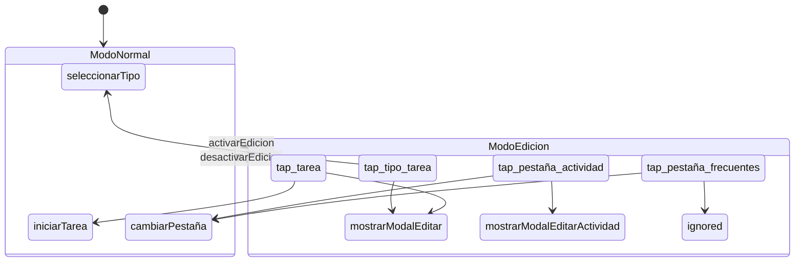

# Language Design — Trenza DSL


**Status**: design proposal — under review (updated with Security by Design + resolved pending decisions)

**Date**: March 4–6, 2026; updated March 12, 2026

**Participants**: developer + Claude Sonnet 4.6 + Claude Opus 4.6 + Gemini 3.1 Pro

**Design references**: Parnas & Clements (A Rational Design Process: How and Why to Fake It, 1986); Reenskaug (DCI)


---


## Guiding Principle: Readability Is a Formal Requirement


Formal methods have an adoption problem. It is not that software engineers
do not need formal reasoning — it is that the usual notation
(temporal logic, relational algebra, dependent types) alienates most
practitioners who would benefit from them the most.

Trenza takes a deliberate stance: **formal properties are expressed
as readable rules, not as formulas**. Rigor comes not from the notation
but from the structure. A well-designed DSL can be as verifiable as
TLA+ without requiring the user to know what a temporal operator is.

This is not a concession to simplicity. It is a design decision: if the
DSL is unreadable for an average software engineer, it has failed its
objective, regardless of how formally correct it is.


---


## Influence: Self-Contained Solutions


The work of Reuven Cohen (rUv) on self-contained solutions contributes a
principle that fits naturally with Trenza.

Cohen builds systems that package everything needed to run and
verify themselves in a single artifact. His RuView project (motion capture
via WiFi) is an extreme example: $8 ESP32 sensors that process
WiFi signals locally, without internet, without cloud, without external dependencies.
The artifact includes the model, inference runtime, and cryptographic
verification — all in a single binary file (RVF format).

The relevant principle for Trenza is not technical but architectural:

> Each artifact must contain everything necessary to verify its own
> correctness, without depending on anything external.

In RuView, you can run `./verify` with just Python and numpy — without WiFi
hardware — and get a complete validation of the processing pipeline.

Trenza adopts this principle: **each context is a self-contained unit**.
It contains its specification, generates its implementation, its tests and its
schematics, and can be verified in isolation. You do not need to run the
entire application to know whether a context is well defined.

There is an additional connection with Cohen's SPARC methodology (Specification,
Pseudocode, Architecture, Refinement, Completion): both start from the premise that
the specification is the primary artifact. But in SPARC, the specification is
a document that humans and LLMs read. In Trenza, **the specification is
the program**. There is no gap between what is specified and what is executed.


---


## The Minimum Unit of Specification: The Context


The first open question from the initial concept was: *What is the
minimum unit of specification?*

The answer is the **context** — in Reenskaug's DCI sense.

A context is the smallest portion of specification that is self-contained and
verifiable on its own. It contains:

- A **name** corresponding to a domain use case.
- The **roles** that participate in that use case.
- The **events** each role can receive.
- The **actions** that result from each event.
- The **transitions** to other contexts.
- The **effects** that are produced (API calls, DOM changes, etc.).

There is no Trenza specification smaller than a context. A standalone event
has no meaning. A role without a context has no behavior.
A context is the atom of the system — indivisible and self-contained.


---


## Security and Privacy by Design (Structural Compliance)


Current legislation (GDPR Art. 25, ENS, CRA, NIS2) demands accountability
for the security and privacy of systems. However, traditional development tools
offer no traceability of these requirements,
generating "technical debt" where accountability is legally
enforceable but technically inscrutable.

Trenza turns part of these legislative aspirations into compiler
checks, making regulatory compliance structural and
demonstrable — not documentary. This does not resolve accumulated technical debt,
but it creates the kind of artifact on which formally traceable accountability
can be built.

### Structural Least Privilege (ENS / CRA)

In Trenza, if an event is not wired to an action in a specific context,
it simply does not exist. It is not an access-control policy that can
fail by omission — it is pure topology. The explicit use of `forbidden`
documents and guarantees denial by default. The Completeness Rule
guarantees that no event is left without a declared handler.

### Resilience and Safe Recovery (CRA / NIS2)

Being a strict state machine, the system always starts in the
`initial` context declared. There are no orphaned intermediate states
derived from inconsistent boolean variables — the original timer bug
that motivated this project.

### Cryptographic Chain of Custody

The `.tzp` package with `manifest.json` and checksums mathematically
binds the specification (`.trz`), the generated implementation
(`.wasm`), and the tests. If the code in production does not correspond to the
signed specification, the checksum reveals it. It is a legally signable
and auditable artifact before the code is executed.

### Audit Traceability (GDPR Art. 30)

Since all state transitions occur through the DSL, the
compiler *can* automatically inject calls to an audit module
in the generated Rust code. To do so, `system.trz` must
declare the target audit module:

```
system MiSistema:

    audit: external modulo_auditoria

```

When declared, no developer can forget to audit a
context transition — the audit code is generated, not written.

### Data Classification and Flow Conformance (GDPR Art. 25.1)

See the "Data Declaration" section and Rule 6 in "Verification".


---


## DSL Grammar


The Trenza grammar uses indentation (like Python) and readable keywords.
There are no symbolic operators except `->` to indicate consequence.

### Data Declaration

Data is declared outside contexts. It is pure structure — without
behavior. Data is "what something is"; a role in a context is
"what something does here".

```
data <name> [clasificacion: <label>]:

    <field>: <type>

```

The `[clasificacion:]` annotation is optional but verified: if data
has `[clasificacion: personal]`, the verifier will apply Rule 6
to ensure it only flows to `external` modules explicitly
authorized for that classification.

### Context Structure

```
context <name>:

    [requires: <conditions>]


    role <role_name>: <data_type>

        [@<decorator>("message")]
        on <event> -> <action>

        [on <event> -> ignored]


    [context <child_name>:       -- nested context (max 2 levels)

        ...]


    [transitions:

        on <event> -> <other_context>]


    [effects:

        <action> -> <effect_description>]

```

### Syntactic Rules

- Context names start with an uppercase letter: `ModoEdicion`, `SesionActiva`.
- Data names start with an uppercase letter: `TipoTarea`, `Actividad`.
- Role names start with a lowercase letter: `tarjeta`, `pestaña_actividad`.
- Events start with a lowercase letter: `tap`, `doble_tap`, `mantener`.
- Actions start with a lowercase letter: `mostrarModal`, `iniciarTarea`.
- Decorators start with `@` (e.g. `@audit("reason")`) and annotate paths with NFRs.
- The keyword `ignored` means "this event is accounted for and does nothing".
- Comments use `--` (double dash, like SQL and Haskell).
- Roles are bound to a data type with `:`. The `self` inside a role
  refers to the properties of that data.

### Reserved Vocabulary

| Keyword | Meaning |
|---------|---------|
| `system` | Declares the complete system with its contexts |
| `data` | Declares a data type (structure without behavior) |
| `context` | Declares a context (use case) |
| `role` | Declares a role within a context |
| `on` | Declares an event handler |
| `->` | Indicates consequence: event -> action |
| `ignored` | The event is accounted for but produces no action |
| `forbidden` | The event is explicitly prohibited in this context |
| `requires` | Condition required for the context to be active |
| `transitions` | Declares context changes |
| `effects` | Declares side effects associated with actions |
| `external` | Marks an action implemented in conventional code |
| `pub` | Marks a definition or member as part of the public surface (ADR-021) |
| `use` | Imports a specific system by name and hash from a package (ADR-021, ADR-022) |


---


## Complete Example: The PSP Timer


The PSP timer has five scattered conditionals that depend on the boolean
`AppState.modoEdicion` (see `frontend/js/app.js`, lines 286, 323, 411, 651, 662).

In Trenza, those five conditionals disappear. First the data
(pure structure) is declared, then the contexts (pure behavior):

```
-- Data layer: what things are (no behavior)

data TipoTarea:

    tipoId: Id

    nombre: Texto

    icono: Texto


data Tarea:

    tareaId: Id

    tipoId: Id


data Actividad:

    id: Id

    nombre: Texto

    color: Color


data Pestaña:

    id: Id


-- System layer: system declaration

system CronometroPSP:

    initial: ModoNormal

    events: tap


-- Context layer: what things do here (no structure)


context ModoNormal:


    role tipo_tarea: TipoTarea

        on tap -> seleccionarTipo(self.tipoId)


    role tarea: Tarea

        on tap -> iniciarTarea(self.tareaId)


    role pestaña_actividad: Actividad

        on tap -> cambiarPestaña(self.id)


    role pestaña_frecuentes: Pestaña

        on tap -> cambiarPestaña('frecuentes')


    transitions:

        on activarEdicion -> ModoEdicion


    effects:

        iniciarTarea -> POST /api/sesiones { tipoTareaId, comentario }

        cambiarPestaña -> actualizarUI()


context ModoEdicion:


    role tipo_tarea: TipoTarea

        on tap -> mostrarModalEditar(self.tipoId)


    role tarea: Tarea

        on tap -> mostrarModalEditar(self.tipoId)


    role pestaña_actividad: Actividad

        on tap -> mostrarModalEditarActividad(self.id)


    role pestaña_frecuentes: Pestaña

        on tap -> ignored                         -- explicit: cannot be edited in this mode


    transitions:

        on desactivarEdicion -> ModoNormal


    effects:

        mostrarModalEditar -> GET /api/tipos-tarea?id=

        mostrarModalEditarActividad -> GET /api/actividades?id=

```

### What This Specification Makes Visible

1. **The five conditionals in the current code do not exist.** There is no `if (modoEdicion)`
   anywhere. The factory (which generates the `system`) decides which context is
   active; the rest is polymorphic.

2. **`pestaña_frecuentes` in `ModoEdicion` says `ignored`**, it does not simply omit it.
   If it were omitted, the verifier would report: "role `pestaña_frecuentes` handles
   event `tap` in `ModoNormal` but not in `ModoEdicion`". Forgetting is impossible.

3. **The action `iniciarTarea` does not appear in `ModoEdicion`** because no path
   leads to it from that context. A defensive guard
   `if (modoEdicion) return` is not needed because the topology prevents it.

4. **Effects are declarative.** The specification says *what* is communicated with
   the outside, not *how*. The how lives in the generated code or in an `external` module.

### Side-by-Side Comparison

| Current code (app.js) | Trenza |
|---|---|
| `if (AppState.modoEdicion)` in 5 places | 0 conditionals; 2 contexts |
| Forgotten guard = silent bug | Role without handler = verification error |
| Effects mixed with control logic | Effects declared separately |
| Implicit state in global boolean | Explicit state as active context |
| Diagram: only if someone draws it | Auto-generated Mermaid schematic |


---


## What Is Generated: The Four Strands


Each Trenza context generates four artifacts — the four strands of the braid:

### Strand 1: Implementation

For the complete system, the generator produces Rust. Contexts are
translated into an enum, and each role+event combination becomes a
function with an exhaustive `match`:

```rust

pub enum Contexto {

    ModoNormal,

    ModoEdicion,

}


pub fn handle_tipo_tarea_tap(ctx: &Contexto, tipo_tarea: &TipoTarea) -> Accion {

    match ctx {

        Contexto::ModoNormal => Accion::SeleccionarTipo(tipo_tarea.tipo_id),

        Contexto::ModoEdicion => Accion::MostrarModalEditar(tipo_tarea.tipo_id),

    }

}


pub fn handle_pestaña_frecuentes_tap(ctx: &Contexto) -> Accion {

    match ctx {

        Contexto::ModoNormal => Accion::CambiarPestaña("frecuentes"),

        Contexto::ModoEdicion => Accion::Ignorar,

    }

}


// Adding a new context to the enum without updating these matches

// produces a compile error. Rust enforces completeness.

```

The choice of Rust as the target is not arbitrary. Rust's exhaustive `match`
enforces the same completeness rule as the Trenza verifier,
but at the compilation level of the generated code. It is double verification:
Trenza verifies the specification; `rustc` verifies the implementation.

The generated code is compiled to WASM for deployment on frontend and backend,
aligning with the self-containment principle: a `.wasm` module carries
everything it needs, without an external runtime.

### Strand 2: Tests

For the same system, the algebraic inverse:

```rust

#[cfg(test)]

mod tests {

    use super::*;


    #[test]

    fn modo_edicion_tipo_tarea_tap_shows_modal() {

        let ctx = Contexto::ModoEdicion;

        let tipo = TipoTarea { tipo_id: 42, nombre: "Test".into(), icono: "🔑".into() };

        let resultado = handle_tipo_tarea_tap(&ctx, &tipo);

        assert_eq!(resultado, Accion::MostrarModalEditar(42));

    }


    #[test]

    fn modo_edicion_pestaña_frecuentes_tap_ignores() {

        let ctx = Contexto::ModoEdicion;

        let resultado = handle_pestaña_frecuentes_tap(&ctx);

        assert_eq!(resultado, Accion::Ignorar);

    }


    #[test]

    fn modo_normal_tipo_tarea_tap_selects() {

        let ctx = Contexto::ModoNormal;

        let tipo = TipoTarea { tipo_id: 7, nombre: "Debug".into(), icono: "🔧".into() };

        let resultado = handle_tipo_tarea_tap(&ctx, &tipo);

        assert_eq!(resultado, Accion::SeleccionarTipo(7));

    }

}

```

Each event-action pair produces exactly one test per context.
There are no tests to write manually: if the specification changes,
the tests change.

### Strand 3: Schematics

The auto-generated Mermaid diagram for the complete system:


```mermaid

stateDiagram-v2

    [*] --> ModoNormal

    ModoNormal --> ModoEdicion : activarEdicion

    ModoEdicion --> ModoNormal : desactivarEdicion


    state ModoNormal {

        tap_tipo_tarea --> seleccionarTipo

        tap_tarea --> iniciarTarea

        tap_pestaña_actividad --> cambiarPestaña

        tap_pestaña_frecuentes --> cambiarPestaña

    }


    state ModoEdicion {

        tap_tipo_tarea --> mostrarModalEditar

        tap_tarea --> mostrarModalEditar

        tap_pestaña_actividad --> mostrarModalEditarActividad

        tap_pestaña_frecuentes --> ignored

    }

```

The four strands are projections of the same artifact. Modifying one
implies regenerating the other three. They cannot fall out of sync.


---


## Verification Without Symbolic Notation


Trenza verifies formal properties by expressing them as readable rules.
Each rule can be checked by inspection of the specification, without
executing code.

### Rule 1: Completeness

**Statement**: Every role that handles an event in any context must
handle that same event in all contexts of the system, even if only
with `ignored` or `forbidden`.

**Example**: If `pestaña_frecuentes` responds to `tap` in `ModoNormal`,
it must respond to `tap` in `ModoEdicion`. If it does not, the verifier
reports:

```

ERROR [completeness]: pestaña_frecuentes.tap defined in ModoNormal

                      but absent in ModoEdicion

```

**What it prevents**: The original bug — an event without a handler in a context.

### Rule 2: Determinism

**Statement**: In a given context, each event of each role produces
exactly one action. There is no ambiguity.

**Example**: If someone writes:

```

role tarjeta:

    on tap -> mostrarModalEditar

    on tap -> seleccionarTipo          -- ERROR

```

The verifier reports:

```

ERROR [determinism]: tarjeta.tap has two actions in ModoEdicion

```

**What it prevents**: Unpredictable behavior due to duplicate handlers.

### Rule 3: Reachability

**Statement**: Every context must be reachable from the initial context
through some sequence of transitions.

**Example**: If a context `ModoMantenimiento` is defined but no
other context has a transition to it:

```

ERROR [reachability]: ModoMantenimiento is not reachable from

                      ModoNormal (initial context)

```

**What it prevents**: Dead code — contexts that are specified but
never activated.

### Rule 4: Return

**Statement**: Every non-initial context must have at least one
transition that, directly or indirectly, returns to the initial context.

**What it prevents**: Sink states — contexts that cannot be exited.

### Rule 5: Role Exhaustiveness

**Statement**: Every role declared in the `system` block must appear
in all contexts of the system.

**Example**: If `system` declares the role `pestaña_frecuentes` but
`ModoEdicion` does not mention it:

```

ERROR [exhaustiveness]: role pestaña_frecuentes declared in the system

                        but absent from context ModoEdicion

```

**What it prevents**: Forgotten roles — interface elements whose
behavior in a context was not considered.

### Rule 6: Data Conformance (GDPR Art. 25.1)

**Statement**: No data with `[clasificacion: X]` may be passed as
a parameter to an `external` action that does not explicitly declare
`[autorizado_para: X]`.

**Example**: If `DatosSesion` is marked as `[clasificacion: personal]`
and a context attempts to pass it to an unauthorized module:

```

ERROR [conformance]: DatosSesion [clasificacion: personal] flows to

                     modulo_analytics which does not declare [autorizado_para: personal]

```

**What it prevents**: Purpose violations and data leaks by design —
the compiler makes it impossible to send personal data to an unauthorized
destination, even by accident or omission.

### Note on Formal Equivalence

These six rules are equivalent to the properties that would be expressed
with temporal logic in TLA+ or with invariants in Alloy. The difference is
that a software engineer can read them, discuss them with their team, and
verify them with a tool that emits natural-language messages.

Rules 1–5 verify behavioral correctness. Rule 6 verifies
regulatory compliance. Both classes of property are first-class
citizens in the verifier.


---


## Context Composition


The fifth open question was: *How is `ModoEdicion + SesionActiva` expressed?*

The DCI solution (documented in `2026-03-04-04-influencias-dci.md`) holds: contexts
coexist, they do not merge. But composition needs priority rules
when two active contexts assign different behaviors to the same role
for the same event.

### Composition Rules

```

system CronometroPSP:

    initial: ModoNormal


    -- Contexts are declared in descending priority order

    contexts:

        SesionActiva        -- highest priority

        ModoEdicion

        ModoNormal          -- lowest priority (base)


    composition: prioridad  -- the highest-priority context prevails

```

If `SesionActiva` and `ModoEdicion` both define a handler for
`tarea.tap`, the one from `SesionActiva` prevails. If `SesionActiva` does not define
that handler, it is looked up in `ModoEdicion`, and then in `ModoNormal`.

Alternative: `composition: exclusiva` — only the active context with the highest
priority takes effect. The others are ignored entirely. This is
simpler but less expressive.

The choice between `prioridad` and `exclusiva` is a system designer's
decision, not the language's. Trenza offers both.


---


## Side Effects


Effects (API calls, DOM modifications, navigation) are declared
in the context but are not executed by the DSL. The DSL generates the interface;
the runtime implements it.

```

context ModoEdicion:

    role tipo_tarea: TipoTarea

        on tap -> mostrarModalEditar(self.tipoId)


    effects:

        mostrarModalEditar -> external cargar_datos_tarea(tipo_id)

```

The keyword `external` indicates that `cargar_datos_tarea` is a conventional
Rust function that the generated code invokes. Trenza does not generate it —
it expects to find it in the target environment.

This resolves the second open question: effects are declared in
Trenza but implemented outside of Trenza. The DSL defines *what* effects
occur; the conventional code defines *how*.


---


## Interoperability With Conventional Code


Trenza does not aim to replace all code in an application. It aims to
govern state and event logic, delegating the rest.

### External Modules

```

external module cronometro_api:

    cargar_datos_tarea(tipo_id: Id) -> TipoTarea

    guardar_edicion(tipo_id: Id, datos: DatosEdicion) -> Resultado

    iniciar_sesion(tarea_id: Id, comentario: Texto) -> Sesion

```

The `external` block declares functions that exist in conventional
Rust code. Trenza treats them as black boxes: it knows their signature
but not their implementation. The generated code produces a `trait`
that the conventional code must implement:

```rust

// Generated by Trenza

pub trait CronometroApi {

    fn cargar_datos_tarea(&self, tipo_id: Id) -> TipoTarea;

    fn guardar_edicion(&self, tipo_id: Id, datos: DatosEdicion) -> Resultado;

    fn iniciar_sesion(&self, tarea_id: Id, comentario: &str) -> Sesion;

}

```

The generated tests use mocks for this trait. Integration tests
(which verify the real implementation) are outside the
scope of Trenza — they belong to conventional code.


---


## Data Layer: Separation of Structure and Behavior


The data layer resolves the fifth open question and avoids the
classic diamond inheritance problem.

### The Problem

In classic OO, inheritance conflates two distinct questions:

- "What is this?" — structure, properties (data inheritance).
- "What does this do here?" — behavior in context (functional inheritance).

When both live in the same hierarchy (`class Tarjeta extends
ElementoUI implements Editable`), multiple inheritance produces
the diamond: who does `Tarjeta` inherit its `onClick` method from?

### The DCI Solution in Trenza

Trenza does not have this problem because the two questions live in
separate layers that never cross:

| Layer | Question | Mechanism | Inheritance |
|-------|----------|-----------|-------------|
| `data` | "What is it?" | Field declaration | None. Flat data. |
| `context` + `role` | "What does it do here?" | Event handlers | None. Isolated contexts. |

A role does not *is* a TipoTarea — it *acts on* a TipoTarea in a
given context. Outside that context, the TipoTarea is data without
behavior. There is no hierarchy that can form a diamond.

If two roles need the same properties, they are bound to the
same data type — they do not inherit from a common base class:

```

context ModoEdicion:

    role tipo_tarea: TipoTarea        -- same data, different role

        on tap -> mostrarModalEditar(self.tipoId)


    role tarea: Tarea                 -- different data, same event

        on tap -> mostrarModalEditar(self.tipoId)

```


---


## Nested Contexts


Contexts can be nested to express sub-states within a
parent context. This aligns with Harel's hierarchical statecharts
(1987) that XState implements today.

### Example

`ModoEdicion` has two sub-states: editing a task or editing
an activity. Sub-contexts inherit the parent's handlers
and can override those they need:

```

context ModoEdicion:


    role pestaña_frecuentes: Pestaña

        on tap -> ignored


    transitions:

        on desactivarEdicion -> ModoNormal


    -- Sub-context: editing a specific task

    context EditandoTarea:

        role campo_nombre: CampoTexto

            on cambio -> actualizarNombre(self.valor)

        role boton_guardar: Boton

            on tap -> guardarEdicion()


        transitions:

            on guardarEdicion -> ModoEdicion     -- returns to parent

            on cancelar -> ModoEdicion


    -- Sub-context: editing an activity

    context EditandoActividad:

        role campo_nombre: CampoTexto

            on cambio -> actualizarNombreActividad(self.valor)

        role selector_color: SelectorColor

            on seleccion -> actualizarColor(self.valor)


        transitions:

            on guardarEdicionActividad -> ModoEdicion

            on cancelar -> ModoEdicion

```

### Encapsulation Rules

1. **Closed scope**: A child context can only transition to its
   parent or to a sibling at the same level. It cannot jump directly
   to a context under a different parent. `EditandoTarea` cannot go to
   `ModoNormal` — it must go through `ModoEdicion`.

2. **Independent verification**: Each nested context is verifiable
   on its own. The rules apply within its scope.

3. **Limited depth**: Maximum two levels of nesting. If
   more is needed, the system likely needs to be decomposed into
   subsystems, not into deeper contexts.

### Inheritance Rules in Nested Contexts (resolved March 12, 2026)

> Decision documented in `2026-03-12-02-decisiones-pendientes-claude.md`
> (Sonnet) and `2026-03-12-03-decisiones-pendientes-opus.md` (Opus).

**Rule H1: Implicit role inheritance.**
A child context automatically inherits all roles from the parent with their
type bindings. `EditandoTarea` says nothing about `pestaña_frecuentes`,
so it inherits the `ignored` from `ModoEdicion`. It cannot change the type
binding of an inherited role.

**Rule H2: Local roles.**
A child context can declare new roles that do not exist in the parent.
These roles are local: they only exist in that child and its own children.
They are not visible from the parent or from sibling contexts.

**Rule H3: Completeness by level.**
The Completeness Rule is applied independently at each nesting level.
A local role of `EditandoTarea` does not need to appear in
`EditandoActividad` or in `ModoEdicion`. Inherited roles keep
the parent's handler unless explicitly overridden.

**Rule H4: Explicit override.**
If a child wants to change the handler of an inherited role, it must
re-declare the full role with its new handlers. A role cannot be
"mentioned" without handlers — that would be ambiguous. The verifier emits
an informational note when it detects an override:

```

NOTE [inheritance]: EditandoTarea overrides pestaña_frecuentes.tap

                    (parent: ignored → child: mostrarAyudaEdicion)

```

**Rule H5: Prohibition of new events on inherited roles.**
A child cannot add handlers for events that the parent did not declare
on an inherited role. If `pestaña_frecuentes` responds only to `tap` in the
parent, the child cannot add `doble_tap`. This keeps the event catalog per role stable
throughout the hierarchy. The alternative is
to declare a local role with the same data type:

```

context EditandoTarea:

    -- pestaña_frecuentes is inherited with on tap -> ignored


    role pestana_edicion: Pestaña        -- local role, same type

        on doble_tap -> mostrarOpciones


    role campo_nombre: CampoTexto

        on cambio -> actualizarNombre(self.valor)

```

**Sibling independence.**
Local roles of a sibling context do not obligate the other. If
`EditandoTarea` and `EditandoActividad` both declare `campo_nombre:
CampoTexto`, they are independent local roles. The Completeness Rule
does not cross between siblings.

### Inspection: Expanded View

The CLI includes an inspect command that shows the expanded view
of any context, making inheritance visible without forcing the author
to repeat it in the source code:

```

trenza inspect contexts/ModoEdicion/EditandoTarea.trz

```

```

context EditandoTarea (child of ModoEdicion):


  [inherited] role pestaña_frecuentes: Pestaña

      on tap -> ignored


  [local] role campo_nombre: CampoTexto

      on cambio -> actualizarNombre(self.valor)


  [local] role boton_guardar: Boton

      on tap -> guardarEdicion()


  transitions:

      on guardarEdicion -> ModoEdicion

      on cancelar -> ModoEdicion

```


---


## File Format and Packages


### Extension

The `.hlx` extension is taken (HLX Deterministic Language, Line 6 Trenza presets,
Adobe AEM namespace). The chosen extension is **`.trz`**
for individual source files.

### Structure: One File Per Context

Each context lives in its own `.trz` file. This allows:

- **Incremental generation**: when a context is modified, only
  its artifacts are regenerated.
- **Parallel work**: different developers (or LLMs) can
  work on different contexts without conflicts.
- **Partial verification**: a single context can be verified without
  processing the entire system.

### Package: Self-Contained ZIP File

Inspired by formats such as .3mf, .epub, and .docx, a complete Trenza
system is packaged as a ZIP file with the `.tzp` extension:

```

cronometro-psp.tzp  (ZIP)

│

├── mimetype                          -- "application/trenza-dsl" (uncompressed)

├── manifest.json                     -- parts map, checksums, version

│

├── system.trz                      -- system declaration (entry point)

├── data.trz                        -- data declarations

│

├── contexts/

│   ├── ModoNormal.trz              -- one file per context

│   ├── ModoEdicion.trz

│   └── ModoEdicion/

│       ├── EditandoTarea.trz       -- nested contexts

│       └── EditandoActividad.trz

│

├── external/

│   └── cronometro_api.trz          -- external modules

│

├── generated/

│   ├── impl/

│   │   └── cronometro_psp.rs         -- strand 1: Rust implementation

│   ├── tests/

│   │   └── cronometro_psp_test.rs    -- strand 2: Rust tests

│   └── schematics/

│       └── system.mermaid            -- strand 3: schematics

│

└── verification/

    └── report.json                   -- result of the 5 rules

```

The `manifest.json` contains checksums for each file. When a
context is modified, the tool compares checksums to regenerate only the
affected artifacts.

The directory structure reflects the context hierarchy:
`contexts/ModoEdicion/EditandoTarea.trz` is a child of
`contexts/ModoEdicion.trz`.

This format embodies Cohen's principle: the package contains
specification, implementation, tests, schematics, and verification.
A single `.tzp` file is copied, versioned, and deployed
as a unit.


---


## Verification Tool: CLI

The verification tool is a CLI — the minimal interface on top of
which everything else is built:

```

trenza verify ModoEdicion.trz       -- verifies a single context

trenza verify cronometro.tzp     -- verifies the complete system

trenza generate cronometro.tzp   -- generates the three strands

trenza check cronometro.tzp      -- verify + generate + run tests

```

The verifier output uses the same readable rules documented
in the verification section:

```

$ trenza verify cronometro.tzp


  completeness ........... OK

  determinism ............ OK

  reachability ........... OK

  return ................. OK

  role exhaustiveness .... OK

  data conformance ....... OK


  6/6 rules passed. System verified.

  Artifact checksum: a7f8b9...

```

An editor plugin invokes the CLI under the hood. A CI/CD action
is the CLI in a container. If the CLI is solid, everything else
comes for free.


---


## Decisions Made

| # | Decision | Resolution | Rationale |
|---|----------|------------|-----------|
| 1 | Compilation target | **Rust + WASM** | Exhaustive `match` enforces completeness; WASM is self-contained; aligned with the project's architectural intent |
| 2 | File format | **`.trz`** (source) + **`.tzp`** (ZIP package) | `.hlx` is taken; one file per context; self-contained package like .3mf |
| 3 | Tooling | **CLI first** (`trenza verify`, `trenza generate`) | Foundation on which plugins and CI/CD are built |
| 4 | Incremental generation | **Per context**, with checksums in `manifest.json` | Natural consequence of one file per context |
| 5 | Role data | **Separate `data` layer**, roles bound by type | Avoids diamond inheritance; DCI separation of structure and behavior |
| 6 | CLI language | **Python for prototype → Rust for final tool** | Discover design gaps with minimal friction; JSON AST as conformance contract for migration |
| 7 | Manifest format | **Simple custom JSON schema** with `trenza_version`; OPC principles adopted (mimetype + manifest at root) | OPC is XML/verbose; JSON Schema published only once the format stabilizes |
| 8 | Inheritance in nested contexts | **Implicit** (rules H1–H5); local roles; completeness by level; `trenza inspect` for expanded view | Sub-scenes, not OO inheritance; explicit override; new events on inherited roles are prohibited |
| 9 | Inter-project reuse | **`use Name#Hash`** syntax | Inter-project composition; name-hash validation (ADR-022); content-addressed catalog |
| 10 | Canonical Identity | **`_<hash6>`** internal ID; prefix `_` reserved | Identity derived from content, not name; stable diffs; prefix `_` is prohibited for user-defined names (ADR-021) |


---


## Answers to Open Questions

For reference, the questions from `2026-03-04-01-concepto-inicial.md` and their current status:

| # | Question | Status |
|---|----------|--------|
| 1 | What is the minimum unit of specification? | **Answered**: the context |
| 2 | Side effects? | **Answered**: declared with `effects`, implemented with `external` |
| 3 | Compiles or interprets? | **Answered**: compiles to Rust + WASM |
| 4 | Interop with existing code? | **Answered**: `external` modules generate Rust traits |
| 5 | State composition? | **Answered**: coexisting contexts with priority rules + encapsulated nesting |


---


## Pending Decisions

All originally pending decisions were resolved on March 12, 2026. See decisions 6, 7, and 8 in the table above, and the contrast memos:

- `docs/2026-03-12-02-decisiones-pendientes-claude.md` (Sonnet position)
- `docs/2026-03-12-03-decisiones-pendientes-opus.md` (Opus position + joint resolution)


---


## Public Surface and Composition (ADR-021, ADR-022)


### 1. Public Surface and `header.trz`


A Trenza package (`.tzp`) can expose a **public header**: a legal subset of `.trz` that declares only the components necessary for a consumer to interact with the system.


- **Manual Marking**: The `pub` keyword marks elements for inclusion in the public header. It can be applied to `data`, `context`, `type` (Enum), `slot`, and `role`.
- **Transitive Closure**: Types appearing in the signature of a `pub` element (e.g., field types of a `pub data`, role types in a `pub context`) are **automatically and transitively** included in the header. The compiler calculates this closure; the author does not maintain a parallel inventory.

#### EBNF (Local Subset)
```ebnf
definition = [pub_kw] (data_def | context_def | enum_def) | system_def | import_def;
pub_kw = "pub";
context_clause = ... | [pub_kw] (role_def | slot_def) | ...;
```

### 2. Inter-Project Reuse (`use`)

Systems reference external components using content-addressed identification.

```trenza
system MyDuct:
    use Relay#a3f2b1c8e4d2...
```

- **Identification**: `Name#Hash`
- **Validation (ADR-022)**: The name (e.g., `Relay`) **MUST** match the name of the single `system` defined within the referenced package. If they differ, the compiler issues an `import-mismatch` error.
- **Reproducibility**: Resolution is strictly by hash in the current phase. The `cimbra.lock` file ensures bit-for-bit reproducibility.

### 3. Canonical Identity (`_<hash6>`)

Anonymous components (glue code that provides no semantic behavior) or generated types receive a content-addressed identifier.

- **Format**: `_<hash6>`, where `hash6` is a 24-bit truncated SHA-256 hash (6 hexadecimal characters).
- **Reserved Prefix**: Characters starting with `_` are **reserved for the compiler**.
- **Canonical Form**: The hash is computed over a canonical representation of the AST:
    - Fixed field and variant order.
    - Irrelevant whitespace and comments excluded.
    - Deterministic capitalization.

> [!WARNING]
> **Technical Debt Note**: As of `trenza-core v0.1.0`, the validator does not yet enforce the prohibition of user-defined names starting with `_`. This is a known issue (ADR-021 compliance gap). The 24-bit SHA-256 hashing logic is also pending migration from the prototype to the Rust core.

### 4. Compiler Diagnostics

| Code | Severity | Meaning |
|------|----------|---------|
| `import-mismatch` | Error | The name in `use Name#Hash` does not match the system name in the package. |
| `slot-conflict` | Error | Multiple contexts attempt to fill the same public slot without priority rules. |
| `privacy` | Error | Data with a privacy label flows to an unauthorized external module. |


