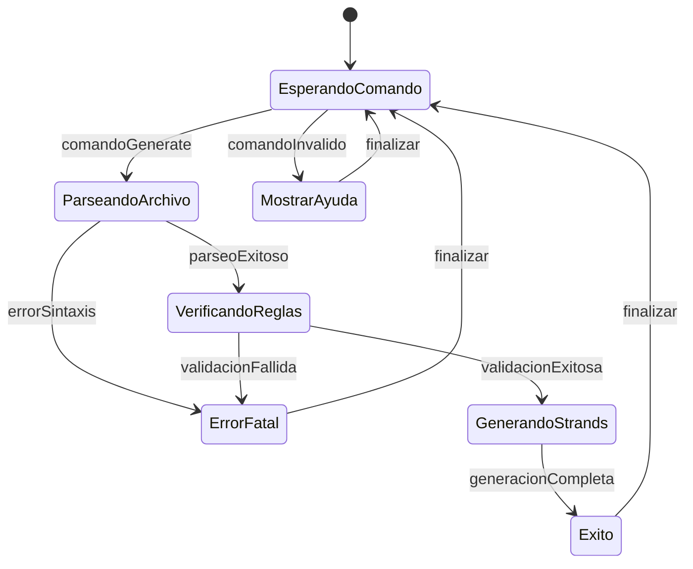
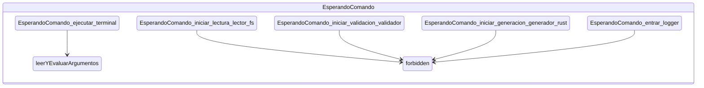
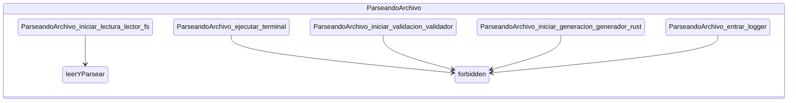
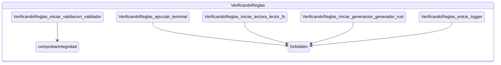
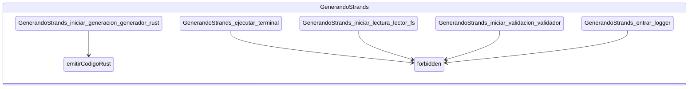
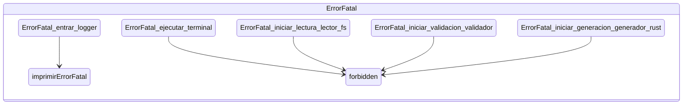
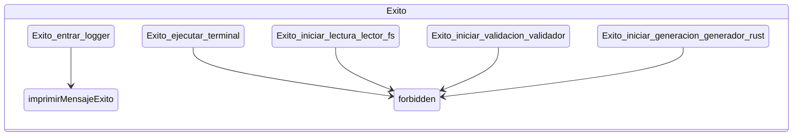
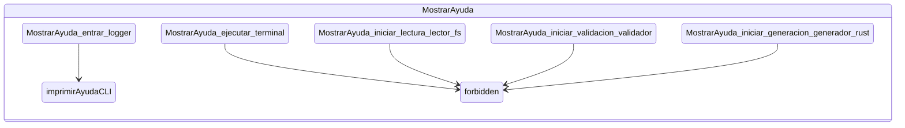

# System Visualization: CLI_Trenza

## 1. High-Level Topology (Context Map)

## 2. Context Details

### Context: EsperandoComando

### Context: ParseandoArchivo

### Context: VerificandoReglas

### Context: GenerandoStrands

### Context: ErrorFatal

### Context: Exito

### Context: MostrarAyuda

*Generated by Trenza CLI*