# System Visualization: CronometroPSP

## 1. High-Level Topology (Context Map)

```mermaid
stateDiagram-v2

    MenuConfiguracion --> ModalCrearActividad : abrirCrearActividad
    MenuConfiguracion --> ModalHistorial : abrirHistorial
    MenuConfiguracion --> ModalAcercaDe : abrirAcercaDe
    MenuConfiguracion --> ModalReset : abrirReset
    MenuConfiguracion --> cerrar_overlay : cerrar
    ModalAcercaDe --> cerrar_overlay : cerrar
    ModalComentario --> cerrar_overlay : confirmarInicio
    ModalComentario --> cerrar_overlay : cancelar
    ModalCrearActividad --> cerrar_overlay : guardarNuevaActividad
    ModalCrearActividad --> cerrar_overlay : cancelar
    ModalCrearTarea --> cerrar_overlay : guardarNuevaTarea
    ModalCrearTarea --> cerrar_overlay : cancelar
    ModalEditarActividad --> cerrar_overlay : guardarEdicionActividad
    ModalEditarActividad --> cerrar_overlay : cancelar
    ModalEditarTarea --> cerrar_overlay : guardarEdicion
    ModalEditarTarea --> cerrar_overlay : cancelar
    ModalHistorial --> cerrar_overlay : cerrar
    Historial7Dias --> Historial30Dias : cambiarA30Dias
    Historial7Dias --> ModalHistorial : cerrar
    Historial30Dias --> Historial7Dias : cambiarA7Dias
    Historial30Dias --> ModalHistorial : cerrar
    ModalReset --> cerrar_overlay : cerrar
    ResetFase1 --> ResetFase2 : avanzarAFase2
    ResetFase1 --> ModalReset : cerrar
    ResetFase2 --> ResetFase3 : avanzarAFase3
    ResetFase2 --> ResetFase1 : retrocederAFase1
    ResetFase3 --> cerrar_overlay : ejecutarReset
    ResetFase3 --> ResetFase2 : retrocederAFase2
    ModalSeleccionActividad --> ModalComentario : elegirActividad
    ModalSeleccionActividad --> cerrar_overlay : cancelar
    ModoEdicion --> ModoNormal : desactivarEdicion
    ModoEdicion --> ModalEditarTarea : abrirEditarTarea
    ModoEdicion --> ModalEditarActividad : abrirEditarActividad
    ModoEdicion --> ModalCrearTarea : abrirCrearTarea
    ModoEdicion --> MenuConfiguracion : abrirMenuConfiguracion
    ModoNormal --> ModoEdicion : activarEdicion
    ModoNormal --> ModalCrearTarea : abrirCrearTarea
    ModoNormal --> MenuConfiguracion : abrirMenuConfiguracion
    ModoNormal --> ModalComentario : seleccionarTipoTarea
    SesionActiva --> deactivate : sesionFinalizada
    [*] --> ModoNormal

```

## 2. Context Details

### Context: MenuConfiguracion

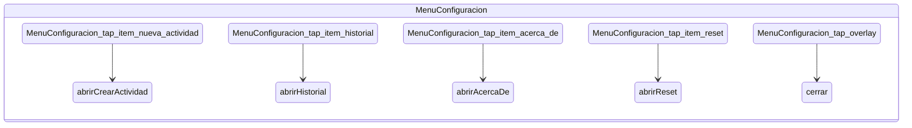

### Context: ModalAcercaDe

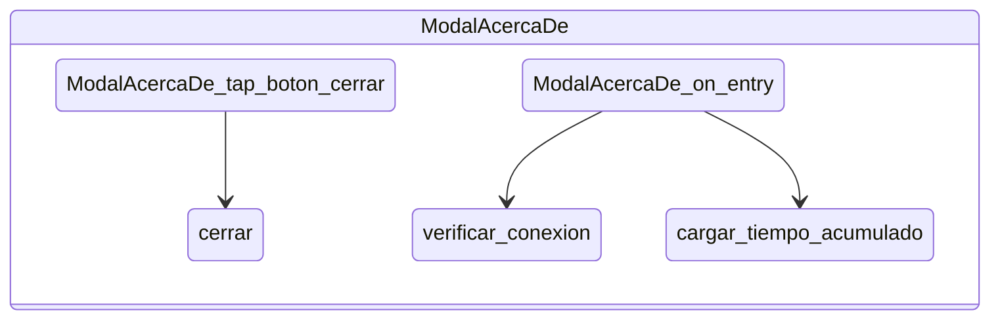

### Context: ModalComentario

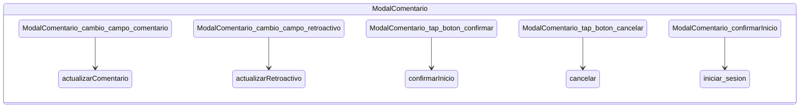

### Context: ModalCrearActividad

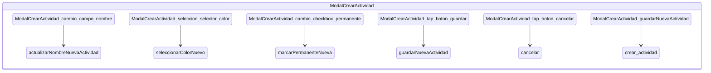

### Context: ModalCrearTarea

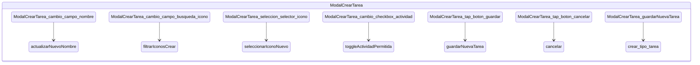

### Context: ModalEditarActividad

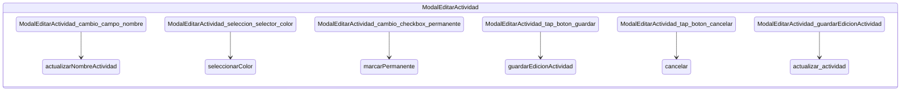

### Context: ModalEditarTarea

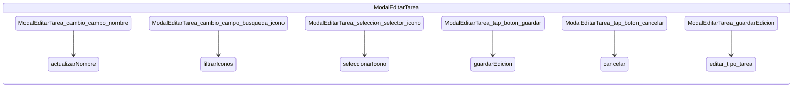

### Context: ModalHistorial

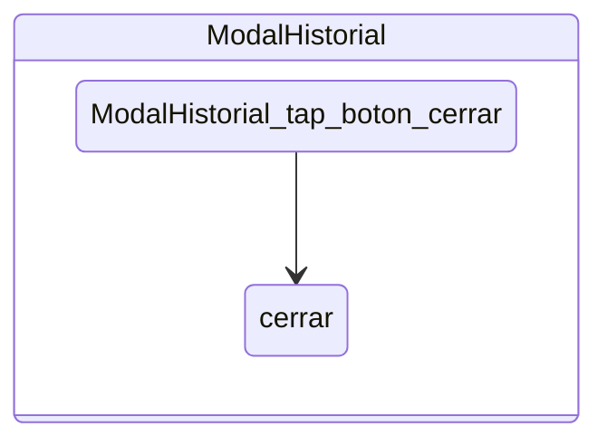

### Context: Historial7Dias

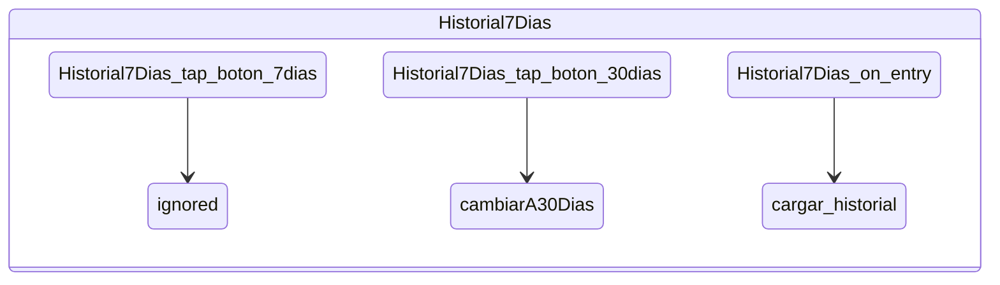

### Context: Historial30Dias

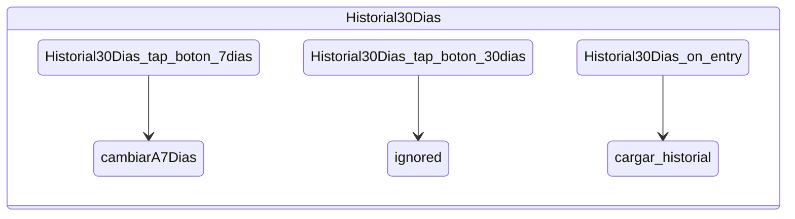

### Context: ModalReset

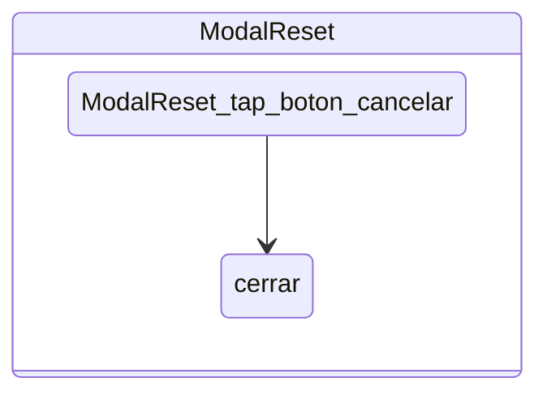

### Context: ResetFase1

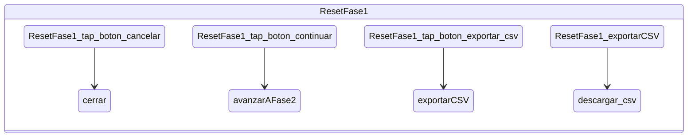

### Context: ResetFase2

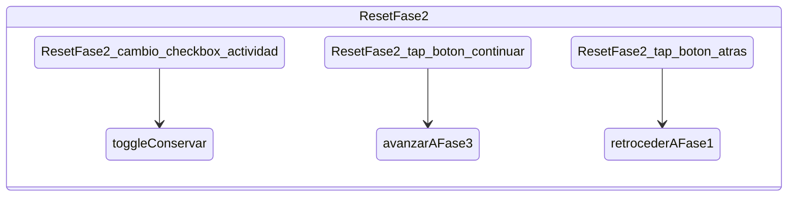

### Context: ResetFase3

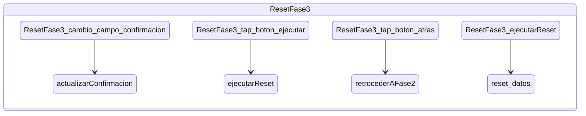

### Context: ModalSeleccionActividad

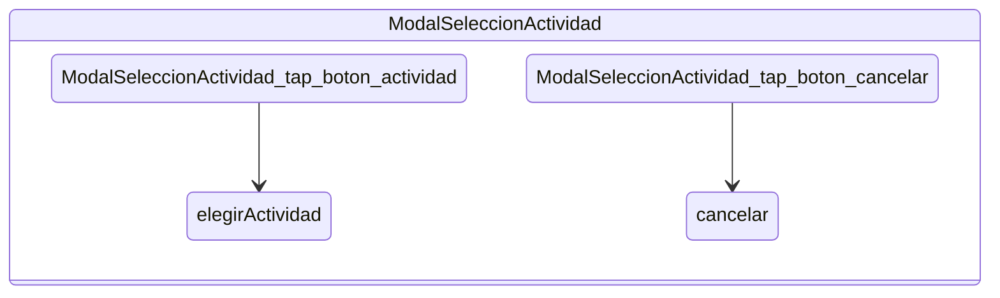

### Context: ModoEdicion

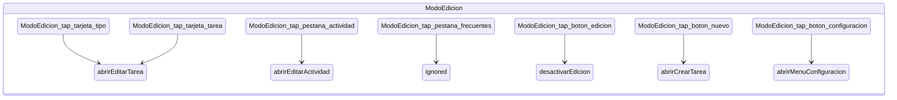

### Context: ModoNormal

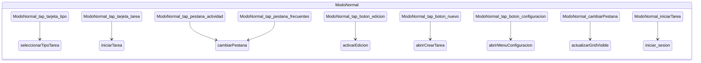

### Context: SesionActiva

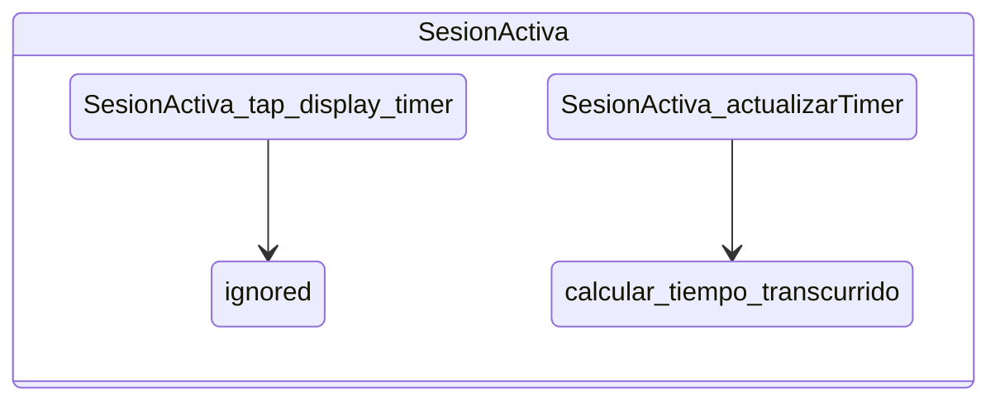

*Generated by Trenza CLI*